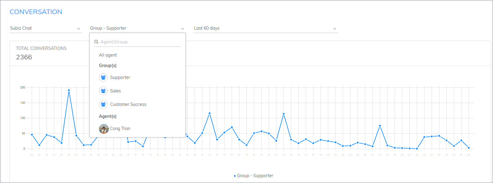
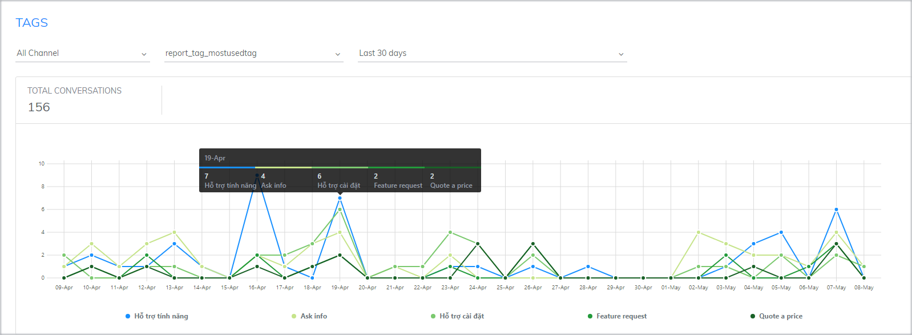
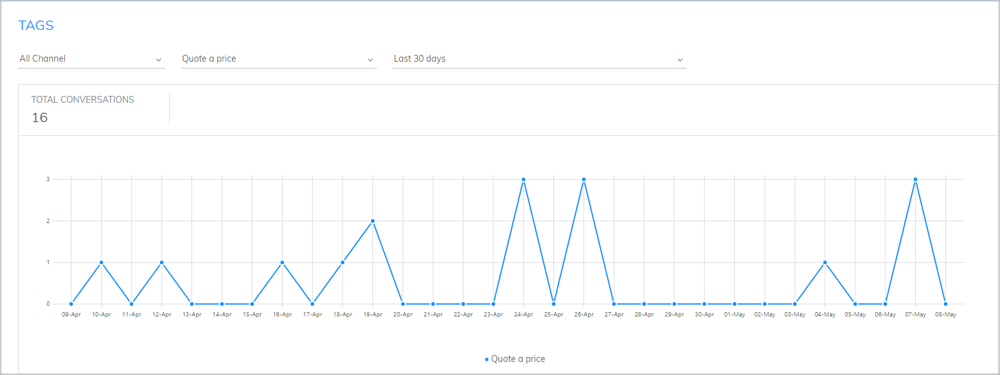
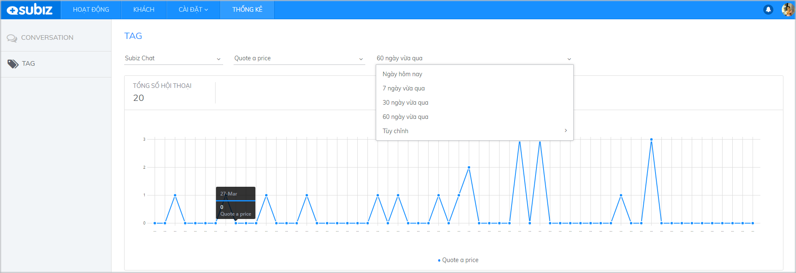

# Báo cáo & Thống kê

### Tổng quan báo cáo thống kê

Trong Subiz, mọi dữ liệu tương tác của bạn với khách hàng đều được lưu lại. Những báo cáo thống kê này sẽ giúp bạn kiểm tra được tình hình hoạt động kinh doanh trực tuyến, nắm bắt chất lượng dịch vụ chăm sóc khách hàng và quản lý đội ngũ nhân viên hiệu quả.

Để theo dõi thống kê tương tác trên Subiz bạn chỉ cần đăng nhập tài khoản Subiz và click vào mục **Thống kê.** 

Tại đây bạn có thể thống kê tương tác online theo các danh mục sau:

* **Thống kê cuộc hôi thoại**: Bạn có thể thống kê cuộc hội thoại theo từng khung thời gian chi tiết và theo từng Agent/ Nhóm Agent cụ thể. Taị đây, bạn sẽ có được số liệu chi tiết về những cuộc tương tác, thời điểm có nhiều khách hàng tương tác, những agent nào có nhiều/ ít cuộc tương tác nhất và kênh nào hoạt động hiệu quả nhất.
* **Thống kê Tag**: Thống kê tag sẽ giúp bạn phân loại và quản lý các cuộc tương tác một cách hiệu quả. Nếu như bạn không chỉ muốn bán hàng trên các kênh online mà còn cung cấp các dịch vụ chăm sóc khách hàng, hỗ trợ kỹ thuật...chức năng thống kê này sẽ giúp bạn nắm được tình hình hoạt động trực tuyến của doanh nghiệp và xác định kênh hỗ trợ khách hàng hiệu quả.

Như vậy, với thống kê báo cáo Subiz, bạn không chỉ đơn thuần thấy được những con số thống kê mà còn xây dựng những cơ sở dữ liệu để quản lý tình hình hoạt động kinh doanh, chăm sóc khách hàng và triển khai những kế hoạch kinh doanh hiệu quả.

### Thống kê cuộc hội thoại

Thống kê cuộc hội thoại giúp bạn có đánh giá tổng quan về tương tác của khách hàng trên Subiz. Subiz hỗ trợ bạn thống kê theo từng tiêu chí.

Đây là cơ sở dữ liệu giúp bạn đưa ra những chiến lược marketing, kinh doanh online trên các kênh và  đánh giá hiệu quả của các chiến dịch quảng cáo, promotion... Ví dụ như trong bạn đang triển khai chạy quảng cáo trên Fanpage trong 30 ngày. Kết thúc chiến dịch, bạn có thể kiểm tra lượng tương tác qua kênh Messenger trong 30 ngày vừa qua. Từ số liệu tương tác cụ thể trong suốt 30 ngày, bạn có thể đưa ra những đánh giá về hiệu quả của chương trình này và có những chỉnh sửa cần thiết.

#### Các tiêu chí thống kê

Tại mục Thống kê, bạn có thể thống kê số lượng cuộc hội thoại theo **Kênh**, **Agent** và **Thời gian**:



Lọc cuộc hội thoại theo kênh giúp bạn biết được lượng tương tác qua từng kênh Subiz Chat/ Email/ Messenger 




Lọc hội thoại theo Agent/ nhóm Agent giúp bạn đánh giá công việc của mỗi Agent, cũng như có đánh giá về tình hình kinh doanh chung:




Bạn có thể lọc theo các khoảng thời gian cụ thể và thực hiện so sánh để thấy sự biến động.




#### Cách đọc biểu đồ thống kê

Sau khi chọn các tiêu chí để thống kê, bạn có thể quan sát dữ liệu được thống kê dưới dạng biểu đồ.

* **Trục dọc:** Số lượng cuộc hội thoại
* **Trục ngang:** Trục thời gian \(đơn vị thời gian là ngày/ giờ tùy theo khoảng thời gian mà bạn chọn\)

Khi đặt con trỏ chuột vào các điểm giao, bạn sẽ thấy hiện thị số lượng cuộc hội thoại cụ thể tại thời điểm được chọn. Như vậy, khi nhìn vào biểu đồ, bạn vừa có thể đánh giá tổng quan sự biến động theo thời gian và xem chi tiết số lượng cuộc hội thoại trong một thời điểm cụ thể.

Ví dụ: Thống kê số cuộc hội thoại trên kênh Subiz Chat của nhóm Support trong 30 ngày gần đây.

### Thống kê tag

Subiz tag là tính năng cho phép người dùng gắn tag cho các tương tác trên tất cả các kênh tích hợp Subiz. Mục đích của tính năng này để hỗ trợ viên dễ dàng quản lý và phân loại các tương tác với khách hàng ví dụ như: Hỗ trợ, Bán hàng, Góp ý…

Nhờ chức năng này bạn cũng có thể thống kê chi tiết nội dung những cuộc tương tác và đánh giá hiệu quả của các chương trình khuyến mãi. Ví dụ, website bạn đang chạy chương trình khuyến mãi _Tuần lễ vàng mua sắm_. Sau 7 ngày, bạn có thể thống kê cụ thể có bao nhiêu cuộc tương tác được gắn tag " báo giá", "quan tâm chương trình", "chốt đơn"... Những thống kê này sẽ giúp bạn đánh giá được mức độ hiệu quả của chương trình khuyến mãi.

#### Các tiêu chí thống kê

Tại trang thống kê Tag, bạn có thể thống kê số lượng tag đã được gắn cho các cuộc hội thoại theo kênh, loại Tag và thời gian.



Chọn kênh mà bạn muốn thông kê Tag: Subiz Chat/ Email/ Messenger




Bạn có thể thống kê theo từng loại tag hoặc theo các tag được sử dụng nhiều nhất.

* Các tag được sử dụng nhiều nhất: Thống kê 5 loại tag được gắn nhiều nhất

* Thống kê theo từng loại tag




Lựa chọn khoảng thời gian cụ thể để thống kê và thực hiện so sánh để thấy được sự biến động \(đơn vị thời gian là ngày/giờ tùy thuộc theo khoảng thời gian mà bạn lựa chọn\)




#### Cách đọc biểu đồ thống kê

Sau khi bạn chọn các tiêu chí thống kê, dữ liệu sẽ hiển thị dưới dạng biểu đồ

* **Trục dọc:** Số lượng Tag
* **Trục ngang:** Trục thời gian \(đơn vị thời gian là ngày/ giờ tùy theo khoảng thời gian mà bạn chọn\)

Bạn có thể quan sát được số lượng tin nhắn được gắn theo từng loại tag cụ thể vào một thời gian nhất định. Điều này sẽ giúp bạn kiểm tra và theo dõi các cuộc tương tác một cách thuận tiện hơn

Ví dụ: Thống kê 5 tag được gắn nhiều nhất ngày 19/04

