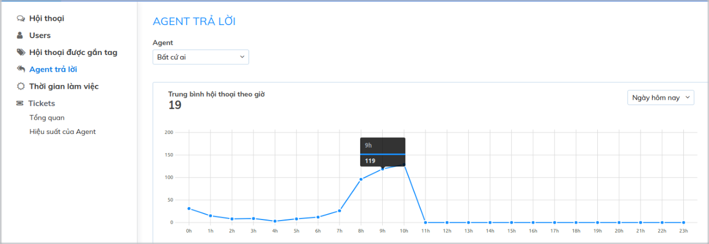
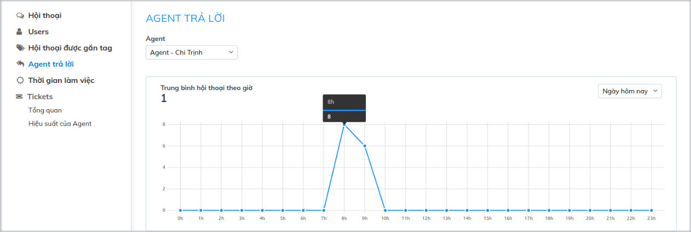

# Thống kê Agent trả lời

Thống kê Agent trả lời là thống kê số hội thoại được Agent trả lời theo thời gian. Thông số này sẽ cho biết mật độ làm việc của Agent trong một khoảng thời gian nhất định.

### **Các thông số thống kê**

**Agent:** Người phụ trách trả lời các cuộc hội thoại

**Thời gian:** Hiện tại bạn có thể lọc theo thời gian Ngày hôm nay để biết hiệu suất làm việc của Agent theo từng khung giờ trong ngày.

**Trung bình hội thoại theo giờ:** Số cuộc hội thoại trung bình Agent trả lời tính theo giờ làm việc của Agent

### Hướng dẫn thống kê agent trả lời

**Trục dọc:** Số lượng cuộc hội thoại Agent trả lời theo khung giờ

**Trục ngang:** Khung giờ trong ngày

Ví dụ: 

Từ 7h - 8h Agent Chi Trịnh đã trả lời 8 cuộc hội thoại. Tổng số hội thoại trung bình theo giờ là 1.

