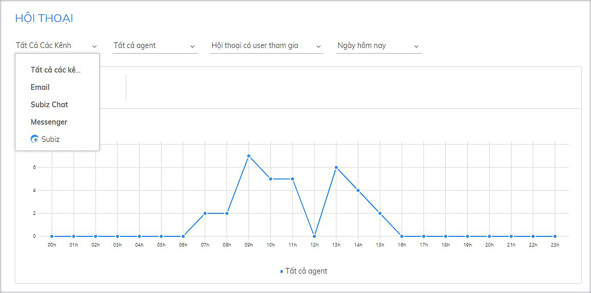
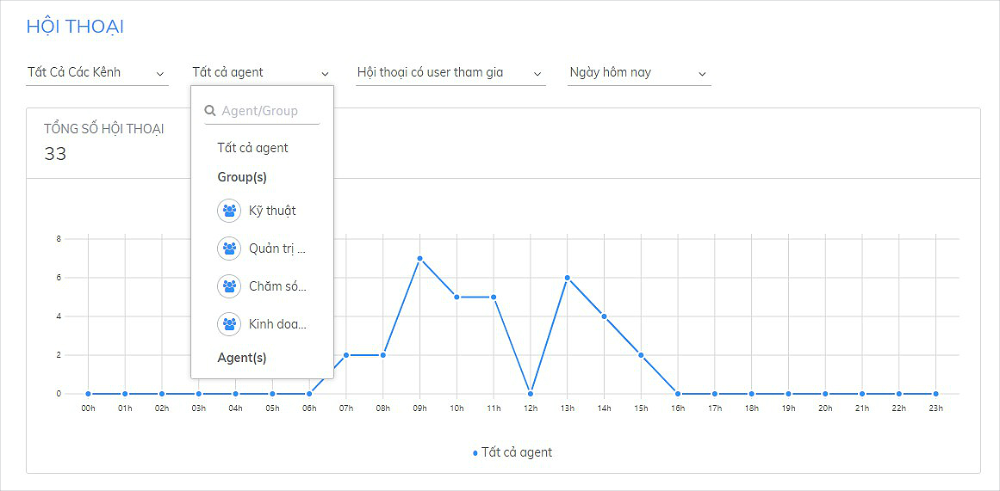
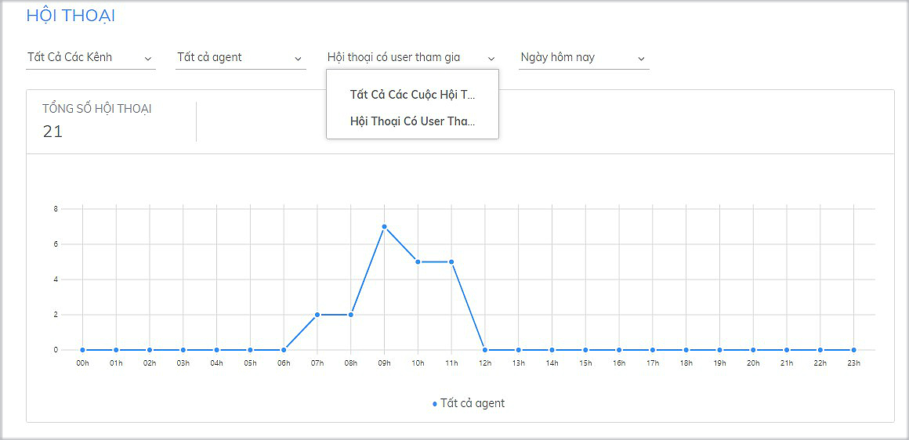
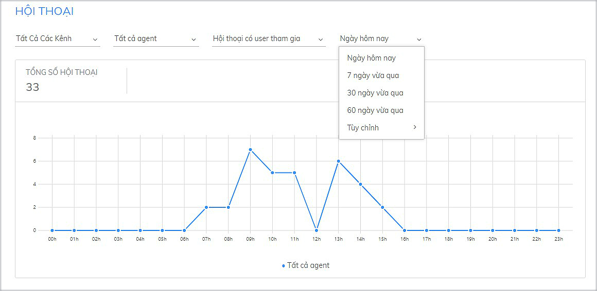
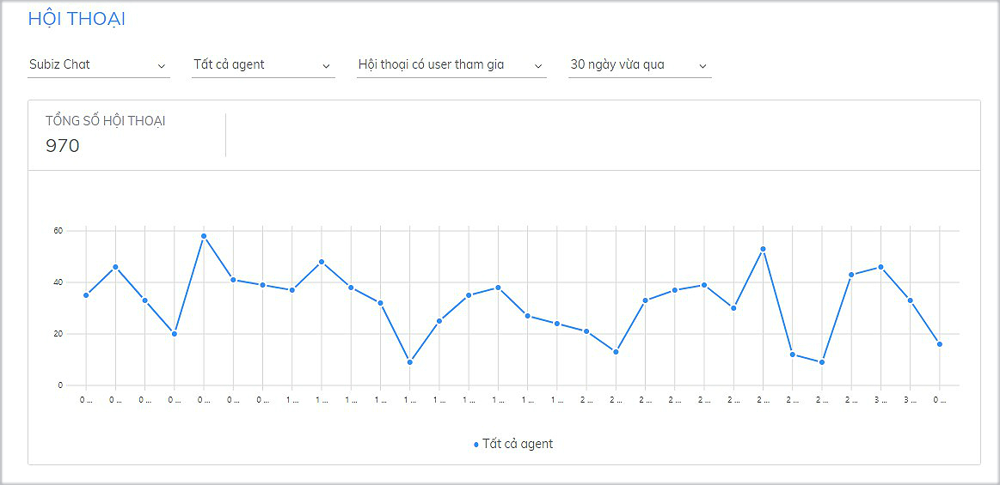

# Thống kê hội thoại

[Thống kê hội thoại](https://app.subiz.com/reports) giúp đánh giá tổng quan về số lượng cuộc tương tác trò chuyện của khách hàng trên [Subiz](https://subiz.com/vi/). Đặc biệt, [Subiz](https://subiz.com/vi/) có thống kê hội thoại theo nhiều thông số khác nhau.

Đây là cơ sở dữ liệu để bạn thực hiện những kế hoạch marketing, kinh doanh online và đánh giá hiệu quả của từng chiến dịch quảng cáo, bán hàng,... Ví dụ như trong bạn đang triển khai chạy quảng cáo Adwords trong 30 ngày. Kết thúc chiến dịch, bạn có thể kiểm tra lượng tương tác qua kênh Subiz chat trong 30 ngày vừa qua. Từ số liệu tương tác cụ thể trong suốt 30 ngày, bạn có thể đưa ra những đánh giá về hiệu quả của chương trình này và có những điều chỉnh phù hợp.

### Các thông số thống kê hội thoại

Tại trang [THỐNG KÊ](https://app.subiz.com/reports) hội thoại, bạn có thể thống kê số lượng cuộc hội thoại theo **Kênh**, **Agent, Loại hội thoại** và **Thời gian**:



Bạn có thể chọn Tất cả các kênh hoặc chọn cụ thể kênh tương tác khách hàng như Email, Subiz chat trên website, Messenger Fanpage




Bạn có thể chọn Tất cả agent để thống kê chung hội thoại của doanh nghiệp hay Tên agent hoặc nhóm Agent cụ thể để thống kê công việc của từng cá nhân/ nhóm tư vấn viên.




Có 2 loại hội thoại:

* **Hội thoại có user tham gia**: Cuộc trò chuyện có khách hàng đã nhắn tin
* **Tất cả cuộc hội thoại**: Cuộc hội thoại có khách đã nhắn tin và cuộc hội thoại khách chưa nhắn tin \(Cuộc hội thoại do Automation gửi tin nhắn hoặc hội thoại do agent gửi tin nhắn\)




Bạn có thể chọn một ngày cụ thể hoặc chọn một khoảng thời gian để thực hiện thống kê, so sánh sự biến động.




### Cách đọc biểu đồ thống kê

Sau khi chọn các tiêu chí để thống kê, bạn có thể quan sát dữ liệu được thống kê dưới dạng biểu đồ.

* **Trục dọc:** Số lượng cuộc hội thoại
* **Trục ngang:** Trục thời gian \(đơn vị thời gian là ngày/ giờ tùy theo khoảng thời gian mà bạn chọn\)

Khi đặt con trỏ chuột vào các điểm giao, bạn sẽ thấy hiện thị số lượng cuộc hội thoại cụ thể tại thời điểm được chọn. Như vậy, khi nhìn vào biểu đồ, bạn vừa có thể đánh giá tổng quan sự biến động theo thời gian và xem chi tiết số lượng cuộc hội thoại trong một thời điểm cụ thể.

Ví dụ: Thống kê số lượng **Hội thoại có user tham gia** trên kênh **Subiz Chat** của **Tất cả agent** trong **30 ngày vừa qua**

