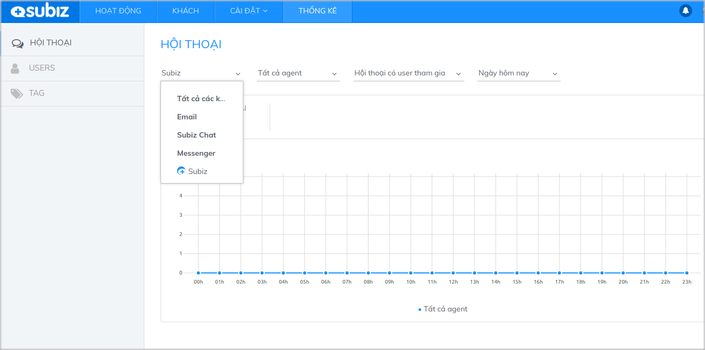
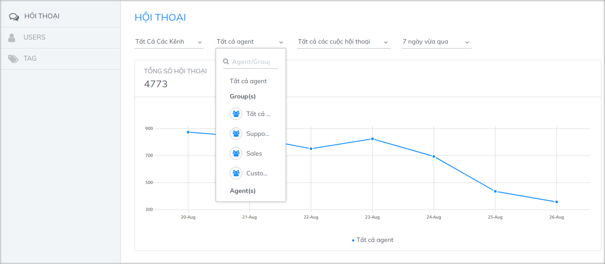
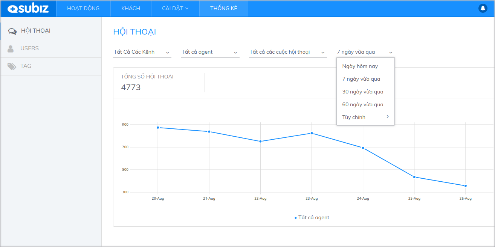
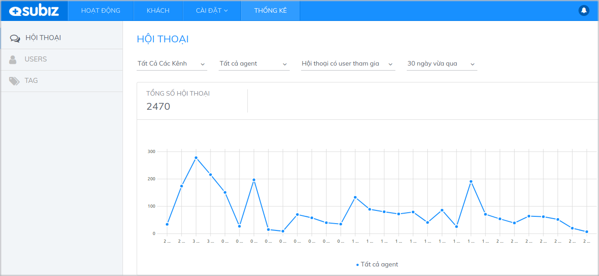

# Thống kê cuộc hội thoại

Thống kê cuộc hội thoại giúp bạn có đánh giá tổng quan về tương tác của khách hàng trên [Subiz](https://subiz.com/vi/). [Subiz](https://subiz.com/vi/) hỗ trợ bạn thống kê theo từng tiêu chí.

Đây là cơ sở dữ liệu giúp bạn đưa ra những chiến lược marketing, kinh doanh online trên các kênh và  đánh giá hiệu quả của các chiến dịch quảng cáo, promotion... Ví dụ như trong bạn đang triển khai chạy quảng cáo trên [Fanpage](https://subiz.com/vi/facebook-messenger.html%20) trong 30 ngày. Kết thúc chiến dịch, bạn có thể kiểm tra lượng tương tác qua kênh [Messenger](https://subiz.com/vi/facebook-messenger.html%20) trong 30 ngày vừa qua. Từ số liệu tương tác cụ thể trong suốt 30 ngày, bạn có thể đưa ra những đánh giá về hiệu quả của chương trình này và có những chỉnh sửa cần thiết.

### Các tiêu chí thống kê

Tại mục Thống kê, bạn có thể thống kê số lượng cuộc hội thoại theo **Kênh**, **Agent** và **Thời gian**:



Lọc cuộc hội thoại theo kênh giúp bạn biết được lượng tương tác qua từng kênh Subiz Chat/ [Email](https://subiz.com/vi/email.html%20)/ [Messenger ](https://subiz.com/vi/facebook-messenger.html%20)




Lọc hội thoại theo Agent/ nhóm Agent giúp bạn đánh giá công việc của mỗi Agent, cũng như có đánh giá về tình hình kinh doanh chung:




Bạn có thể lọc theo các khoảng thời gian cụ thể và thực hiện so sánh để thấy sự biến động.




### Cách đọc biểu đồ thống kê

Sau khi chọn các tiêu chí để thống kê, bạn có thể quan sát dữ liệu được thống kê dưới dạng biểu đồ.

* **Trục dọc:** Số lượng cuộc hội thoại
* **Trục ngang:** Trục thời gian \(đơn vị thời gian là ngày/ giờ tùy theo khoảng thời gian mà bạn chọn\)

Khi đặt con trỏ chuột vào các điểm giao, bạn sẽ thấy hiện thị số lượng cuộc hội thoại cụ thể tại thời điểm được chọn. Như vậy, khi nhìn vào biểu đồ, bạn vừa có thể đánh giá tổng quan sự biến động theo thời gian và xem chi tiết số lượng cuộc hội thoại trong một thời điểm cụ thể.

Ví dụ: Thống kê số cuộc hội thoại trên kênh Subiz Chat của nhóm Support trong 30 ngày gần đây.

