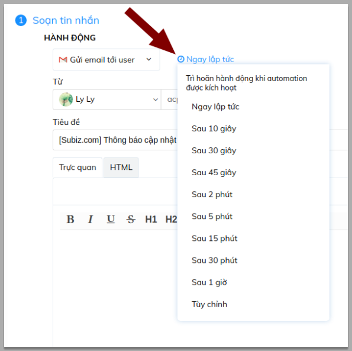

# Thống kê hội thoại

[Thống kê hội thoại](https://app.subiz.com/reports) giúp đánh giá tổng quan về số lượng cuộc tương tác trò chuyện của khách hàng trên [Subiz](https://subiz.com/vi/). Đặc biệt, [Subiz](https://subiz.com/vi/) có thống kê hội thoại theo nhiều thông số khác nhau.

Đây là cơ sở dữ liệu để bạn thực hiện những kế hoạch marketing, kinh doanh online và đánh giá hiệu quả của từng chiến dịch quảng cáo, bán hàng,... Ví dụ như trong bạn đang triển khai chạy quảng cáo Adwords trong 30 ngày. Kết thúc chiến dịch, bạn có thể kiểm tra lượng tương tác qua kênh Subiz chat trong 30 ngày vừa qua. Từ số liệu tương tác cụ thể trong suốt 30 ngày, bạn có thể đưa ra những đánh giá về hiệu quả của chương trình này và có những điều chỉnh phù hợp.

### Các thông số thống kê hội thoại

Tại trang [THỐNG KÊ](https://app.subiz.com/reports) hội thoại, bạn có thể thống kê số lượng cuộc hội thoại theo **Kênh**, **Agent, Loại hội thoại** và **Thời gian**:



Có 6 loại hội thoại:

* **Tất cả cuộc hội thoại:** Bao gồm tất cả cuộc hội thoại khởi tạo bởi Automation, Agent nhắn tin chủ động, User nhắn tin chủ động.
* **Hội thoại có User tham gia:** Cuộc hội thoại có ít nhất 1 tin nhắn được gửi từ User.
* **Hội thoại đã trả lời:** Cuộc hội thoại có ít nhất 1 tin nhắn được gửi từ Agent
* **Agent không trả lời trong 5 phút:** Agent được phân phối vào cuộc hội thoại nhưng không có tin nhắn phản hồi trong vòng 5 phút
* **Agent không trả lời trong 15 phút:** Agent được phân phối vào cuộc hội thoại nhưng không có tin nhắn phản hồi trong vòng 15 phút.
* **Agent không trả lời trong 24h:** Agent được phân phối vào cuộc hội thoại nhưng không có tin nhắn phản hồi trong vòng 24h

**Lưu ý:** Agent Subot vẫn được tính như 1 Agent




Bạn có thể chọn Tất cả các kênh hoặc chọn cụ thể kênh tương tác khách hàng như Email, Subiz chat trên website, Messenger Fanpage




Bạn có thể chọn Tất cả agent để thống kê chung hội thoại của doanh nghiệp hay Tên agent hoặc nhóm Agent cụ thể để thống kê công việc của từng cá nhân/ nhóm tư vấn viên.




Bạn có thể thống kê số cuộc hội thoại theo một giai đoạn cụ thể:




### Cách đọc thống kê

Thống kê hội thoại giúp doanh nghiệp có thể tổng quan tình hình tương tác với khách hàng, phân loại các cuộc hội thoại để đánh giá khách hàng cũng như thái độ, hiệu suất làm việc của nhân viên để từ đó xây dựng những chiến lược phù hợp.  
Bạn có thể kết hợp các trường lọc để có được số liệu thống kê đúng tiêu chí và mục đích thống kê của doanh nghiệp.

**Thống kê tình hình tương tác của khách hàng**

Trong ngày hôm nay doanh nghiệp nhận được 76 cuộc hội thoại có sự tham gia của khách hàng.

**Thống kê hiệu suất làm việc Agent**

Trong 7 ngày vừa qua Agent Linh Lê đã chat 50 cuộc hội thoại

Trong 7 ngày vừa qua, Agent Hoa Ta có 4 cuộc hội thoại không được trả lời sau 5 phút

