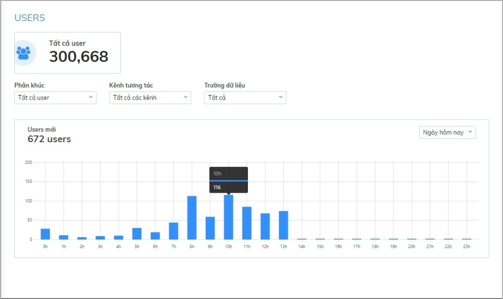
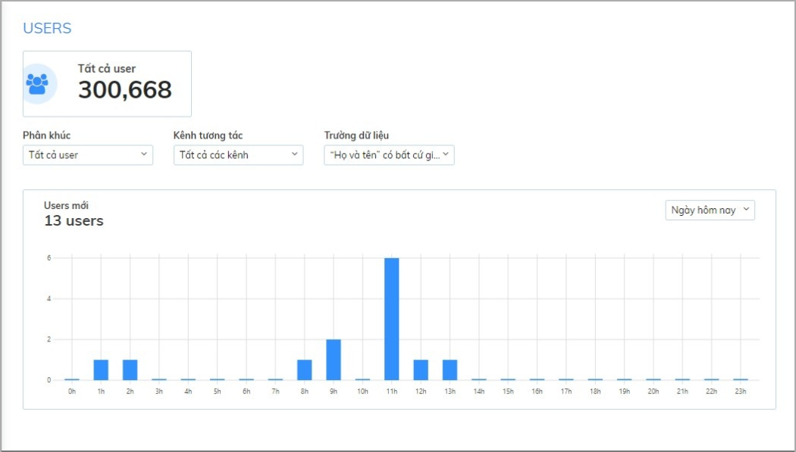

# Thống kê tình hình tương tác khách hàng và hiệu quả làm việc của tư vấn viên

Là một quản lý bán hàng, bạn quản lý hoạt động kinh doanh trên Subiz như thế nào? Bài viết dưới đây chia sẻ một số yếu tố giúp bạn thống kê và đánh giá được bức tranh khách hàng và hiệu suất làm việc của các tư vấn viên.

### Thống kê tình hình tương tác khách hàng

Thống kê này giúp bạn đánh giá được tổng quan tình hình tương tác khách hàng: Số lượng hội thoại tương tác theo thời gian, kênh tương tác chính,... Cụ thể, để thống kê tình hình tương tác khách hàng trên website, bạn cần kết hợp các thống kê như sau: 

* Thống kê số lượng user \(khách hàng\) mới: Số liệu thể hiện số lượng khách hàng mới đã truy cập website, có tương tác qua Subiz trong một khoảng thời gian.

Như ví dụ trong hình, trong ngày hôm nay, có **672 khách hàng mới** truy cập website, thời gian khách hàng tương tác nhiều nhất là 10h sáng với 116 lượt khách tương tác.

* Thống kê tỷ lệ khách hàng tiềm năng: Bạn có thể đo đếm được trong tổng số hội thoại, có bao nhiêu user đã thu thập được các dữ liệu như: Số điện thoại, tên, địa chỉ email,... 

Ví dụ: Thống kê hôm nay có bao nhiêu user thu thập được thông tin số họ tên.

Ảnh trên cho thấy có **13 users** đã thu thập được thông tin **Họ và tên** trong hôm nay.

* Thống kê hội thoại: Là con số thống kê các khách hàng đã có tương tác với doanh nghiệp. Từ tổng số khách hàng mới truy cập website, bạn sẽ biết được có bao nhiêu khách hàng đã tương tác với doanh nghiệp.

Trong ngày hôm nay, doanh nghiệp nhận được 41 cuộc hội thoại có sự tham gia của khách hàng.

* Thống kê các vấn đề khách hàng thường quan tâm: Bạn sẽ tạo các Tag và quản lý các Tag và lọc dữ liệu theo kênh hay các Tag cụ thể để hiểu rõ hơn về tình hình khách hàng.

Chẳng hạn, theo hình ảnh trên, số lượng khách hàng yêu cầu báo giá tăng tuy nhiên số lượng khách hàng chốt đơn lại giảm xuống do vấn đề sản phẩm lỗi và khách hàng phàn nàn. Từ đó, bạn có thể nhận diện rõ ràng hơn về chân dung khách hàng, những vấn đề còn tồn đọng để cải thiện và làm việc lại với Team đưa ra phương án hỗ trợ khách hàng hiệu quả.

### Thống kê hiệu quả làm việc của tư vấn viên

Nhờ tính năng thống kê, doanh nghiệp sẽ quản lý được hiệu suất làm việc của từng nhân viên, cách nhân viên tương tác với khách hàng. Bạn cần quan tâm đến 3 chỉ số như sau: Thời gian agent online, thống kê agent trả lời hội thoại, Thống kê hội thoại chưa được trả lời sau 1 khoảng thời gian. 

* Thống kê thời gian agent online: Khác với Subiz 3.0, tại Subiz phiên bản 4.0 đã không còn trạng thái away của agent. Thống kê này được tính khi agent bắt đầu online, đồng nghĩa với việc sẵn sàng bắt đầu ngày làm việc mới. Bạn có thể thống kê thời gian làm việc trên từng agent trên Subiz, qua đó giúp doanh nghiệp tương tác khách hàng đúng thời điểm, nâng cao hiệu quả tương tác khách hàng.

Như hình ảnh trên, hôm nay agent Chi Trịnh có thời gian online là 5h36 phút, từ 8h đến 9h, có thời gian online là 33 phút. 

* Thống kê hội thoại agent đã trả lời: số lượng hội thoại thực agent đã trả lời, từ đó bạn sẽ nắm được mức độ công việc của tư vấn viên. Doanh nghiệp có thể biết được agent đã tham gia vào bao nhiêu hội thoại, cách agent hỗ trợ khách hàng như thế nào.

Như hình ảnh trên, agent Chi Trịnh đã chat với khách hàng 20 cuộc trong ngày hôm nay. 

* Thống kê hội thoại không được trả lời bởi agent: Giúp doanh nghiệp đánh giá được tốc độ phản hồi khách hàng của agent, qua đó đưa ra điều chỉnh phù hợp.

Trong ngày hôm nay, Agent Chi Trịnh có 10 hội thoại không được trả lời sau 5 phút. 

* Thống kê agent trả lời hội thoại: Có bao nhiêu hội thoại được trả lời tính theo thời gian hội thoại diễn ra. Qua đây, bạn sẽ đánh giá được mật độ làm việc của agent theo từng khung thời gian trong ngày.

Ví dụ: Từ khung giờ từ 07h đến 8h, Agent Chi Trịnh đã trả lời 11 cuộc hội thoại, số lượng hội thoại trả lời trung bình theo giờ là 2 hội thoại.

Subiz là phần mềm hỗ trợ doanh nghiệp bán hàng và chăm sóc khách hàng nhưng còn hơn thế, chúng tôi còn giúp bạn - nhà quản lý có cái nhìn khái quát hơn về hoạt động tư vấn trên các kênh tương tác của doanh nghiệp. Từ đó, bạn có thể có những điều chỉnh, thay đổi hợp lý góp phần nâng cao chất lượng dịch vụ cũng như việc quản lý, đánh giá hiệu quả làm việc của đội ngũ tư vấn viên.

