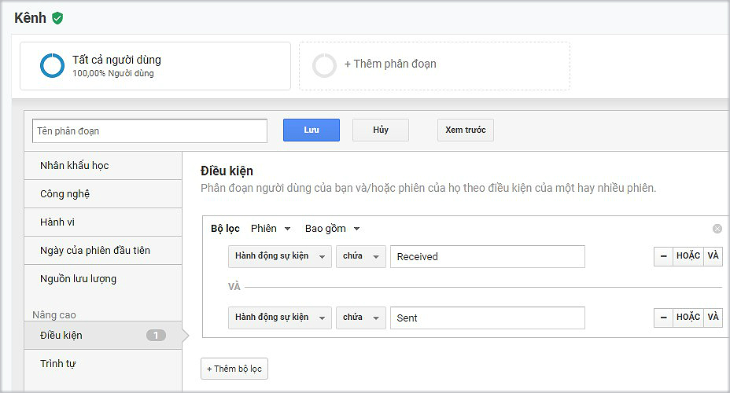

# Thống kê Subiz chat theo nguồn khách truy cập

Subiz kết hợp mạnh mẽ với Google Analytics thống kê dữ liệu sự kiện Subiz chat với nhiều mục tiêu khác nhau. Trong đó, bạn có thể thống kê số lượng khách hàng có cuộc hội thoại và tương tác qua Subiz chat theo từng nguồn khách truy cập.


**Lưu ý**: 

* Subiz tự động gửi 3 dữ liệu sự kiện qua Google Analytics bao gồm: Khách hàng gửi tin nhắn trên cửa sổ Subiz chat, Khách hàng nhận tin nhắn trên cửa sổ Subiz chat, Khách hàng mở cửa sổ Subiz chat.
* Trên Google Analytics, mỗi dữ liệu sự kiện Subiz được chia thành 3 thành tố sự kiện là: Danh mục sự kiện, Hành động sự kiện, Nhãn sự kiện. [Xem thêm cách đọc sự kiện Subiz trên Google Analytics](https://help.subiz.com/bao-cao-and-thong-ke/thong-ke-subiz-chat-tren-google-analytics#cac-loai-su-kien-subiz-gui-sang-ga). 


Để xem thống kê số lượng khách hàng có tương tác qua Subiz chat theo nguồn truy cập trên Google analytics, bạn sẽ thao tác 4 bước như sau:

### Bước 1: Đăng nhập [Google Analytics](https://analytics.google.com).

Vào mục CHUYỂN ĐỔI &gt; Tất cả lưu lượng truy cập &gt; Kênh

### Bước 2: Thêm phân đoạn thống kê sự kiện SUBIZ chat

 Chọn Thêm phân đoạn &gt; Phân đoạn mới 

### Bước 3: Cài đặt điều kiện thống kê

Chọn Điều kiện &gt; Ô Biến thể sẽ chọn điều kiện tương ứng tùy theo từng mục tiêu thống kê.

Tùy từng mục đích thống kê, bạn sẽ chọn các điều kiện tương ứng. Một số ví dụ thống kê thường dùng.

* Ví dụ 1: Xem thống kê tổng số khách hàng có hành động tương tác qua Subiz chat như gửi tin nhắn hoặc nhận tin nhắn hoặc mở cửa sổ Subiz chat, chọn Điều kiện là **Danh mục sự kiện** - **chứa** - **SUBIZ chat**

* Ví dụ 2: Xem thống kê tổng số khách có nhận tin nhắn qua cửa sổ Subiz chat,  chọn Điều kiện là **Hành động sự kiện - chứa  - Received** 

* Ví dụ 3: Xem thống kê tổng số khách có gửi tin nhắn qua cửa sổ Subiz chat,  chọn Điều kiện là **Hành động sự kiện - chứa - Sent**

* Ví dụ 4: Xem thống kê tổng số khách có nhận và gửi tin nhắn qua cửa sổ Subiz chat, chọn Điều kiện  **Hành động sự kiện - chứa  - Received** và **Hành động sự kiện - chứa - Sent**

* Ví dụ 5: Xem thống kê tổng số khách có nhận tin nhắn HOẶC gửi tin nhắn qua cửa sổ Subiz chat,  chọn Điều kiện là **Nhãn sự kiện - chứa - User**

* Ví dụ 6: Xem thống kê tổng số khách đã mở cửa sổ Subiz chat,  chọn Điều kiện là **Hành động sự kiện - chứa - Opened**

### Bước 4: Đặt tên phân đoạn & Lưu để cập nhật thống kê


**Lưu ý**: Để so sánh thống kê của phân đoạn Subiz chat và các phân đoạn khác, bạn chọn Thêm phân đoạn &gt; tìm kiếm phân đoạn đã cài đặt của bạn và chọn Áp dụng.


> Bạn cần hỗ trợ thêm về thống kê Subiz, hãy gửi yêu cầu cho Subiz qua Support@Subiz.com hoặc chat online tại [Subiz.com](https://subiz.com/vi/feature.html)!

