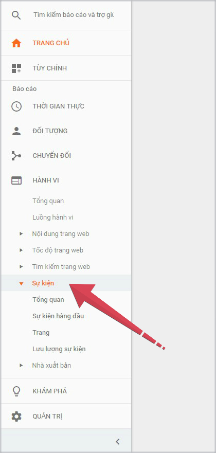
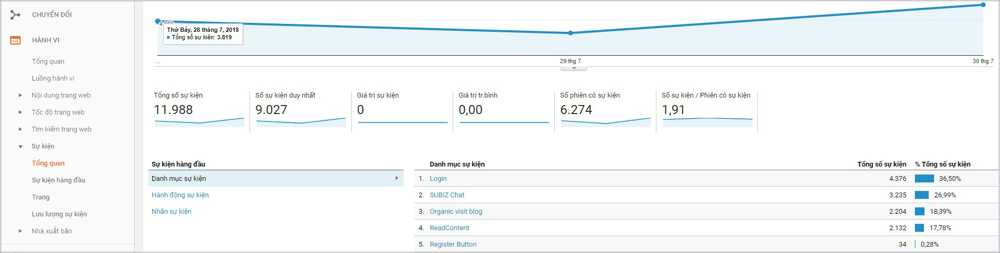
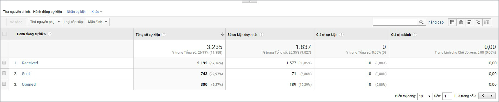
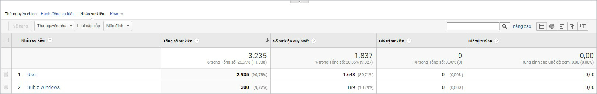

# Thống kê Subiz chat trên Google Analytics

### Hướng dẫn xem thống kê Subiz trên GA

**Bước 1**: [Đăng nhập tài khoản Google Analytics](https://analytics.google.com/analytics/) của website cần kiểm tra 

**Bước 2**: Trong mục Báo cáo &gt; chọn HÀNH VI &gt; Sự kiện 

**Bước 3**: Chọn Tổng quan để xem thống kê Danh mục sự kiện

**Bước 4**: Để xem thống kê chi tiết các Hành động sự kiện của Subiz: vào Sự kiện hàng đầu &gt; Danh mục sự kiện &gt;  chọn Subiz chat &gt; Hành động sự kiện

**Bước 5**: Để xem thống kê chi tiết các Nhãn sự kiện của Subiz: vào Sự kiện hàng đầu &gt; Danh mục sự kiện &gt;  chọn Subiz chat &gt;  Nhãn sự kiện

> Bạn đã đọc được thống kê Subiz chat trên Google Analytics?   
> Cần hỗ trợ thêm, bạn hãy chat với tư vấn viên ngay trên website [Subiz.com](https://subiz.com/vi/feature.html) nhé.

