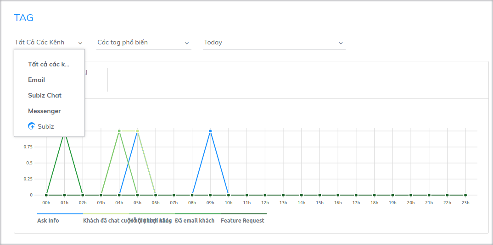
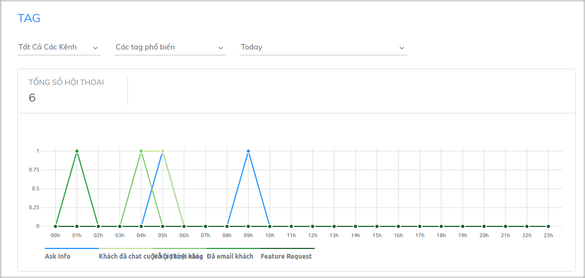
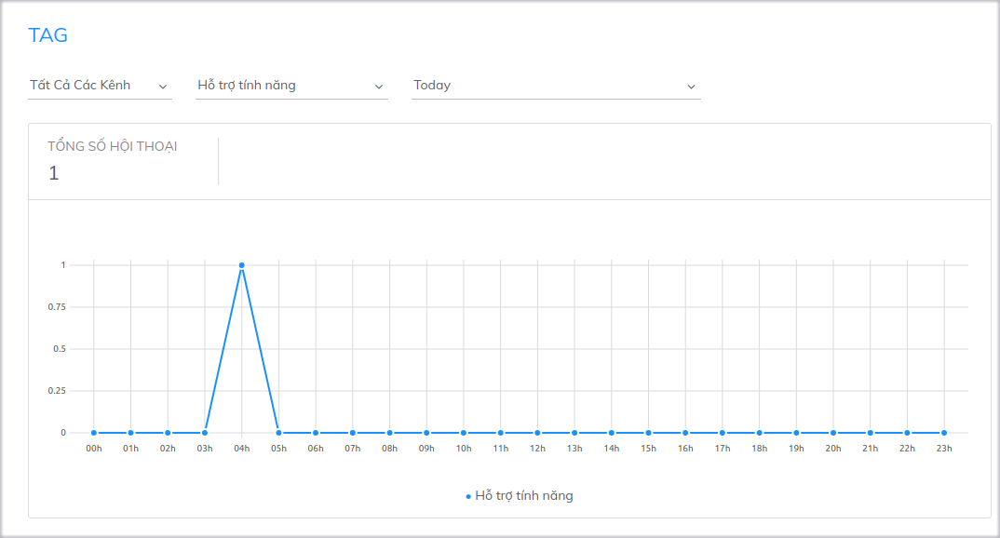

# Thống kê hội thoại được gắn tag

Subiz Tag là [tính năng](https://subiz.com/vi/feature.html) cho phép người dùng gắn thẻ tag cho các hội thoại trò chuyện trên tất cả các kênh tích hợp [Subiz](https://subiz.com/vi/). Mục đích của tính năng này để hỗ trợ viên dễ dàng phân loại cuộc trò chuyện theo những vấn đề của khách hàng: Tư vấn sản phẩm, Mua hàng, Phàn nàn,…

Từ đó, bạn có thể thống kê chi tiết nội dung những cuộc tương tác và tổng quan được bức tranh khách hàng. Ví dụ, website bạn đang chạy chương trình khuyến mãi _Tuần lễ vàng mua sắm_. Sau 7 ngày, bạn có thể thống kê cụ thể có bao nhiêu cuộc tương tác được gắn tag " Mua hàng", "Báo giá", "Hỏi thông tin"... Những thống kê này sẽ giúp bạn đánh giá được mức độ hiệu quả của chương trình khuyến mãi.

### Các thông số thống kê

Tại trang thống kê hội thoại được gắnTag, bạn có thể thống kê số lượng tag đã được gắn cho các cuộc hội thoại theo **Kênh, Loại Tag** và **Thời gian.**



Chọn kênh mà bạn muốn thống kê Tag: Subiz Chattrên website,  [Email](https://subiz.com/vi/email.html%20), [ Messenger](https://subiz.com/vi/facebook-messenger.html%20) Fanpage.




Bạn có thể thống kê theo từng loại tag hoặc theo các tag được sử dụng nhiều nhất.

* Các tag phổ biến: Thống kê 5 loại tag được gắn nhiều nhất

* Thống kê theo từng loại tag cụ thể




Lựa chọn khoảng thời gian cụ thể để thống kê và thực hiện so sánh để thấy được sự biến động \(đơn vị thời gian là ngày/giờ tùy thuộc theo khoảng thời gian mà bạn lựa chọn\)




### Cách đọc biểu đồ thống kê

Sau khi bạn chọn các tiêu chí thống kê, dữ liệu sẽ hiển thị dưới dạng biểu đồ

* **Trục dọc:** Số lượng Tag
* **Trục ngang:** Trục thời gian \(đơn vị thời gian là ngày/ giờ tùy theo khoảng thời gian mà bạn chọn\)

Bạn có thể quan sát được số lượng tin nhắn được gắn theo từng loại tag cụ thể vào một thời gian nhất định. Điều này sẽ giúp bạn kiểm tra và theo dõi các cuộc tương tác một cách thuận tiện hơn

Ví dụ: Thống kê 5 tag được gắn nhiều nhất ngày 19/04

