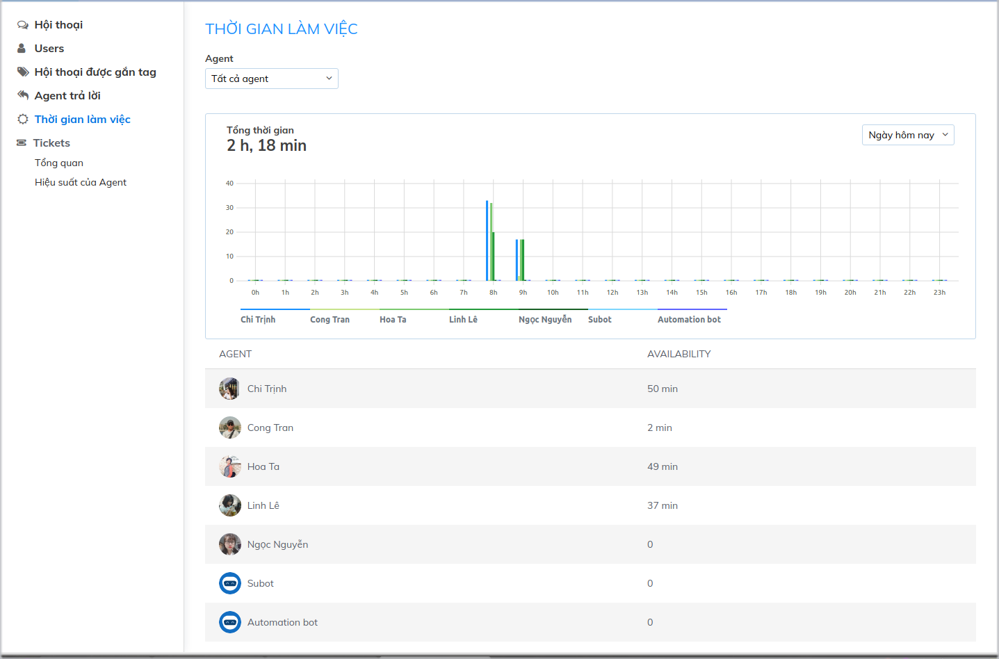
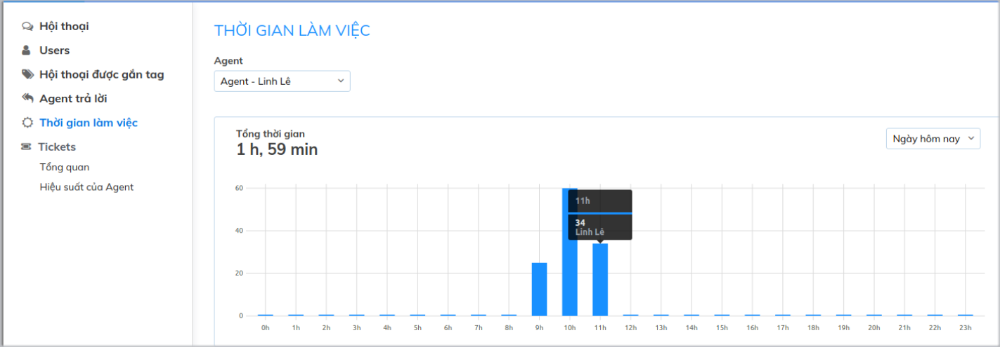

# Thống kê thời gian làm việc

Thời gian làm việc của Agent được tính từ lúc Agent đăng nhập Dashboard / App Mobile cho đến khi Agent không kết nối Subiz nữa \( tắt tab đăng nhập, đăng xuất, thoát màn hình App\). Đây là khoảng thời gian Agent sẵn sàng trả lời và hỗ trợ khách hàng.

Với thống kê này, nhà quản lý có thể biết được thời gian làm việc của các Agent trên Subiz. Mặc dù cửa sổ Subiz luôn mở  để khách hàng có thể nhắn tin bất cứ khi nào, việc sẵn sàng online của các Agent sẽ giúp doanh nghiệp tận dụng triệt để các tương tác với khách hàng và hỗ trợ khách đúng thời điểm.

### Các thông số thống kê

Biểu đồ thống kê được chia ra làm 2 dạng: Biểu đồ dạng cột và dạng bảng.

- Với biểu đồ dạng cột, bạn có thể lọc thời gian làm việc của agent theo:

* Agent
* Thời gian thống kê
* Tổng thời gian online của Agent trong khung thời gian đo

- Biểu đồ dạng bảng sẽ hiển thị thời gian online của toàn bộ danh sách Agent trong khoảng thời gian đo

### Cách đọc biểu đồ

**Trục ngang:** Đơn vị thời gian đo  

Lưu ý: Thống kê sẽ được tính theo đơn vị nhỏ nhất là cung Giờ trong ngày

**Trục dọc:** Thời gian làm việc của Agent

Ví dụ:

Trong ngày hôm nay, Agent Linh Lê có tổng số thời gian làm việc trên Subiz là 1 tiếng 59 phút. Từ 11h - 12h có thời gian Online là 34 phút

  

