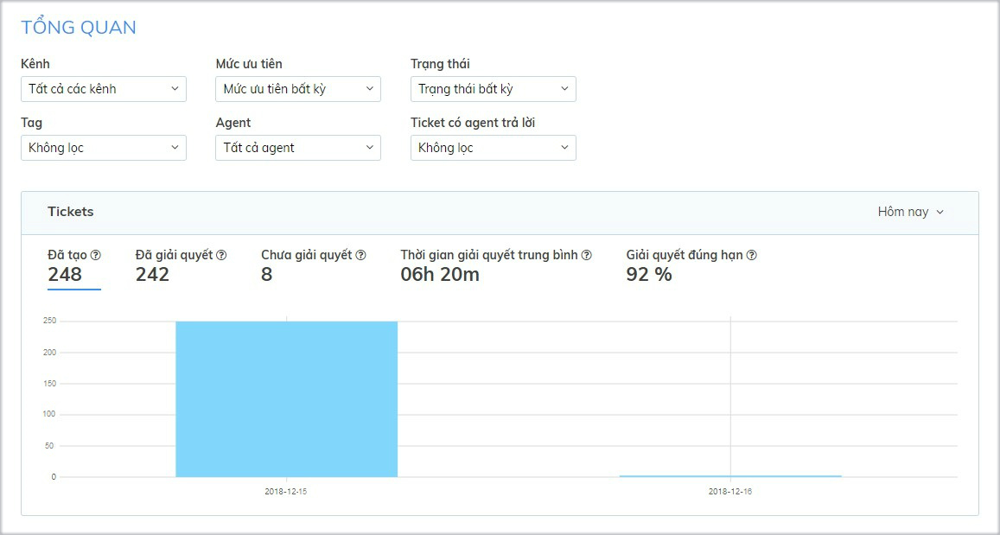

# Thống kê Tickets

Thống kê [Tickets](https://help.subiz.com/bat-dau-voi-subiz/lam-viec-tren-subiz/ticket-quan-ly-cham-soc-khach-hang) gồm 2 bảng thống kê Tổng quan và Hiệu suất của Agent theo các dữ liệu khác nhau. Từ đó, nhà quản lý có bức tranh toàn cảnh để đánh giá về tình hình chăm sóc  khách hàng và hiệu suất làm việc của từng agent.

### Các chỉ số thống kê

Thống kê Ticket sẽ tính 5 chỉ số sau theo đơn vị thời gian.

* **Đã tạo**: Tổng số ticket được tạo theo thời gian.
* **Đã giải quyết**: Tổng số ticket được giải quyết theo thời gian.
* **Chưa giải quyết**: Tổng số ticket chưa được giải quyết theo thời gian, như ticket đang mở, chờ xử lý, đóng nhưng chưa giải quyết theo thời gian.
* **Thời gian giải quyết trung bình**: Thời gian trung bình để agent giải quyết một ticket.
* **Giải quyết đúng hạn**: Tỷ lệ của số ticket được giải quyết theo thời hạn SLA trên tổng số ticket được giải quyết.

 [Tickets ](https://help.subiz.com/bat-dau-voi-subiz/lam-viec-tren-subiz/ticket-quan-ly-cham-soc-khach-hang)được tạo từ cuộc hội thoại nên mỗi ticket có thể được lọc theo các dữ liệu:

* **Kênh** tương tác như Subiz chat, Subiz Email, Messenger.
* **Mức ưu tiên** của ticket như Thấp, Trung Bình, Cao, Khẩn Cấp.
* **Trạng thái** của ticket như Đang mở, Chờ xử lý, Đã giải quyết, Đóng.
* **Tag** của ticket chính là tag của hội thoại.
* **Agent**
* **Ticket** có agent trả lời.

### Cách đọc thống kê Tickets

#### Tickets Tổng quan

Sau khi chọn các tiêu chí để thống kê, bạn có thể quan sát dữ liệu được thống kê dưới dạng biểu đồ. 

* **Trục dọc:** Số lượng ticket
* **Trục ngang:** Trục thời gian 

#### Ticket Hiệu suất của Agent

Bảng thống kê liệt kê đầy đủ danh sách agent của tài khoản và số lượng ticket của từng agent theo thời gian. Từ đó, bạn sẽ có đánh giá, so sánh đối chiếu kết quả của agent trong việc tiếp nhận và giải quyết các vấn đề của khách hàng.

