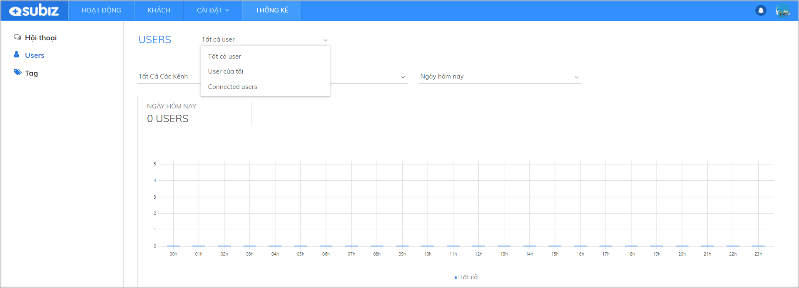
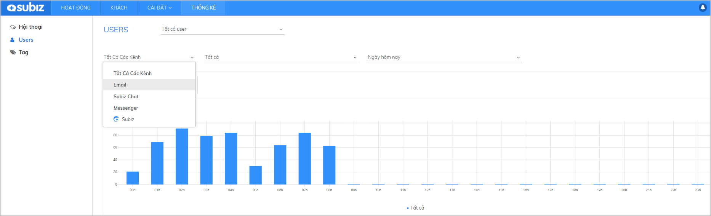
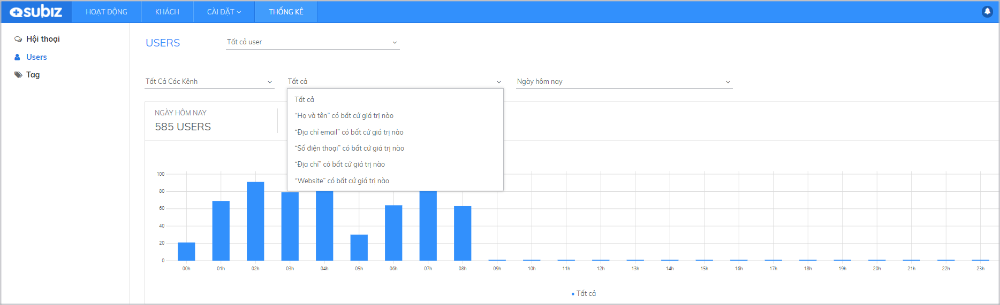
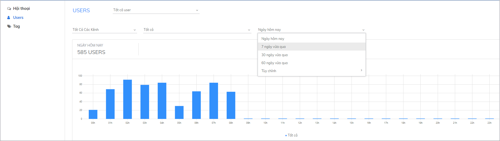
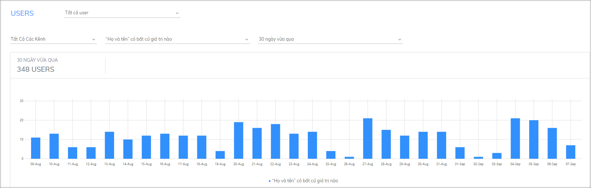

# Thống kê User

Thống kê User cho phép bạn thống kê được tất cả các khách hàng đã truy cập website và có trò chuyện, tương tác với bạn. Đây cũng là cơ sở giúp các chủ tài khoản \(Agent owner\) đánh giá được hiệu quả công việc của từng agent giúp nâng cao hiệu suất và cải thiện chất lượng hội thoại tốt hơn. 

### Các tiêu chí thống kê 

Tại trang thống kê User, bạn có thể thống kê số lượng khách hàng đã truy cập website hay số lượng khách hàng đã có tương tác theo **Agent, Kênh, Các giá trị** và **Thời gian**. 



Chọn đối tượng User bạn muốn thống kê:

* **User của tôi:** Số lượng user đã có tương tác với bạn.
* **Contacted User:** Tổng hợp số lượng user đã có tương tác với tất cả các agent.



Tổng hợp các user đã có tương tác qua các kênh như: Website, Messenger, Fanpage.




Đây chính là các thông tin bạn đã thu thập được qua quá trình tương tác hoặc thu thập tự động qua Automation hỏi thông tin khách hàng. Tùy vào nhu cầu bạn có thể tạo các trường dữ liệu phù hợp để thu thập và thống kê các thông tin bạn đã thu thập được từ khách hàng.   
Ví dụ: bạn có thể thống kê các khách hàng đã có thông tin họ và tên như sau:




Bạn có thể lọc theo các khoảng thời gian cụ thể và thực hiện so sánh để thấy sự biến động.




### Cách đọc biểu đồ thống kê 

Sau khi chọn các tiêu chí để thống kê, bạn có thể quan sát dữ liệu được thống kê dưới dạng biểu đồ. 

* **Trục dọc:** Số lượng user
* **Trục ngang:** Trục thời gian \(đơn vị thời gian là ngày/ giờ tùy theo khoảng thời gian mà bạn chọn\).

Qua biểu đồ thống kê này, bạn sẽ quan sát được số lượng user có tương tác cụ thể tại thời điểm được chọn. Nhờ vậy, bạn vừa có thể đánh giá tổng quan số lượng user truy cập, tương tác theo từng thời gian, từng kênh hay agent phụ trách. Bạn sẽ đánh giá được hiệu quả tương tác qua từng kênh hay hiệu suất làm việc của các agent dễ dàng và thuận tiện nhất.

Ví dụ: Thống kê User đã thu thập được thông tin Họ và tên trong 30 ngày qua:

