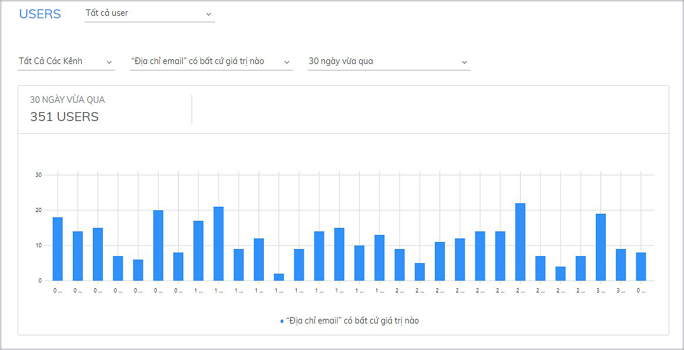

# Thống kê Users

[Thống kê Users](https://app.subiz.com/reports/user) là thống kê số lượng khách hàng mới đã truy cập website, có tương tác qua Subiz trong một khoảng thời gian. Đây cũng là cơ sở giúp các Marketing, nhà quản lý đánh giá được tổng quan khách hàng và tỷ lệ chuyển đổi của doanh nghiệp.

### Các thông số thống kê User

Tại trang [THỐNG KÊ  Users](https://app.subiz.com/reports/user), bạn có thể thống kê số lượng khách hàng đã truy cập website hay số lượng khách hàng đã có tương tác theo các thông số như **Phân khúc user**, **Kênh**, **Trường dữ liệu của user**, **Thời gian**



Phân khúc user là nhóm khách hàng đã được phân chia. Gồm 3 phân khúc user chính: Tất cả user, User của tôi, Connected users  
\([Xem thêm về phân khúc user](https://help.subiz.com/su-dung-subiz-nang-cao/quan-ly-du-lieu/phan-khuc-khach-hang/su-dung-phan-khuc-khach-hang-mac-dinh)\)

* **User của tôi:** là khách hàng đã có tương tác trò chuyện với bạn.
* **Contacted users:** là khách hàng đã có tương tác trò chuyện với tất cả các agent.
* **Tất cả user**: là khách hàng đã truy cập vào website




Các kênh chăm sóc khách hàng và bán hàng của bạn như: Email, Subiz chat trên Website, Fanpage Messenger.




Trường dữ liệu của user là những dữ liệu khách hàng đã được thu thập và cập nhật qua Automation hỏi thông tin hay tư vấn viên chủ động cập nhật khi trò chuyện với khách.  
Tùy theo nhu cầu, bạn có thể tạo các trường dữ liệu khách hàng phù hợp để thu thập và thống kê.




Bạn có thể chọn một ngày cụ thể hoặc một khoảng thời gian để chạy thống kê user.




### Cách đọc biểu đồ thống kê 

Sau khi chọn các tiêu chí để thống kê, bạn có thể quan sát dữ liệu được thống kê dưới dạng biểu đồ. 

* **Trục dọc:** Số lượng user
* **Trục ngang:** Trục thời gian \(đơn vị thời gian là ngày/ giờ tùy theo thời gian bạn chọn\).

Qua biểu đồ thống kê này, bạn sẽ quan sát được số lượng user có tương tác cụ thể trong khoảng thời gian được chọn. Từ đó, bạn có thể đánh giá tổng quan số lượng user truy cập, tương tác theo từng thời gian, từng kênh hay có thông tin cụ thể. 

Ví dụ: Thống kê **Tất cả User** đã thu thập được thông tin **Địa chỉ email** trong **30 ngày vừa qua**

