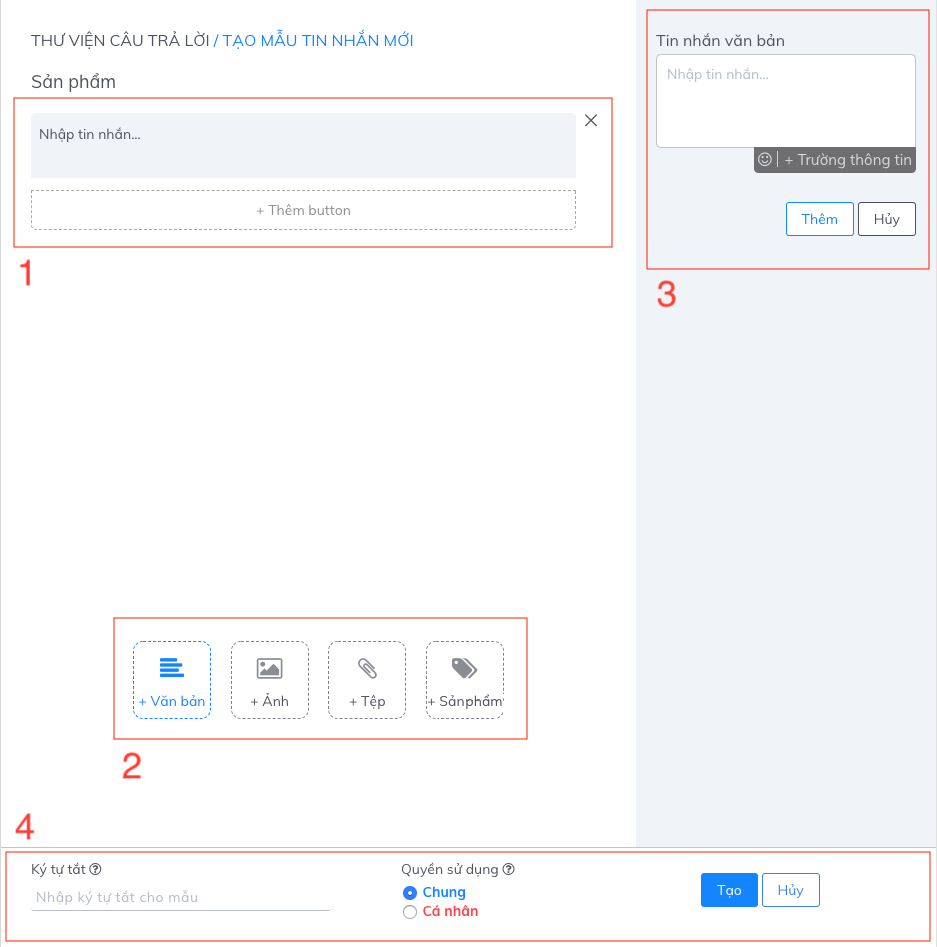
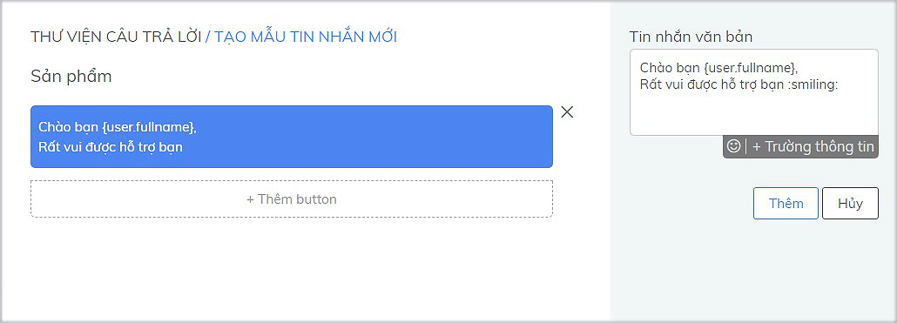
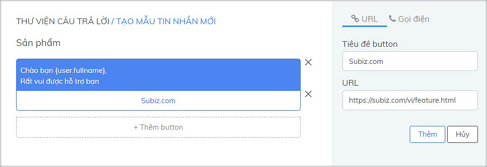
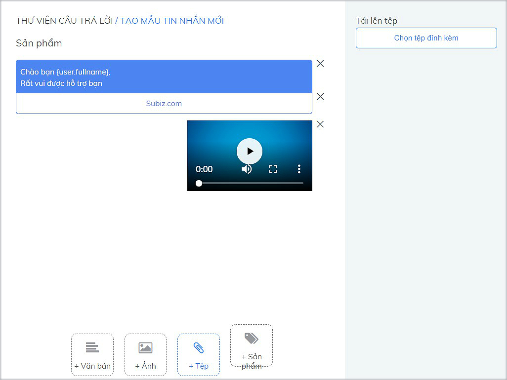
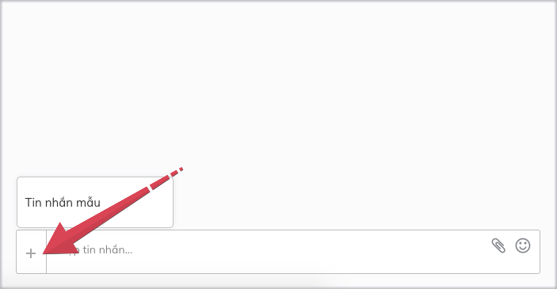
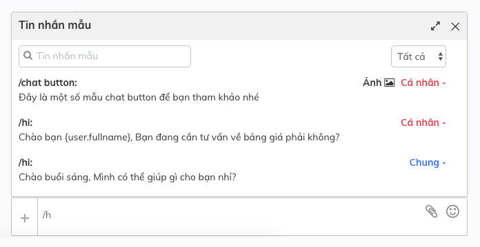

# Mẫu tin nhắn

Mẫu tin nhắn được phát triển hoàn toàn mới, thay thế cho thư viện câu trả lời và cập nhật đa dạng nhiều mẫu tin nhắn gồm tin nhắn văn bản kèm button, hình ảnh, đính kèm tệp và sản phẩm của Doanh Nghiệp..

Agent sẽ rút ngắn thời gian trả lời cũng như đảm bảo sự ổn định và chính xác cho các câu hỏi thường gặp từ phía khách hàng, giúp tăng chất lượng cuộc hội thoại và giảm thiểu thời gian chờ đợi của khách hàng.

Mỗi Agent đều có quyền tạo Mẫu tin nhắn cho riêng Cá nhân sử dụng hoặc Chung cho tất cả agent trong tài khoản sử dụng trên các kênh tương tác như Subiz chat, Email,....

### Hướng dẫn tạo Mẫu tin nhắn mới

Để tạo mẫu tin nhắn mới, bạn truy cập [Mẫu tin nhắn](https://app.subiz.com/message-template) &gt; chọn **Kênh** **tương tác**  &gt; **Nhập nội dung tin nhắn mẫu** &gt; Điền **Ký tự tắt** để dễ dàng tìm kiếm mẫu tin nhắn &gt; Chọn **Quyền sử dụng: Chung hoặc Cá nhân** &gt; Chọn **Tạo** để hoàn thành 

Dưới đây là ví dụ tạo tin nhắn mẫu mới trên kênh Subiz chat.

Trong mục TẠO MẪU TIN NHẮN MỚI có 3 vùng chính:

* \(1\) Vùng hiển thị nội dung mẫu tin nhắn
* \(2 + 3\) Vùng nhập nội dung mẫu tin nhắn:  Agent có thể chọn tạo mẫu tin nhắn theo từng kiểu nội dung riêng như tin nhắn mẫu văn bản, tin nhắn mẫu ảnh, tin nhắn mẫu Sản phẩm, tin nhắn mẫu Tệp; hoặc thêm cùng lúc nhiều kiểu nội dung trong 1 mẫu tin nhắn.
* \(4\) Vùng tạo Ký tự tắt và chọn Quyền sử dụng mẫu tin nhắn

#### **1.Thêm văn bản**

Khi agent chọn Tạo mẫu tin nhắn mới, sẽ hiển thị ô Tin nhắn văn bản để bạn nhập nội dung mẫu tin nhắn, thêm Icon cảm xúc và Trường thông tin của khách hàng như Họ tên - Fullname, Emails, Phone,...để tạo sự gần gũi và đem lại cảm giác riêng biệt cho khách.

Phía dưới phần hiển thị nội dung có chức năng thêm button giúp khách hàng click và liên kết tới trang đích. Có 2 loại button là:

* URL - gắn link trang sản phẩm 
* Gọi điện - gắn số điện thoại để khách click và gọi trực tiếp tới hotline của Doanh Nghiệp.

#### 2. Thêm Ảnh

Agent có thể thêm tối đa 10 hình ảnh trong 1 mẫu tin nhắn. 

Danh sách ảnh hiển thị dưới dạng slide, có icon di chuyển ảnh trước và sau hoặc click vào danh sách ảnh thu nhỏ phía dưới để xem lại các ảnh tải lên. 

#### 3. Thêm Tệp

Chức năng này giúp agent có thể đính kèm Tệp trong mẫu tin nhắn như PDF \(.pdf\), DOC \(.docs\), EXEL \(.xlxs\),... Các loại file Subiz hỗ trợ chạy và xem trực tiếp ngay trên Subiz : Audio, Image, Video.

#### 4. Thêm Sản phẩm

Chức năng này cho phép agent thêm tối đa 10 sản phẩm trong 1 mẫu tin nhắn. Danh sách sản phẩm sẽ hiển thị dạng slide gồm ảnh thu nhỏ của sản phẩm, tên sản phẩm, nội dung miêu tả và giá.

Để thêm sản phẩm, agent sẽ tìm kiếm ở ô Tìm kiếm.  Lưu ý: Bạn cần tạo sản phẩm tại mục [Sản phẩm](https://app.subiz.com/settings/content) trước.   
  
****Agent có thể click vào vùng ảnh sản phẩm hoặc tên sản phẩm để truy cập vào link trang sản phẩm và xem thông tin chi tiết của sản phẩm trên website. 

### **Cách sử dụng mẫu tin nhắn** 

Khi mẫu tin nhắn mới được tạo thành công, agent có thể sử dụng mẫu tin nhắn trong [mỗi cuộc hội thoại](https://app.subiz.com/activities) với khách hàng. 

Ví dụ trên kênh Subiz chat, Agent có 2 cách sử dụng mẫu tin nhắn: 

*  Cách 1: Tại ô Nhập tin nhắn, nhấp chuột vào  icon **+** và chọn **Tin nhắn mẫu** để hiển thị danh sách các mẫu tin nhắn &gt; Di chuyển chuột chọn tin nhắn mẫu &gt; chọn Enter gửi đi

*  Cách 2: Tại ô Nhập tin nhắn, bắt đầu bằng **\ + ký tự tắt** và chọn tin nhắn mẫu &gt; Enter gửi đi

### Một số lưu ý sử dụng mẫu tin nhắn 

#### **1.**  Mẫu Email có thể tạo dạng văn bản hoặc HTML

Sử dụng mã HTML để tạo những mẫu email sáng tạo và ấn tượng.

**2. Mẫu tin nhắn ngắn gọn và đi thẳng vào vấn đề**

Khách hàng luôn muốn được nhanh chóng hỗ trợ giải quyết vấn đề của mình. Hãy gửi tin nhắn ngắn gọn. và trả lời đúng vấn đề của khách hàng.

#### 3. Cá nhân hóa tin nhắn mẫu tới Trường thông tin khách hàng 

Với chức năng thêm Trường thông tin, bạn có thể cá nhân hóa tin nhắn như gọi tên riêng của khách hàng.

#### 4. **Sử dụng Ký tự tắt ngắn và dễ nhớ**

Thư viện câu trả lời thường được sử dụng trong một số trường hợp nhất định như lời chào, cảm ơn, báo giá, thông tin khuyến mãi, thông tin liên hệ,...

Tạo phím tắt ngắn và dễ nhớ giúp bạn dễ dàng tim kiếm sử dụng khi cần thiết.

**5. Thường xuyên cập nhật mới cho Mẫu tin nhắn**

Thay đổi để phát triển. Với mỗi ****mẫu tin nhắn, bạn hãy thường xuyên tùy chỉnh làm mới câu chữ và cách diễn đạt hay hơn khi gửi tới khách hàng của mình.

Bạn có thể vào Mẫu tin nhắn và tùy chỉnh trực tiếp mẫu tin nhắn đã có hoặc xóa đi để  tạo mẫu tin nhắn mới.

\*\*\*\*

#### 

  

  
****

  

