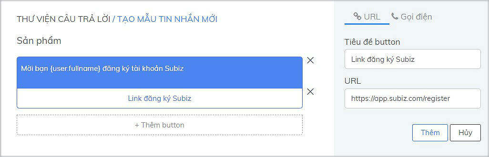
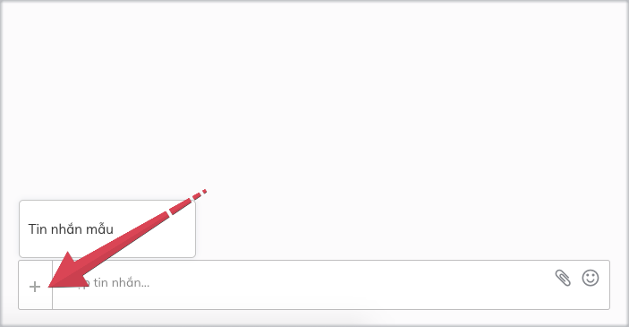

# Mẫu tin nhắn

Mẫu tin nhắn giúp agent rút ngắn thời gian trả lời cũng như đảm bảo sự ổn định và chính xác cho các câu hỏi thường gặp từ phía khách hàng, giúp tăng chất lượng cuộc hội thoại và giảm thiểu thời gian chờ đợi của khách  hàng.

Bạn có thể tạo những Mẫu tin nhắn theo từng kênh tương tác như Subiz chat, Email,... và lựa chọn chế độ hiển thị **Chung** cho tất cả agent cùng sử dụng hoặc **Cá nhân** chỉ riêng bạn sử dụng.

Mẫu tin nhắn hỗ trợ nhiều kiểu nội dung như:

* **Tin nhắn văn bản**: gồm nội dung tin nhắn văn bản, có thể thêm icon emoji cảm xúc, thông tin cá nhân của khách hàng và thêm button như ****button dẫn link URL trang web, button gọi số điện thoại
* **Hình ảnh**: Hỗ trợ tải lên tối đa 10 ảnh/ 1 mẫu tin nhắn
* **Tệp đính kèm**: hỗ trợ nhiều định dạng như DOC \(.doc\) PDF \(.pdf\), TXT \(.txt\), CSV \(.csv\), RAR \(.zip\),... và có thể xem trực tiếp trên Subiz tệp Audio, Video
* **Sản phẩm**: Hỗ trợ hiển thị  tối đa 10 sản phẩm / 1 mẫu tin nhắn

### Cách tạo mẫu tin nhắn trên Subiz chat

Bạn có thể chọn tạo mẫu tin nhắn theo từng kiểu nội dung riêng như tin nhắn mẫu văn bản, tin nhắn mẫu hình ảnh, tin nhắn mẫu Sản phẩm, Tin nhắn mẫu đính kèm hay tin nhắn mẫu button;  
hoặc kết hợp đồng thời nhiều kiểu nội dung trong 1 mẫu tin nhắn.

Để tạo mẫu tin nhắn mới trên kênh Subiz chat, bạn truy cập vào [**Thư viện câu trả lời**](https://app.subiz.com/message-template) &gt; chọn **Subiz chat** &gt; Thao tác 5 bước sau:

* Bước 1: Chọn kiểu nội dung tin nhắn mẫu: Văn bản - Hình ảnh - Tệp - Sản phẩm 
* Bước 2: Nhập nội dung tin nhắn tương ứng với từng kiểu nội dung đã chọn và Thêm

Ví dụ: Tạo  mẫu tin nhắn văn bản &gt; chọn Văn bản &gt; Nhập  Tin nhắn văn bản &gt; Thêm &gt; chọn Thêm button &gt; Thêm

Ví dụ: Tạo mẫu tin nhắn hình ảnh &gt; Chọn Hình ảnh &gt; Chọn Ảnh

Ví dụ: Tạo  mẫu tin nhắn gồm văn bản, button và hình ảnh &gt; chọn Văn bản &gt; Nhập Tin nhắn văn bản &gt; Thêm &gt; chọn Thêm button &gt; Thêm &gt; Chọn Hình ảnh &gt; Chọn Ảnh 

* Bước 3: Điền **Ký tự tắt** để Agent nhanh chóng tìm kiếm và sử dụng tin nhắn mẫu
* Bước 4: Chọn **Quyền sử dụng** tin nhắn mẫu là **Chung** cho tất cả agent hoặc **Cá nhân** riêng bạn sử dụng
* Bước 5: Chọn **Tạo** để hoàn thành mẫu tin nhắn

### Hướng dẫn sử dụng mẫu tin nhắn trên Subiz chat

Khi mẫu tin nhắn mới được tạo thành công, agent có thể sử dụng mẫu tin nhắn trong[ mỗi cuộc hội thoại ](https://app.subiz.com/activities)với khách hàng. Agent có 2 cách sử dụng tin nhắn mẫu:

* Cách 1: Tại ô Nhập tin nhắn, chọn icon **+** và ****chọn **Tin nhắn mẫu** gửi khách

* Cách 2: Tại ô Nhập tin nhắn, bắt đầu bằng **\ + ký tự tắt** và chọn tin nhắn mẫu gửi khách

### Cách tạo mẫu Email và sử dụng trên Subiz Email

Để tạo Mẫu email, bạn truy cập vào [**Thư viện câu trả lời**](https://app.subiz.com/message-template) &gt; chọn Email &gt;  Nhập nội dung email mẫu:

Mẫu Email sẽ bao gồm **Tiêu đề email** , **Địa chỉ email người gửi**, **Nhập nội dung email** kiểu văn bản trực quan hoặc mã HTML.  Lưu ý:

* Khi tạo email sẽ có chức năng soạn thảo, thêm file đính kèm và thêm trường thông tin của khách hàng như Họ tên, Địa chỉ,....
* Điền **Ký tự tắt** để nhanh chóng tìm kiếm và sử dụng mẫu email
* Chọn **Quyền sử dụng** mẫu Email là **Chung** cho tất cả agent hoặc **Cá nhân** riêng bạn sử dụng

Khi mẫu email tạo thành công, trong hội thoại email, bạn có thể chọn Mẫu email và sử dụng

  
  

