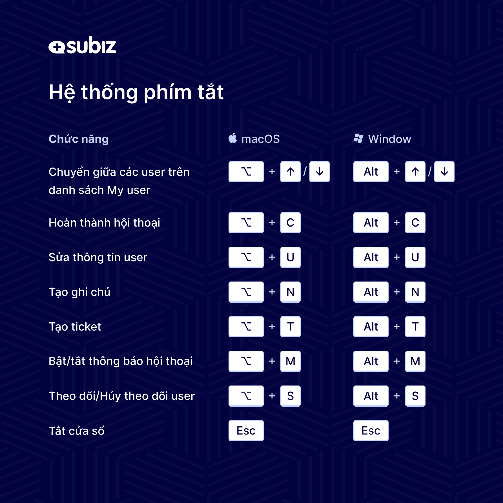

# Phím tắt trên Dashboard

Phím tắt là chức năng được tạo ra nhằm hỗ trợ agent làm việc hiệu quả hơn. Các thao tác thủ công sẽ được thay thế, từ đó, bạn có thể tăng hiệu suất làm việc và chất lượng tư vấn khách hàng. Danh sách các phím tắt chi tiết như sau:

| **Phím tắt**      | **Chức năng** |
| :--- | :--- |
| **Alt + M**  | Mute/Unmute hội thoại đang chọn |
| **Alt + C** | Hoàn thành hội thoại |
| **Alt +** ⬆**/** ⬇  | Di chuyển user lên xuống trên danh sách User của tôi |
| **Alt + T** | Tạo Ticket |
| **Alt + U** | Sửa thông tin user |
| **Alt + N** | Tạo mới note |
| **Alt + S** | Theo dõi hoặc bỏ theo dõi user |
| **ESC** | Tắt tất cả cửa sổ đang bật trên màn hình |
| **CTRL + V** | Gửi file ảnh nhanh qua cửa sổ chat Dashboard. Nếu bạn muốn gửi ảnh chụp màn hình nhanh qua hội thoại với khách trên dashboard, bạn chỉ cần ấn phím Prtscr ở bàn phìm rồi mở cửa sổ dashboard và ấn Ctrl + V để gửi file ảnh này. |


Bạn còn băn khoăn? Hãy chat trực tuyến với hỗ trợ viên ngay trên website Subiz.com!


