# Quản lý hội thoại Subiz chat

Hội thoại Subiz chat là cuộc chat tư vấn khách hàng trên website.

Bắt đầu ngày làm việc, bạn sẽ trả lời tin nhắn của khách hàng và giải quyết các yêu cầu chat trên trang [**HOẠT ĐỘNG**](https://app.subiz.com/convo) của Subiz tại link [**app.subiz.com/convo**](https://app.subiz.com/convo)\*\*\*\*

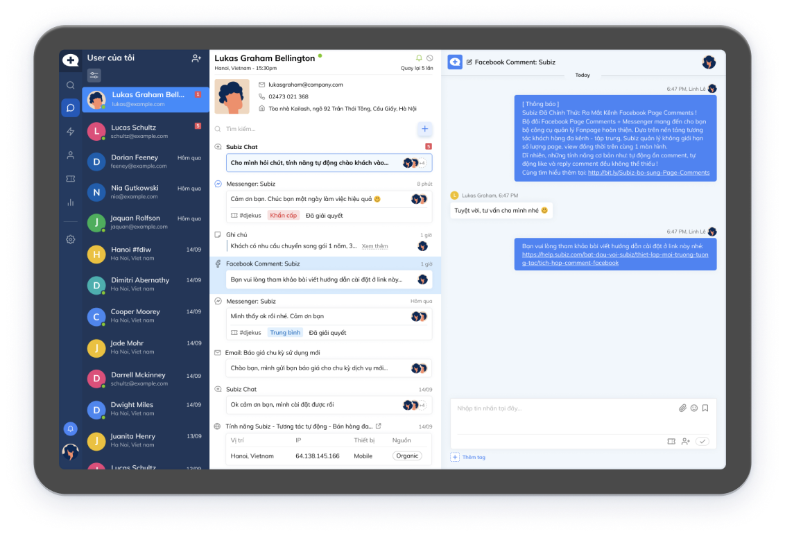

Giao diện trang [**HOẠT ĐỘNG**](https://app.subiz.com/convo) gồm 3 mục:

* Danh sách **User của tôi** \(khách hàng đã có tương tác\)
* Thông tin user và lịch sử hoạt động của user
* Màn hình hội thoại chat

### 1. Nhận và trả lời tin nhắn của khách hàng

Tin nhắn mới của khách hàng \(user\) gửi đến sẽ có thông báo đỏ. Click vào user để mở cửa sổ hội thoại và trả lời tư vấn khách.

* Nhấp chuột ô _**Nhập tin nhắn tại đây**_ và soạn nội dung tin nhắn 
* Enter để gửi tin nhắn

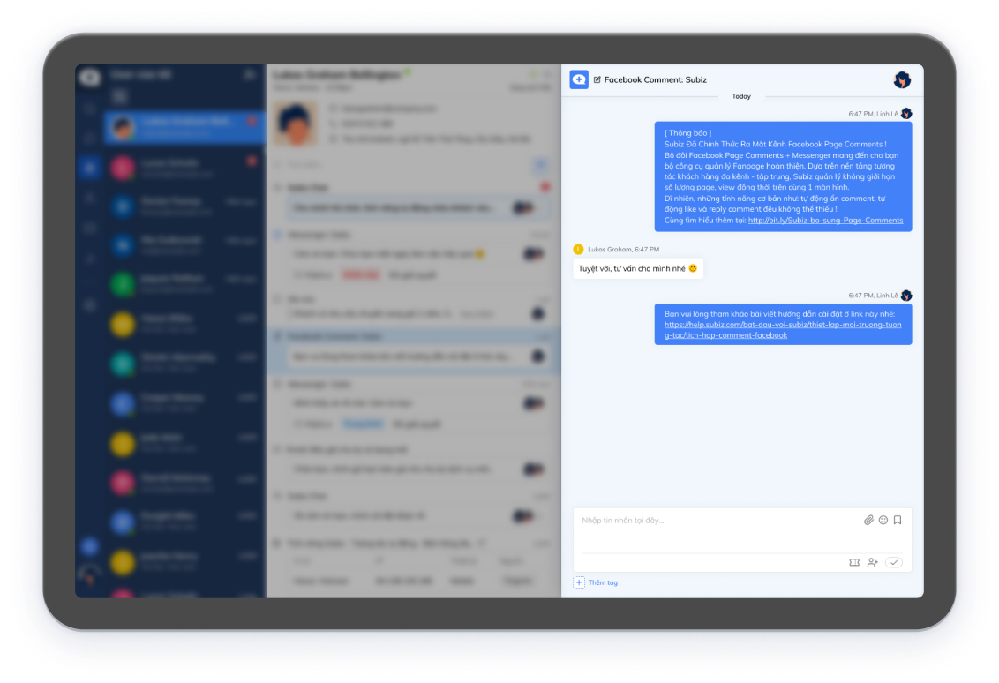


Tip nhỏ:

* Cho phép Subiz [thông báo tin nhắn mới](https://app.subiz.com/profile/setting-notification) để bạn nhận thông báo khách gửi tin nhắn mới
* Cài đặt [Rule phân phối hội thoại](https://app.subiz.com/settings/rule-setting) để agent nhận được chat của khách hàng


### 2. Gửi tin nhắn cho khách truy cập

Để xem danh sách khách truy cập website và đang xem trang của bạn, hãy vào trang [SUBIZ LIVE](https://app.subiz.com/visitors).

Chọn _**Say hello**_ và nhập tin nhắn gửi khách hàng.

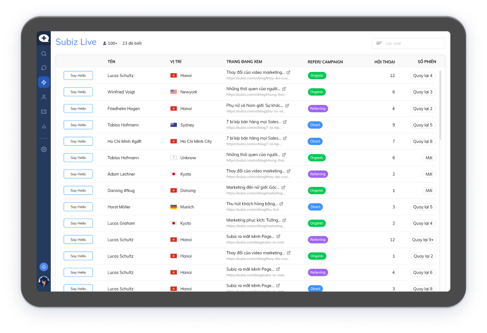


Tip hay: Bạn có thể tạo [M**ẫu tin nhắn**](https://app.subiz.com/message-template) **“hello”** để gửi lời chào nhanh chóng cho nhiều khách hàng**.**


### 3. Sử dụng Mẫu tin nhắn

Với những tin nhắn gửi đi nhiều lần cho các khách hàng, bạn có thể soạn sẵn mẫu tin nhắn và nhanh chóng gửi cho khách hàng khi cần.

Sử dụng mẫu tin nhắn:

* Dùng ký tự: Nhập **/ ký tự tắt** để tìm tin nhắn mẫu có sẵn
* Click chọn **Mẫu tin nhắn** và tìm kiếm tin nhẵn mẫu có sẵn

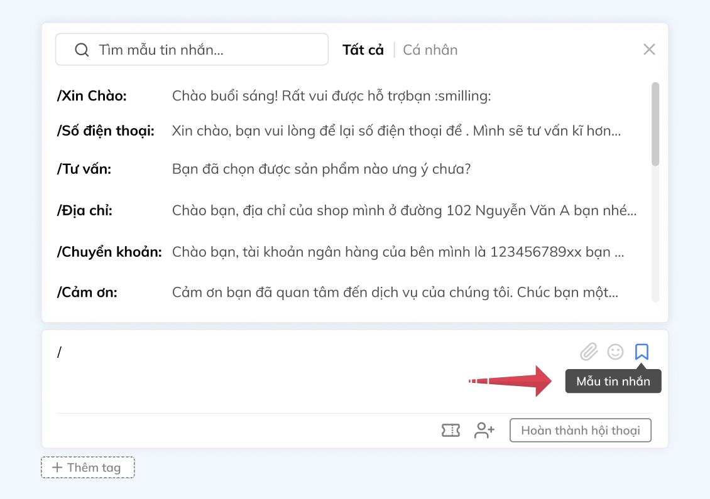


Lưu ý: Nếu bạn chưa có tin nhắn mẫu, hay Tạo mẫu tin nhắn như sau: Vào trang [**Mẫu tin nhắn**](https://app.subiz.com/message-template) &gt; Chọn Subiz chat &gt; Nhập tin nhắn &gt; Nhập Ký tự tắt &gt; Chọn Quyền riêng tư &gt; Tạo


### 4. Thêm Agent tham gia hội thoại

Khi cần trợ giúp từ đồng nghiệp để tham gia chat tư vấn khách hàng, bạn có thể thêm agent như sau:   
Click icon **Thêm Agent** &gt; Tìm kiếm agent &gt; Click chọn agent

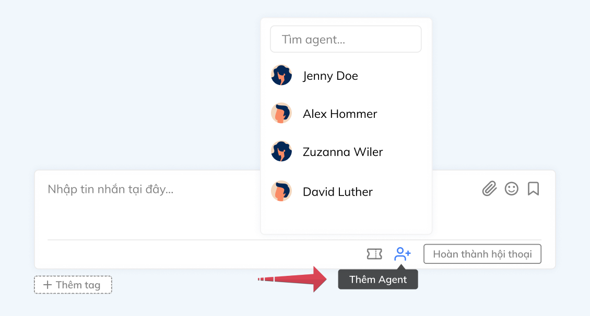

### 5. Thêm Tag hội thoại

Tag hội thoại để phân loại nội dung cuộc chat theo từng chủ đề khác nhau, giúp bạn tổng hợp và khái quát được yêu cầu của khách hàng.



Hướng dẫn thêm Tag cho cuộc hội thoại chat: Click button **Thêm Tag** &gt; Tìm kiếm Tag phù hợp &gt; Chọn Tag

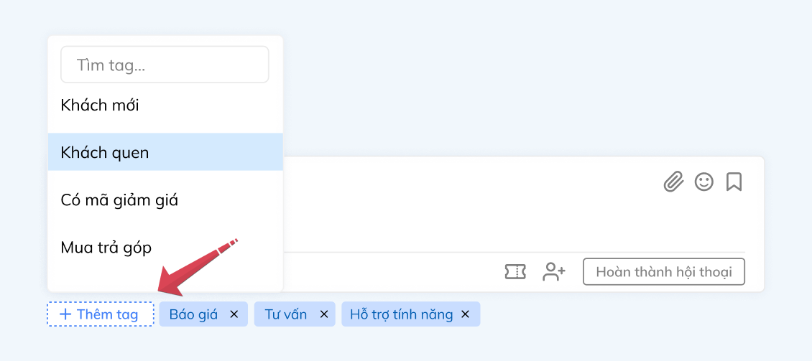



Xóa Tag: Chọn **X** ở button Tag đã chọn



Nếu bạn chưa có thẻ Tag, hãy tạo Tag mới theo hướng dẫn tại trang [TAG](https://app.subiz.com/settings/tags)



### 6. **Đính kèm tệp, hình ảnh, emoji cảm xúc**

Bạn tải lên và chia sẻ nhiều tệp, hình ảnh, video,... trong Subiz chat bằng cách sử dụng chức năng **Đính kèm.**

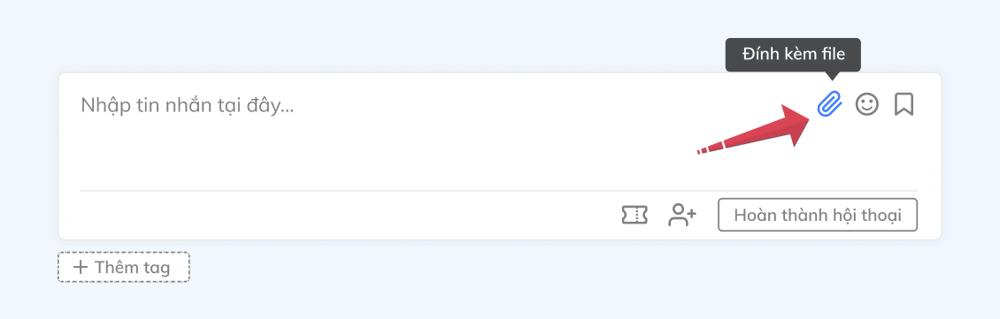

Gửi tin nhắn kèm biểu tượng cảm xúc sẽ tạo sự liên kết cá nhân mạnh mẽ với khách hàng của bạn. Chọn emoji cảm xúc ngay trong Subiz chat.

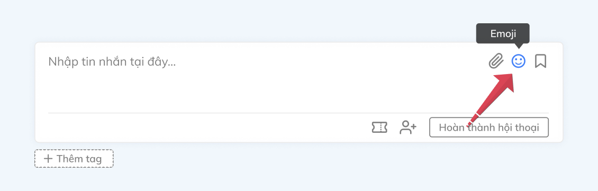

### 7. Ghi chú cho user khách hàng

Sử dụng Ghi chú trên Subiz để ghi nhanh vấn đề của khách hàng, lưu ý hay các bước xử lý tiếp theo.

Hướng dẫn tạo Ghi chú mới: Nhấp chuột **+** &gt; Chọn **Ghi chú** &gt; **Nhập nội dung ghi chú** &gt; Chọn **Thêm**

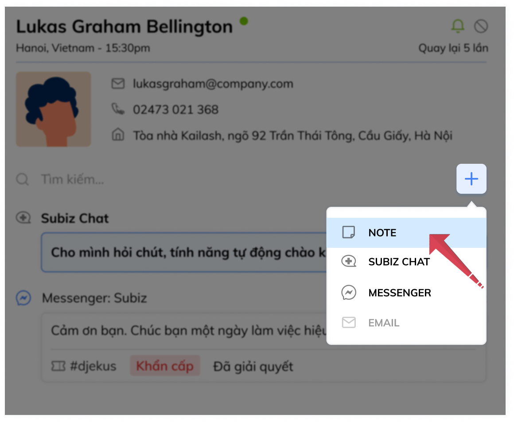

### 8. Sửa tiêu đề hội thoại

Tiêu đề hội thoại sẽ hiển thị tin nhắn đầu tiên khách hàng gửi tới. Bạn có thể sửa tiêu đề hội thoại để lướt nhanh cuộc hội thoại nắm bắt câu hỏi hay yêu cầu của khách hàng.

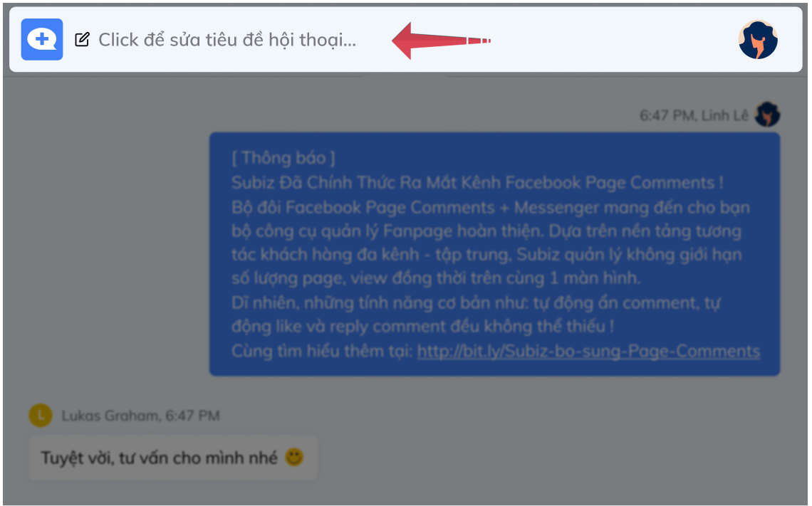

### 9. Chuyển ticket theo dõi sự vụ

Với một vấn đề của khách hàng cần thời gian xử lý sau khi chat, bạn có thể chuyển hội thoại thành Ticket để ghi nhận, theo dõi và giải quyết.  
Xem thêm [Ticket - Quản lý chăm sóc khách hàng](ticket-quan-ly-cham-soc-khach-hang.md)

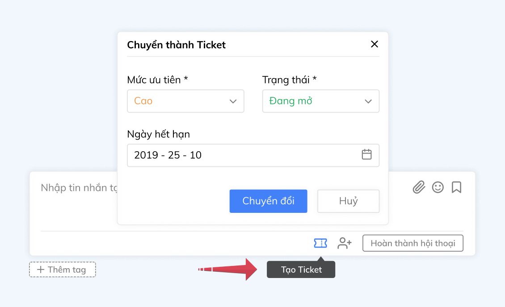

### 10. Hoàn thành hội thoại chat

Hoàn thành hội thoại chat giúp bạn nhận diện yêu cầu tư vấn của khách đã được hoàn thành. Đồng thời, các yêu cầu tư vấn mới của khách hàng sẽ được tạo thành hội thoại mới, bạn sẽ dễ dàng theo dõi các sự vụ khác nhau của khách hàng.

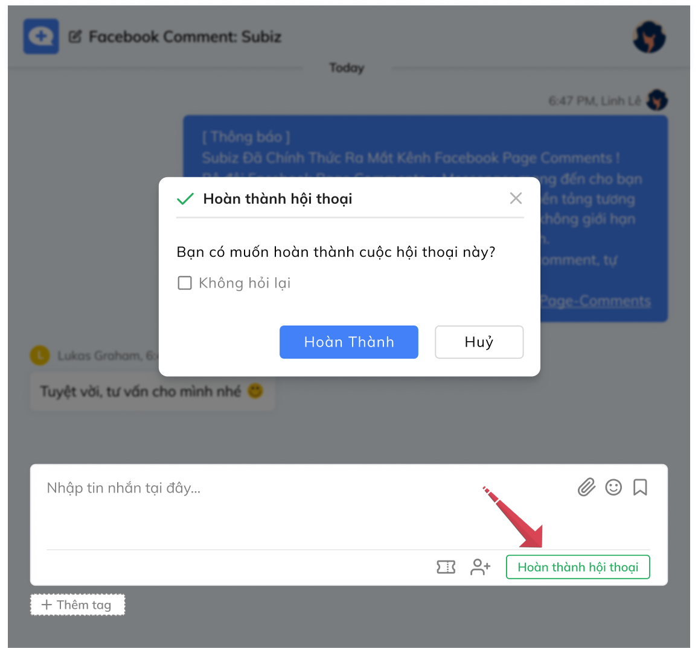

> Bạn cần hỗ trợ làm việc trên Subiz? Hãy liên hệ ngay tư vấn Subiz qua cửa sổ chat tại [Subiz.com](https://subiz.com/vi/feature.html)!

  
  
  
  
  

