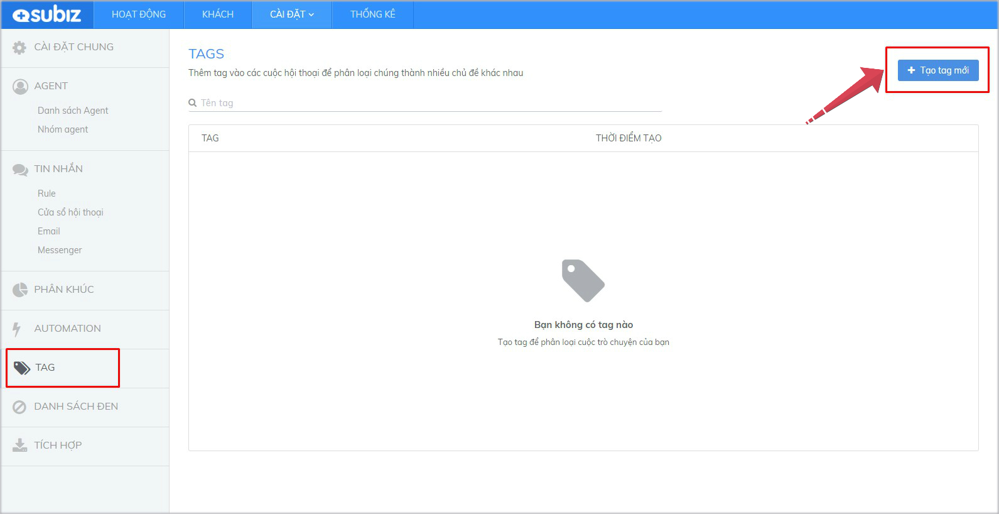
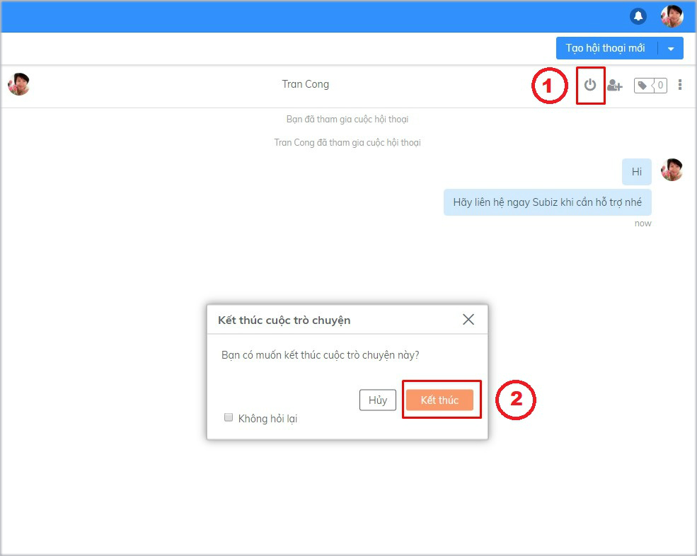
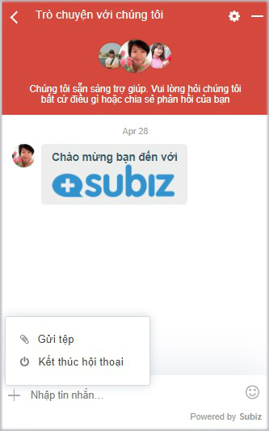

# Quản lý hội thoại Subiz chat

**Tương tác trên kênh**[ **Subiz chat**](https://subiz.com/vi/live-chat.html) **là cuộc hội thoại trò chuyện và tư vấn khách truy cập website**. Đây là những khách hàng tiềm năng đang có nhu cầu tìm hiểu về sản phẩm, dịch vụ và thông tin của doanh nghiệp.

Bắt đầu vào giờ làm việc, bạn cần đăng nhập trang quản lý Subiz qua đường link [App.subiz.com](https://app.subiz.com) để trả lời những tin nhắn khách đã gửi đến và kết nối với khách đang trực tuyến trên trang web.

### Nhận và trả lời tin nhắn của khách hàng



Khi truy cập website của bạn, khách hàng có thể gửi tin nhắn yêu cầu hỗ trợ ngay trên[ cửa sổ Subiz chat](https://subiz.com/vi/live-chat.html).

Để xem được tin nhắn mới từ khách hàng, bạn vào trang[ **HOẠT ĐỘNG**](https://app.subiz.com/activities) &gt; chọn **User của tôi** để xem các hội thoại mới chưa đọc &gt; Chọn hội thoại chưa đọc &gt; Cửa sổ chat mở, hãy nhập tin nhắn gửi khách.


**Lưu ý**: Nếu bạn không nhận được tin nhắn từ khách hàng, hãy xem lại [cài đặt tính năng RULE ](https://subiz.gitbook.io/subiz-document/bat-dau-voi-subiz/untitled/untitled/untitled)đã phân phối cuộc hội thoại của khách hàng cho bạn hay chưa?


[Subiz](https://subiz.com/vi/live-chat.html) sẽ thông báo âm thanh và thông báo màn hình khi có tin nhắn mới của khách hàng.


_**Lưu ý**_: Khi không nhận được thông báo tin nhắn mới, hãy kiểm tra lại đã cho phép Subiz thông báo màn hình chưa? Xem thêm [Cài đặt thông báo](https://help.subiz.com/bat-dau-voi-subiz/thiet-lap-moi-truong-tuong-tac/toi-uu-moi-truong-tuong-tac/cai-dat-thong-bao-tin-nhan-moi).





**Agent chủ động khởi tạo cuộc hội thoại**

Agent có thể quan sát khách hàng trên trang [**KHÁCH**](https://app.subiz.com/visitors) để biết khách hàng đang quan tâm thông tin gì và nhận diện khách hàng tiềm năng. Click **Say hello** và nhắn tin trò chuyện với khách hàng.  
Sử dụng [Mẫu tin nhắn](https://help.subiz.com/bat-dau-voi-subiz/lam-viec-tren-subiz/mau-tin-nhan) để nhanh chóng gửi tin nhắn tới khách của bạn.




### Thêm Agent vào cuộc hội thoại 

Khi bạn đang trò chuyện cùng khách hàng, bạn có thể Mời thêm Agent tham gia cuộc hội thoại và cùng hỗ trợ khách hàng.

Hướng dẫn thêm Agent: Chọn nút  **"Add Agent"**  &gt; Chọn **Agent**  &gt; Chọn **Thêm**


_**Lưu ý**_: Chỉ Agent được phân phối cuộc hội thoại mới có quyền thêm Agent khác.


### Sử dụng mẫu tin nhắn

[Mẫu tin nhắn](https://help.subiz.com/bat-dau-voi-subiz/lam-viec-tren-subiz/mau-tin-nhan) được soạn sẵn, giúp bạn gửi khách hàng một cách nhanh chóng và hiệu quả.

Mỗi Agent có quyền được tạo và quản lý mẫu tin nhắncủa riêng mình.  
  
Hướng dẫn cài đặt như sau:



 Để tạo mẫu tin nhắn mới, bạn truy cập [Mẫu tin nhắn](https://app.subiz.com/message-template) &gt; chọn **Kênh** Subiz chat &gt; **Nhập nội dung tin nhắn mẫu** &gt; Điền **Ký tự tắt** để dễ dàng tìm kiếm mẫu tin nhắn &gt; Chọn **Quyền sử dụng: Chung hoặc Cá nhân** &gt; Chọn **Tạo** để hoàn thành




Tại ô Nhập tin nhắn, nhấp chuột vào icon **+** và chọn **Tin nhắn mẫu** để hiển thị danh sách các mẫu tin nhắn &gt; Di chuyển chuột chọn tin nhắn mẫu &gt; chọn Enter gửi đi




### Sử dụng Emoji cảm xúc và chia sẻ file

Tại vùng nhập tin nhắn, bạn có thể lựa chọn gửi kèm biểu tượng cảm xúc hoặc file đính kèm.

### Gắn Tag hội thoại

Subiz Tag là tính năng gắn thẻ Tag cho mỗi cuộc hội thoại, giúp Agent dễ dàng phân loại và quản lý các tương tác của khách hàng.



Hướng dẫn tạo thẻ Tag mới:

1. [Đăng nhập **App.subiz.com** &gt; **Cài đặt** &gt; **Tài khoản** &gt; **Tag** &gt; **Tạo Tag mới**](https://app.subiz.com/settings/tags)

     2. Nhập **Tên Tag** &gt; **Tạo**


Lưu ý: Chỉ Agent được [phần quyền Cài đặt Tài khoản](https://subiz.gitbook.io/subiz-document/~/edit/primary/bat-dau-voi-subiz/untitled/quan-ly-agent/cac-loai-agent#phan-quyen-tai-khoan-agent) được phép Cài đặt Tag




Hướng dẫn gắn thẻ Tag: Chọn nút **Tag** &gt; chọn **tên thẻ Tag** &gt; **Enter**




Hướng dẫn xóa thẻ Tag: Chọn nút **Tag** &gt; chọn **X** xóa Tag




### Kết thúc hội thoại

[Subiz](https://subiz.com/vi/) sẽ tính cuộc hội thoại được kết thúc bằng hành động **Kết thúc**. Hành động này được thực hiện bởi Agent hoặc khách truy cập.



**Agent**: Kết thúc bằng cách chọn nút "**End Chat**" và xác nhận kết thúc cuộc hội thoại. Khách hàng sẽ nhận được thông báo là Agent đã kết thúc cuộc trò chuyện.




**Khách truy cập** có thể kết thúc ngay trên cửa sổ chat bằng cách chọn dấu **"+" &gt;** chọn **Kết thúc hội thoại**. Agent cũng sẽ nhận được thông báo khi khách truy cập kết thúc hội thoại.





_**Lưu ý**_: Khi cuộc hội thoại kết thúc sẽ có thông báo trên cửa sổ chat, đồng thời phần nhập tin nhắn sẽ chuyển màu xám và không thể thao tác thêm. **Để tiếp tục trò chuyện, bạn cần Tạo hội thoại mới.**


### Tạo ticket chăm sóc khách hàng

Từ một hội thoại của khách hàng trên bất kỳ kênh tương tác nào như Subiz chat, Email, Messenger,..., agent có thể chuyển thành [Ticket](https://help.subiz.com/bat-dau-voi-subiz/lam-viec-tren-subiz/ticket-quan-ly-cham-soc-khach-hang) để ghi nhận và theo dõi kết quả giải quyết yêu cầu của khách hàng

Xem thêm [cách quản lý và thống kê ticket](https://help.subiz.com/bat-dau-voi-subiz/lam-viec-tren-subiz/ticket-quan-ly-cham-soc-khach-hang)

### Chặn khách hàng

 Agent có thể chặn khách hàng đã có tương tác như sau: Trong cửa sổ hội thoại  chọn nút **Chặn** &gt; bật **ON** chức năng **Chặn người này**


Khi bạn chọn chức năng "**Chặn người này**", lưu ý:

* Khách hàng bị chặn có ảnh đại diện hình gạch chéo.
*  Với kênh [Subiz Chat](https://subiz.com/vi/live-chat.html), khách hàng sẽ  không nhìn thấy [cửa sổ chat Subiz ](https://subiz.com/vi/live-chat.html)trên website.
* Với kênh [Email](https://subiz.com/vi/email.html), [Email](https://subiz.com/vi/email.html) khách hàng gửi đến sẽ không hiển thị cho Agent.
* Với kênh [Messenger](https://subiz.com/vi/facebook-messenger.html), tin nhắn không hiển thị cho Agent. Nhưng tin nhắn vẫn tồn tại và hiển thị nếu bạn đăng nhập [Fanpage](https://subiz.com/vi/facebook-messenger.html).


> Bạn còn băn khoăn? Hãy chat trực tuyến với hỗ trợ viên ngay trên website [Subiz.com](https://subiz.com/vi/feature.html) nhé!

Hội thoại Subiz chat là cuộc chat tư vấn khách hàng trên website.

Bắt đầu ngày làm việc, bạn sẽ trả lời tin nhắn của khách hàng và giải quyết các yêu cầu chat trên trang [**HOẠT ĐỘNG**](https://app.subiz.com/convo) của Subiz tại link [**app.subiz.com/convo**](https://app.subiz.com/convo)\*\*\*\*

Giao diện trang [**HOẠT ĐỘNG**](https://app.subiz.com/convo) gồm 3 mục:

* Danh sách **User của tôi** \(khách hàng đã có tương tác\)
* Thông tin user và lịch sử hoạt động của user
* Màn hình hội thoại chat

### 1. Nhận và trả lời tin nhắn của khách hàng

Tin nhắn mới của khách hàng \(user\) gửi đến sẽ có thông báo đỏ. Click vào user để mở cửa sổ hội thoại và trả lời tư vấn khách.

* Nhấp chuột ô _**Nhập tin nhắn tại đây**_ và soạn nội dung tin nhắn 
* Enter để gửi tin nhắn


Tip nhỏ:

* Cho phép Subiz [thông báo tin nhắn mới](https://app.subiz.com/profile/setting-notification)
* Cài đặt [Rule phân phối hội thoại](https://app.subiz.com/settings/rule-setting) để agent nhận được chat của khách hàng


### 2. Gửi tin nhắn cho khách truy cập

Để xem danh sách khách truy cập website và đang xem trang của bạn, hãy vào trang [SUBIZ LIVE](https://app.subiz.com/visitors).

Chọn _**Say hello**_ và nhập tin nhắn gửi khách hàng.


Tip hay: Bạn có thể tạo [M**ẫu tin nhắn**](https://app.subiz.com/message-template) **“hello”** để gửi lời chào nhanh chóng cho nhiều khách hàng**.**


### 3. Sử dụng Mẫu tin nhắn

Với những tin nhắn gửi đi nhiều lần cho các khách hàng, bạn có thể soạn sẵn mẫu tin nhắn và nhanh chóng gửi cho khách hàng khi cần.

Sử dụng mẫu tin nhắn:

* Dùng ký tự: Chọn **/** + **ký tự tắt**
* Mở Mẫu tin nhắn và tìm kiếm


Lưu ý: Nếu bạn chưa có tin nhắn mẫu, hay Tạo mẫu tin nhắn như sau: Vào trang [**Mẫu tin nhắn**](https://app.subiz.com/message-template) &gt; chọn Subiz chat &gt; Nhập tin nhắn &gt; Nhập Ký tự tắt &gt; Chọn Quyền riêng tư &gt; Tạo


### 4. Thêm Agent tham gia hội thoại

Khi cần trợ giúp từ đồng nghiệp để tham gia chat tư vấn khách hàng, bạn có thể thêm agent như sau: Click icon Thêm agent &gt; tìm kiếm agent &gt; Click chọn agent

### 5. Thêm Tag hội thoại

Tag hội thoại để phân loại nội dung cuộc chat theo từng chủ đề khác nhau, giúp bạn tổng hợp và khái quát được yêu cầu của khách hàng.



Hướng dẫn thêm Tag cho cuộc hội thoại chat: Click button Thêm Tag &gt; Tìm kiếm Tag phù hợp &gt; Chọn Tag



Xóa Tag: Chọn X ở button Tag đã chọn



Nếu bạn chưa có thẻ Tag, hãy tạo Tag mới theo hướng dẫn tại trang [TAG](https://app.subiz.com/settings/tags)



### 6. **Đính kèm tệp, hình ảnh, emoji cảm xúc**

Bạn tải lên và chia sẻ nhiều tệp, hình ảnh, video,... trong Subiz chat bằng cách sử dụng chức năng **Đính kèm.**

Gửi tin nhắn kèm biểu tượng cảm xúc sẽ tạo sự liên kết cá nhân mạnh mẽ với khách hàng của bạn. Chọn emoji cảm xúc ngay trong Subiz chat.

### 7. Ghi chú cho user khách hàng

Sử dụng Ghi chú trên Subiz để ghi nhanh vấn đề của khách hàng, lưu ý hay các bước xử lý tiếp theo.

Tạo Ghi chú mới: Nhấp chuột + &gt; Chọn Ghi chú &gt; Nhập nội dung ghi chú &gt; Chọn Thêm

### 8. Sửa tiêu đề hội thoại chat

Tiêu đề hội thoại chat sẽ hiển thị tin nhắn đầu tiên khách hàng gửi tới. Bạn có thể sửa tiêu đề hội thoại để lướt nhanh cuộc hội thoại nắm bắt câu hỏi hay yêu cầu của khách hàng.

### 9. Chuyển ticket theo dõi sự vụ

Với một vấn đề của khách hàng cần thời gian xử lý sau khi chat, bạn có thể chuyển hội thoại thành Ticket để ghi nhận, theo dõi và giải quyết.

### 10. Kết thúc hội thoại chat

Kết thúc hội thoại chat giúp bạn nhận diện yêu cầu tư vấn của khách đã được hoàn thành. Đồng thời, các yêu cầu tư vấn mới của khách hàng sẽ được tạo thành hội thoại mới, bạn sẽ dễ dàng theo dõi các sự vụ khác nhau của khách hàng.  
  
  
  
  

