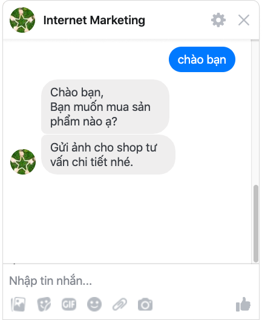

# Quản lý tin nhắn messenger và bình luận fanpage

Bạn có thể quản lý không giới hạn số lượng Fanpage trong tài khoản Subiz. Tất cả bình luận, tin nhắn chat từ hàng chục, hàng trăm Fanpage của bạn sẽ hiển thị cùng lúc trên 1 trang quản lý Subiz. Bạn sẽ tiết kiệm được nhiều thời gian và công sức thay vì chuyển tab liên tục giữa các Fanpage.

Bắt đầu ngày làm việc, bạn đăng nhập Subiz, vào trang **HOẠT ĐỘNG** qua đường link ****[**App.subiz.com/convo**](https://app.subiz.com/convo)

### **Quản lý tin nhắn Messenger**

Tin nhắn messenger từ các fanpage được nhận diện bằng icon \(**~**\)và tên fanpage.  
Ví dụ: _**Tin nhắn messenger**_ từ fanpage _**Internet Marketing**_

**Nhận và trả lời tin nhắn messenger:**

* Click User để hiển thị thông tin của khách hàng
* Chọn hội thoại messenger có tin nhắn mới
* Nhập nội dung tin nhắn vào ô Nhập nội dung và Enter gửi đi

**Một số chức năng hỗ trợ cho hội thoại trên kênh messenger:**

1. Cập nhật thông tin khách hàng như Họ tên, Số điện thoại, Nguồn Fanpage,...
2. Gắn Tag cho cuộc hội thoại
3. Thêm Agent tham gia hội thoại
4. Sử dụng tin nhắn mẫu
5. Đính kèm file
6. Gửi tin nhắn emoji
7. Chuyển thành Ticket
8. Hoàn thành hội thoại

### Quản lý bình Luận fanpage

Bình luận fanpage được nhận diện bằng icon \(**f**\) và tên fanpage:   
Ví dụ: _**Bình luận**_ từ fanpage _**Internet Marketing**_

**Nhận và trả lời bình luận Fanpage:**

* Click User để hiển thị thông tin của khách hàng
* Chọn hội thoại bình luận có tin nhắn mới
* Nhập nội dung tin nhắn vào ô Nhập nội dung và Enter gửi đi

**Một số chức năng hỗ trợ trên kênh messenger:**

1. Cập nhật thông tin khách hàng như Họ tên, số điện thoại, Nguồn Fanpage,...
2. Gắn Tag cho cuộc hội thoại
3. Thêm Agent tham gia hội thoại
4. Đính kèm file
5. Gửi tin nhắn emoji
6. Chuyển thành Ticket
7. Hoàn thành hội thoại

Lưu ý: Các chức năng hỗ trợ cho hội thoại trên kênh messenger và bình luận fanpage hoạt động giống như trên kênh Subiz chat. [Xem thêm hướng dẫn sử dụng tại đây](https://help.subiz.com/bat-dau-voi-subiz/lam-viec-tren-subiz/quan-ly-hoi-thoai-subiz-chat).

### Một số tips quản lý Fanpage trên Subiz

#### 1. Tự động trả lời nhanh tin nhắn messenger

Sử dụng Subot tự động trả lời nhanh ngay khi khách hàng gửi tin nhắn messenger tới fanpage. 

Hướng dẫn cài đặt:

* Tích hợp Subot và soạn tin nhắn trả lời nhanh + Tích hợp Subot tại [Cài đặt Trợ lý ảo](https://app.subiz.com/settings/bots) + Soạn nội dung tin nhắn trả lời nhanh &gt; Lưu để hoàn thành
* Cài đặt Rule phân phối cho Subot trả lời tin nhắn + Tạo rule phân phối tại [Cài đặt Rule phân phối](https://app.subiz.com/settings/rule-setting) + Chọn Điều kiện: Nguồn hội thoại - Là một trong các giá trị sau - Chọn tên fanpage + Chọn PHÂN PHỐI TỚI: Click Phân phối tới agent - Subot

#### 2. Tự động ẩn bình luận, like và trả lời bình luận

Cài đặt Automation webhook giúp bạn sẽ tự động hóa công tác ẩn bình luận của khách hàng, like và trả lời bình luận. 

#### 3. Tự động phân luồng công việc cho tư vấn viên

Bạn kết nối hàng trăm fanpage vào Subiz. Để phân chia nhân sự nhận và trả lời tin nhắn của khách hàng từ một số fanpage cụ thể, bạn sẽ cài đặt [Rule phân phối](https://app.subiz.com/settings/rule-setting).

#### 4. Xuất file dữ liệu khách hàng

Sau khi thu thập thông tin khách hàng từ những bình luận và chat messenger, bạn sẽ xem trực tiếp danh sách khách hàng ngay trên trang DANH SÁCH USER.

Đồng thời, bạn có thể xuất dữ liệu thành file về máy tính của mình để lưu trữ và sử dụng.   
Lưu ý: File dữ liệu sẽ ở định dạng .csv. Bạn mở bằng Google Sheet hoặc xem [hướng dẫn đọc file .csv](https://docs.subiz.com/huong-dan-xem-du-lieu-lich-su-chat-tren-microsoft-excel/).

