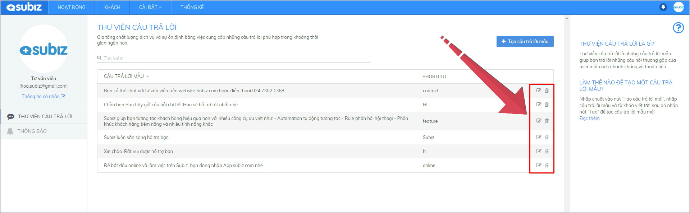

# Thư viện câu trả lời

Thư viện câu trả lời là những câu trả lời mẫu được bạn soạn sẵn. Bằng cách sử dụng một phím tắt, bạn sẽ nhanh chóng gửi tin nhắn mẫu này cho khách hàng và tăng hiệu quả tương tác với nhiều khách hàng cùng lúc.

Mỗi Agent có quyền được tạo và quản lý thư viện câu trả lời chung của tài khoản.

### Tạo câu trả lời mẫu mới

* Bước 1: Đăng nhập ****[**App.subiz.com &gt;** Chọn **Ảnh đại diện của Agent &gt;** Chọn **Thư viện câu trả lời.**](https://app.subiz.com/profile/canned-response)

* Bước 2: Chọn **Tạo câu trả lời mẫu &gt; Nhập thông tin &gt; Tạo**

### Sử dụng thư viện câu trả lời

Tại cửa sổ hội thoại với khách, bạn bắt đầu bằng kí tự "**/**" + **Phím tắt** &gt; chọn **Câu trả lời mẫu** &gt; **Enter**

### Một số tips sử dụng thư viện câu trả lời

   **1.Sử dụng Phím tắt ngắn và dễ nhớ**

Thư viện câu trả lời thường được sử dụng trong một số trường hợp nhất định như lời chào, cảm ơn, báo giá, lời đề nghị khách hàng chờ đợi, thông tin khuyến mãi, thông tin liên hệ.

Tạo phím tắt ngắn và dễ nhớ giúp bạn dễ dàng sử dụng khi cần thiết.

   **2. Câu trả lời mẫu súc tích và đi thẳng vào vấn đề**

Khách hàng luôn muốn được nhanh chóng hỗ trợ giải quyết vấn đề của mình. Hãy gửi câu trả lời ngắn gọn và trả lời đúng vấn đề của khách hàng

   **3. Ngắt dòng trong câu trả lời mẫu**

Câu trả lời mẫu có thể được chia thành nhiều dòng giúp khách hàng dễ nhìn, dễ đọc hơn.  
Khi cần ngắt xuống dòng, sử dụng phím **Enter**

  **4. Cá nhân hóa câu trả lời mẫu**

Mang lại trải nghiệm cho khách đang trò chuyện cùng một tư vấn viên thực sự chứ không phải robot chat.

   **5. Thường xuyên cập nhật mới cho thư viện câu trả lời**

Thay đổi để phát triển. Với mỗi câu trả lời mẫu, bạn hãy thường xuyên tùy chỉnh làm mới câu chữ và cách diễn đạt hay hơn khi gửi tới khách hàng của mình.

Bạn có thể vào Thư viện câu trả lời và tùy chỉnh trực tiếp câu mẫu đã có hoặc xóa đi để thay đổi câu hoàn toàn mới.

