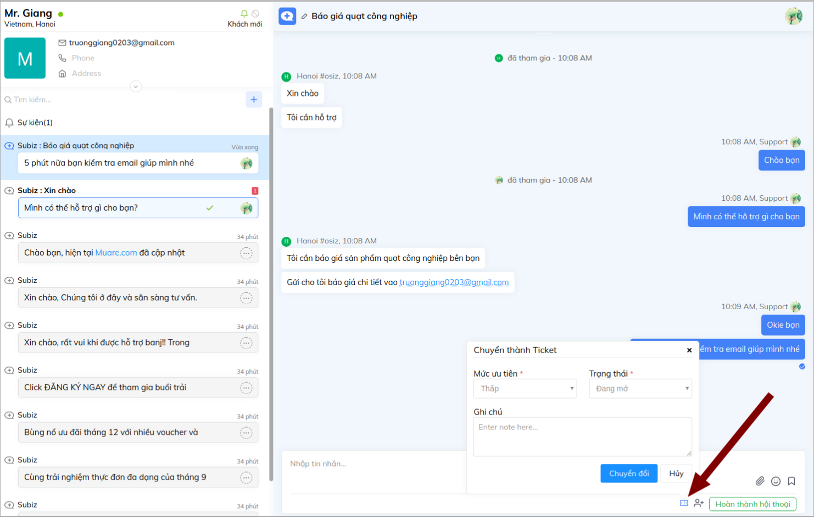
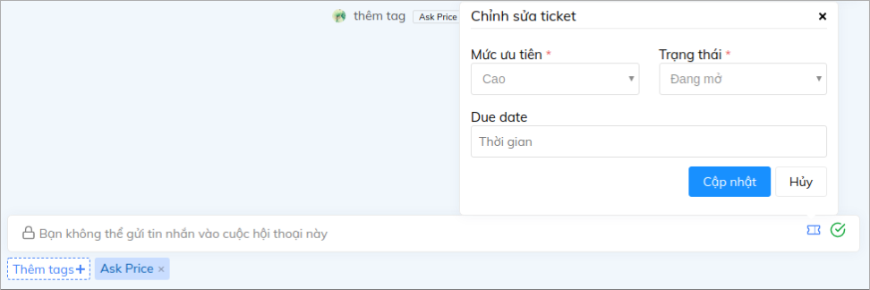
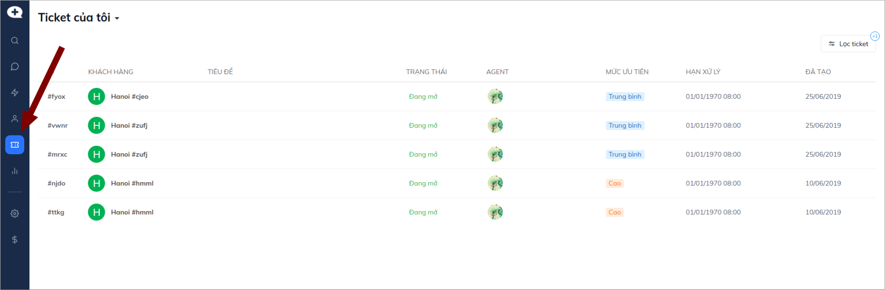
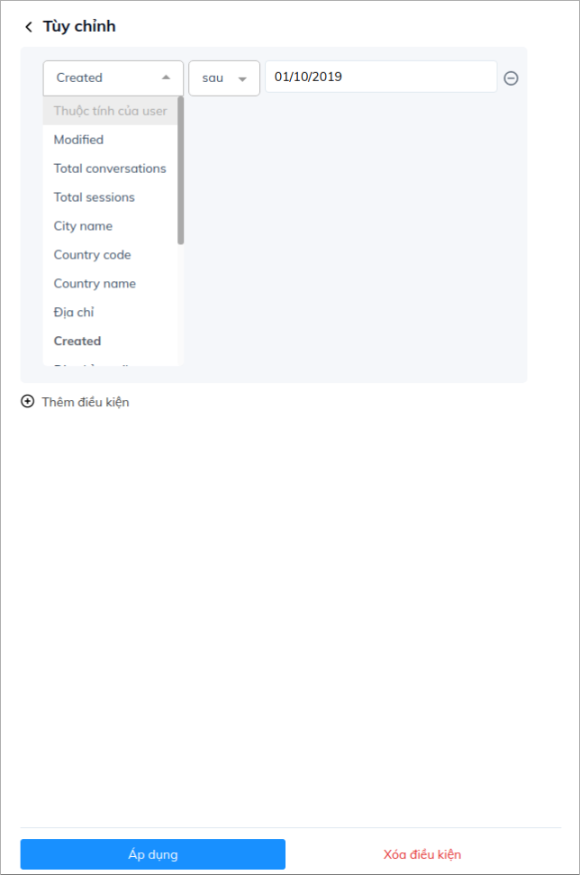
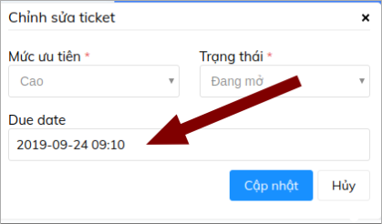

# Ticket - Quản lý chăm sóc khách hàng

## **Ticket là gì?**

Ticket \(tạm dịch là vé yêu cầu của khách hàng\) là một chức năng giúp Doanh nghiệp quản lý và theo dõi kết quả hỗ trợ khách hàng giải quyết vấn đề và yêu cầu. Từ đó, Ticket sẽ làm hài lòng khách hàng và nâng cao chất lượng dịch vụ của Doanh nghiệp.

Ví dụ: Khách hỏi về mẫu sản phẩm đang hết hàng, khách phàn nàn về giao hàng chậm,... Chăm sóc khách hàng tạo Ticket ghi nhận vấn đề của khách &gt; Theo dõi &gt; Làm việc với các bộ phận liên quan &gt; Phản hồi khách hàng &gt; Đóng ticket đã giải quyết xong vấn đề của khách.

## Ticket Subiz hoạt động như thế nào? 

### 1. Tạo ticket mới 

Từ một hội thoại của khách hàng trên bất kỳ kênh tương tác nào như Subiz chat, Email, Messenger,..., agent có thể chuyển thành Ticket để ghi nhận và theo dõi kết quả giải quyết yêu cầu của khách hàng

Agent sẽ thiết lập và phân loại ticket theo các dữ liệu sau:

* **Mức ưu tiên**: Khẩn cấp, Cao, Trung Bình, Thấp
* **Trạng thái**: Đang mở, Chờ xử lý, Đã giải quyết, Đóng
* **Hạn xử lý**: Ticket mới tạo sẽ mặc định chọn Hạn xử lý theo thời gian [ticket SLA](https://app.subiz.com/settings/ticket-list) hoặc bạn có thể tùy chỉnh thời gian hạn xử lý.
* **Ghi chú**: Tóm tắt ngắn gọn vấn đề hay yêu cầu của khách hàng

Bạn có thể kết hợp chức năng [Gắn Tag cuộc hội thoại](https://help.subiz.com/bat-dau-voi-subiz/lam-viec-tren-subiz/gan-tag-cuoc-hoi-thoai) và Ticket để có thể nắm được vấn đề chính hỗ trợ khách hàng và dễ dàng lọc, theo dõi và xử lý các Ticket.

### **2. Theo dõi và quản lý ticket**

Ticket được tạo thành công sẽ hiển thị thông báo ngay trên cuộc hội thoại. 

Bạn có thể dễ dàng theo dõi các Ticket trong trang quản lý Ticket: [Tại đây](https://app.subiz.com/tickets) 

Chức năng Lọc Ticket sẽ giúp bạn có thể quan sát được tình hình hỗ trợ khách hàng, bạn có thể lọc theo mức độ ưu tiên của Ticket, tình trang xử lý, thời gian tạo hay Tags của Ticket...hoặc kết hợp nhiều trường lọc với nhau.

Trong qúa trình xử lý Ticket, Agent cần lưu ý cập nhật thời gian xử lý Ticket để chủ động trong việc hỗ trợ khách hàng:

## Một số lưu ý khi sử dụng ticket 

* Người quản lý cần có quy định chung cho các agent về nghiệp vụ sử dụng ticket như: Khi nào cần tạo Ticket, Gắn Tag hội thoại để thống kê Tag ticket,  Phân loại mức độ ưu tiên của ticket,...
* Cài đặt [Giờ làm việc](https://app.subiz.com/settings/business-hours) và thiết lập [Ticket SLA](https://app.subiz.com/settings/ticket-edit?sid=saqesmawfkrzwfcksgty) để xác định hạn thời gian xử lý các vấn đề của khách hàng theo từng mức ưu tiên.
* Agent cần thường xuyên theo dõi danh sách Ticket để kịp thời xử lý và cập nhật thông tin hỗ trợ khách hàng.
* Xem thêm [thống kê ticket](https://help.subiz.com/bao-cao-and-thong-ke/thong-ke-tickets).

###  

