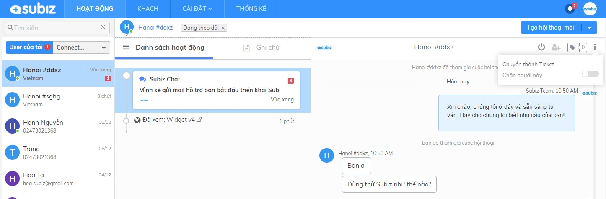

# Ticket - Quản lý vấn đề của khách hàng

## **Ticket là gì?**

Ticket \(tạm dịch là vé yêu cầu của khách hàng\) là một chức năng giúp Doanh nghiệp quản lý và theo dõi kết quả hỗ trợ khách hàng giải quyết vấn đề. Từ đó, Ticket sẽ làm hài lòng khách hàng và nâng cao chất lượng dịch vụ của Doanh nghiệp.

Ví dụ: Khách hỏi về mẫu sản phẩm đang hết hàng, khách phàn nàn về giao hàng chậm,... Chăm sóc khách hàng tạo Ticket ghi nhận vấn đề của khách &gt; Theo dõi &gt; Làm việc với các bộ phận liên quan &gt; Phản hồi khách hàng &gt; Đóng ticket đã giải quyết xong vấn đề của khách.

## Ticket Subiz hoạt động như thế nào? 

### 1. Tạo ticket mới 

Từ một hội thoại của khách hàng trên bất kỳ kênh tương tác nào như Subiz chat, Email, Messenger,..., agent có thể chuyển thành Ticket để ghi nhận và theo dõi xử lý vấn đề của khách hàng

Agent sẽ thiết lập và phân loại ticket theo các dữ liệu sau:

* **Mức ưu tiên**: Khẩn cấp, Cao, Trung Bình, Thấp
* **Trạng thái**: Đang mở, Chờ xử lý, Đã giải quyết, Đóng
* **Hạn xử lý**: Ticket mới tạo sẽ mặc định chọn Hạn xử lý theo thời gian SLA hoặc bạn có thể tùy chỉnh thời gian hạn xử lý.
* **Agent**: Agent xử lý ticket chính là Agent được chỉ định cuộc hội thoại
* **Ghi chú**: Tóm tắt ngắn gọn vấn đề hay yêu cầu của khách hàng

### **2. Theo dõi và quản lý ticket**

Ticket được tạo thành công sẽ hiển thị thông báo ngay trên cuộc hội thoại. 

Agent sẽ vào phân khúc Ticket để theo dõi danh sách ticket đang có và lọc ticket theo NHÓM, TRẠNG THÁI, ... để ưu tiên xử lý các yêu cầu của khách hàng.

Agent có thể tùy chỉnh các dữ liệu của ticket và cập nhật Trạng thái kết quả xử lý ticket.

###  

