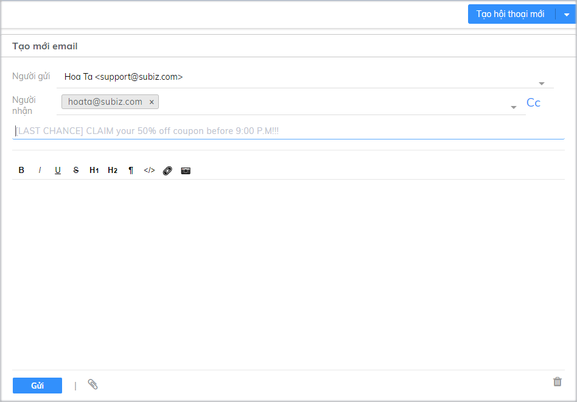
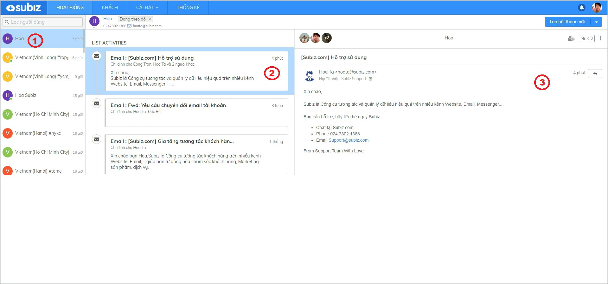

# Tương tác qua kênh Email

Tương tác qua kênh [Email](https://subiz.com/vi/email.html) là cuộc tương tác gửi và nhận [email](https://subiz.com/vi/email.html) của khách hàng ngay trên ứng dụng [Subiz](https://subiz.com/vi/).

Bạn \(Agent\) cần[ tích hợp Email và thiết lập chuyển tiếp mail](https://subiz.gitbook.io/subiz-document/~/edit/primary/bat-dau-voi-subiz/thiet-lap-moi-truong-tuong-tac/tich-hop-su-dung-email-tren-subiz) để có thể tạo mới hội thoại trên kênh [Email](https://subiz.com/vi/email.html).

### Chủ động gửi [Email](https://subiz.com/vi/email.html) tới khách hàng

Địa chỉ [**Email**](https://subiz.com/vi/email.html) **khách hàng** phải được cập nhật trong mục **Thông tin khách hàng,** sau đó ****bạn sẽ tạo được hội thoại mới trên kênh [Email](https://subiz.com/vi/email.html).

Bạn có thể chủ động gửi [Email](https://subiz.com/vi/email.html) tới khách hàng với 2 bước đơn giản sau:

1. **Tạo hội thoại mới trên kênh** [**Email**](https://subiz.com/vi/email.html)\*\*\*\*
2. **Viết** [**Email**](https://subiz.com/vi/email.html) **gửi khách hàng**



Hướng dẫn tạo hội thoại mới trên kênh[ Email](https://subiz.com/vi/email.html) như sau: Chọn K**hách hàng** muốn gửi mail &gt; Chọn **Tạo hội thoại mới &gt;** Chọn [**Email**](https://subiz.com/vi/email.html) ****




Cửa sổ Email mở, bạn soạn mail gửi khách hàng tại đây:

1. **Người gửi**: Chọn Email gửi đi 
2. **Người nhận**: Chọn Email nhận của khách hàng 
3. **Điền tiêu đề Mail**
4. **Soạn nội dung mail** và chọn **Gửi**




###  Trả lời[ Email ](https://subiz.com/vi/email.html)khách hàng

Với mỗi **khách hàng**, bạn vào mục **List Activities** sẽ nhận biết được kênh tương tác qua **biểu tượng** [**Mail** ](https://subiz.com/vi/email.html)**và tiêu đề** [**Email**](https://subiz.com/vi/email.html)**.** 

Để trả lời mail khách hàng, bạn thao tác như sau:

1. Chọn [**Email**](https://subiz.com/vi/email.html) ****cần trả lời
2. Chọn **nút Reply**
3. **Viết nội dung mail và Gửi**

### Một số chức năng hữu ích trên [Email Subiz](https://subiz.com/vi/email.html)

1. **Hỗ trợ soạn thảo** [**Email**](https://subiz.com/vi/email.html) **dưới dạng HTML**

  **2. Tùy chỉnh font chữ văn bản**

**3. Chèn link trực tiếp vào chữ hoặc hình ảnh**

**4. Đình kèm tệp tài liệu hay tệp hình ảnh**

**5. Gắn thẻ Tag hội thoại** [**Email**](https://subiz.com/vi/email.html)\*\*\*\*

[Subiz](https://subiz.com/vi/) Tag là tính năng gắn thẻ Tag cho mỗi cuộc hội thoại, giúp Agent dễ dàng phân loại và quản lý các tương tác của khách hàng. 



Hướng dẫn tạo thẻ Tag mới:

1. [Đăng nhập **App.subiz.com** &gt; **Cài đặt** &gt; **Tài khoản** &gt; **Tag** &gt; **Tạo Tag mới**](https://app.subiz.com/settings/tags)\*\*\*\*

    2.  Nhập **Tên Tag** &gt; **Tạo**​


Lưu ý: Chỉ Agent được [phân quyền Cài đặt tài khoản](https://subiz.gitbook.io/subiz-document/~/edit/primary/bat-dau-voi-subiz/untitled/quan-ly-agent/cac-loai-agent#phan-quyen-tai-khoan-agent) được phép Cài đặt Tag​




_Hướng dẫn gắn thẻ Tag_: Chọn nút **Tag** &gt; chọn **tên thẻ Tag** &gt; **Enter**




_Hướng dẫn xóa thẻ Tag_: Chọn nút **Tag** &gt; chọn **X** xóa Tag




