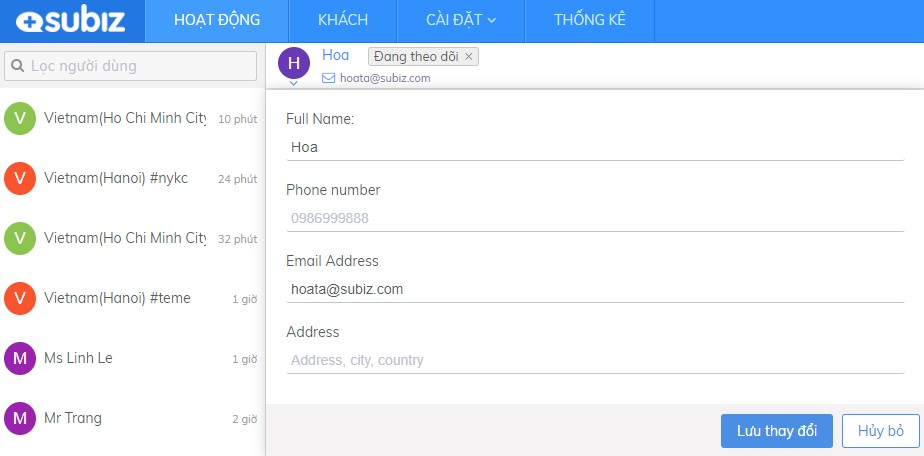
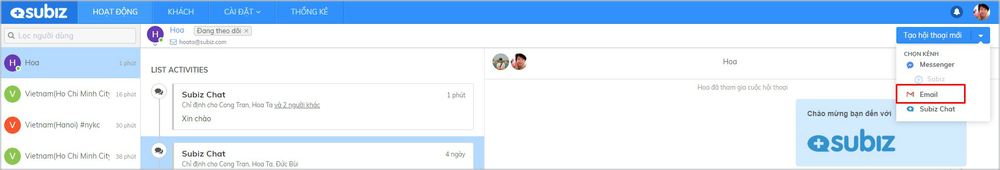

# Tương tác qua kênh Email

Tương tác qua kênh Email là cuộc tương tác gửi và nhận email của khách hàng ngay trên ứng dụng App.subiz.com.

Bạn \(Agent\) cần[ tích hợp Email và thiết lập chuyển tiếp mail](https://docv4.subiz.com/thiet-lap-chuyen-tiep-email/) để có thể tạo mới hội thoại trên kênh Email.

### Chủ động gửi Email tới khách hàng

Bạn có địa chỉ email khách hàng, hãy cập nhật trong mục thông tin khách hàng.

Như vậy, bạn có thể chủ động gửi Email tới khách hàng với 2 bước đơn giản sau:  
**1. Tạo hội thoại mới trên kênh Email  
2. Viết Email gửi khách hàng**



Hướng dẫn tạo hội thoại mới trên kênh Email như sau:

1. Chọn K**hách hàng** muốn gửi mail
2. Chọn **Tạo hội thoại mới**
3. Chọn **Email** 




Cửa sổ Email mở, bạn soạn mail gửi khách hàng tại đây:

1. **Người gửi**: Chọn Email gửi đi 
2. **Người nhận**: Chọn Email nhận của khách hàng 
3. **Điền tiêu đề Mail**
4. **Soạn nội dung mail** và chọn **Gửi**




###  Trả lời Email khách hàng

### Một số tính năng hữu ích trên kênh Email

## 

