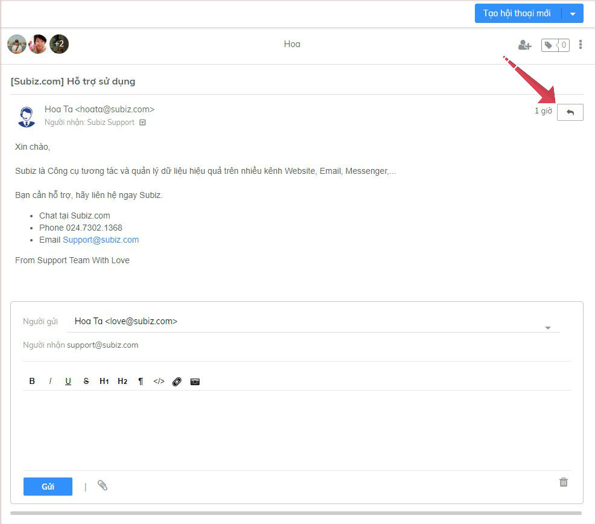
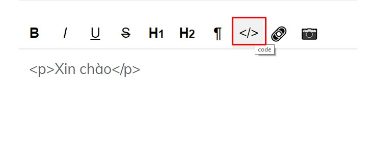
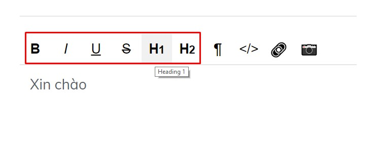
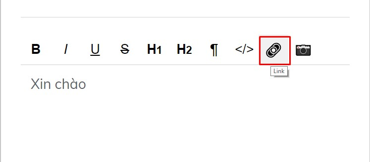
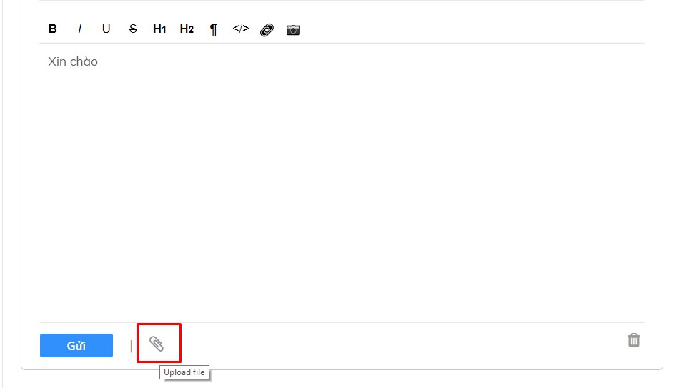

# Tương tác qua kênh Email

Tương tác qua kênh Email là cuộc tương tác gửi và nhận email của khách hàng ngay trên ứng dụng Subiz.

Bạn \(Agent\) cần[ tích hợp Email và thiết lập chuyển tiếp mail](https://docv4.subiz.com/thiet-lap-chuyen-tiep-email/) để có thể tạo mới hội thoại trên kênh Email.

### Chủ động gửi Email tới khách hàng

Địa chỉ **Email khách hàng** phải được cập nhật trong mục **Thông tin khách hàng,** sau đó ****bạn sẽ tạo được hội thoại mới trên kênh Email.

Bạn có thể chủ động gửi Email tới khách hàng với 2 bước đơn giản sau:  
**1. Tạo hội thoại mới trên kênh Email  
2. Viết Email gửi khách hàng**



Hướng dẫn tạo hội thoại mới trên kênh Email như sau:

1. Chọn K**hách hàng** muốn gửi mail
2. Chọn **Tạo hội thoại mới**
3. Chọn **Email** 




Cửa sổ Email mở, bạn soạn mail gửi khách hàng tại đây:

1. **Người gửi**: Chọn Email gửi đi 
2. **Người nhận**: Chọn Email nhận của khách hàng 
3. **Điền tiêu đề Mail**
4. **Soạn nội dung mail** và chọn **Gửi**




###  Trả lời Email khách hàng

Với mỗi **khách hàng**, bạn vào mục **List Activities** sẽ nhận biết được kênh tương tác qua **biểu tượng Mail và tiêu đề Email.** 

Để trả lời mail khách hàng, bạn thao tác như sau:

1. Chọn **Email** cần trả lời
2. Chọn **nút Reply**
3. **Viết nội dung mail và Gửi**

### Một số chức năng hữu ích trên Email Subiz

1. **Hỗ trợ soạn thảo Email dưới dạng HTML**

  **2. Tùy chỉnh font chữ văn bản**

**3. Chèn link trực tiếp vào chữ hoặc hình ảnh**

**4. Đình kèm tệp tài liệu hay tệp hình ảnh**

**5. Gắn thẻ Tag hội thoại Email**

Subiz Tag là tính năng gắn thẻ Tag cho mỗi cuộc hội thoại, giúp Agent dễ dàng phân loại và quản lý các tương tác của khách hàng. 



_**Hướng dẫn gắn thẻ Tag**:_ Chọn nút **Tag** &gt; chọn **tên thẻ Tag** &gt; **Enter**



**Hướng dẫn xóa thẻ Tag**: Chọn nút **Tag** &gt; chọn **X** xóa Tag

​




Lưu ý: Bạn cần cài đặt Tag trước khi gắn thẻ Tag cuộc hội thoại \([Xem chi tiết](https://docv4.subiz.com/cai-dat-tag/)\)


## 

