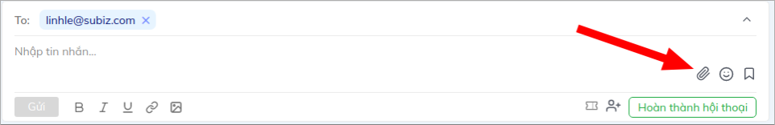

# Hướng dẫn làm việc trên kênh Email

Khách hàng trao đổi với bạn trên cửa sổ Subiz, để lại thông tin và yêu cầu bạn gửi cho họ thêm mẫu sản phẩm, báo gía, thông tin chương trình ưu đãi...qua email. Thay vì việc phải đăng nhập vào email để gửi thư cho khách hàng, giờ đây với việc tích hợp Email vào Subiz, bạn có thể thực hiện gửi và nhận mail ngay trên trang quản trị Subiz của bạn. Nhờ vậy, bạn hoàn toàn có thể theo dõi được toàn bộ lịch sử giao dịch với khách hàng và hạn chế việc phân tán thông tin trên nhiều công cụ khác nhau.

Bài viết sau sẽ giúp bạn tìm hiểu cụ thể hơn về cách làm việc trên kênh Email.

Trước hết, đừng quên tích hợp Email vào tài khoản Subiz theo: [Hướng dẫn ](https://help.subiz.com/bat-dau-voi-subiz/thiet-lap-moi-truong-tuong-tac/tich-hop-su-dung-email-tren-subiz)

### Chủ động gửi [Email](https://subiz.com/vi/email.html) tới khách hàng

Để có thể gửi được email cho khách hàng, trước hết, khách hàng cần có thông tin địa chỉ Email trên trang quản trị Subiz của bạn. Để khai thác thông tin email, bạn có thể chủ động xin khách trong qúa trình trao đổi và lưu lại hoặc sử dụng chức năng tự động [Automation hỏi thông tin khách hàng](https://help.subiz.com/su-dung-subiz-nang-cao/tuong-tac-tu-dong/mot-so-automation-thong-dung/hoi-thong-tin-khach-hang).

Bạn có thể chủ động gửi [Email](https://subiz.com/vi/email.html) tới khách hàng với 2 bước đơn giản sau:

1. **Tạo hội thoại mới trên kênh** [**Email**](https://subiz.com/vi/email.html)\*\*\*\*
2. **Viết** [**Email**](https://subiz.com/vi/email.html) **gửi khách hàng**



Để tạo chủ động gửi email cho khách hàng, bạn click vào biểu tượng dấu " + " và lựa chọn kênh Email.




Cửa sổ Email mở, bạn soạn mail gửi khách hàng tại đây:

1. **From**: Chọn Email gửi đi 
2. **To**: Chọn Email nhận của khách hàng. Bạn có thể gửi mail cho một hoặc nhiều địa chỉ, lựa chọn email có sẵn hoặc nhập thêm vào.
3. **Cc:** Chon Email Cc \(nếu có\)
4. **Điền tiêu đề Mail**
5. **Soạn nội dung mail** và chọn **Gửi**




###  Trả lời[ Email ](https://subiz.com/vi/email.html)khách hàng

Để trả lời Email của khách hàng, bạn vào phần lịch sử hoạt động, tìm biểu tượng cuộc hội thoại Emal và click vào ô nhập tin nhắn:

Cuộc hội thoại email được thiết kế như một cuộc hội thoại trên kênh Website hay Fanpage giúp bạn có thể dễ dàng phản hồi lại khách và quan sát được các email trong qúa trình trao đổi:

### Một số chức năng hữu ích trên kênh Email 

**1. Tùy chỉnh font chữ văn bản :** Bôi đậm, in nghiêng, gạch chân, đính kèm link trực tiếp vào chữ, tải hình ảnh

**2. Đình kèm tệp tài liệu** 

**3. Đính kèm biểu tượng cảm xúc**

**4. Sử dụng mẫu Email**

Đây là một chức năng vô cùng hữu ích trong Subiz giúp bạn tiết kiệm thời gian trong việc phản hồi khách hàng. Bạn có thể tạo một danh sách những mẫu email để phản hồi những vấn đề khách hàng hay trao đổi như : email báo giá, email giới thiệu doanh nghiệp, email cảm ơn... để có thể nhanh chóng gửi đến khách hàng mà không cần mất thời gian biên soạn:

Để thiết lập các mẫu email bạn tham khảo : [Hướng dẫn taọ mẫu email](https://help.subiz.com/bat-dau-voi-subiz/lam-viec-tren-subiz/mau-tin-nhan)

**5. Gắn thẻ Tag hội thoại** [**Email**](https://subiz.com/vi/email.html)\*\*\*\*

Để có thể dễ dàng thống kê các vấn đề trao đổi với khách hàng qua email, bạn có thể sử dụng chức năng gắn thẻ Tag của Subiz Email. Chức năng này sẽ giúp Agent dễ dàng phân loại và quản lý các tương tác của khách hàng. 

Tham khảo:[ Hướng dẫn tạo Subiz Tag ](https://help.subiz.com/bat-dau-voi-subiz/lam-viec-tren-subiz/gan-tag-cuoc-hoi-thoai)

**6. Gắn Ticket hội thoại Email**

Cùng với việc sử dụng chức năng Ticket, bạn có thể dễ dàng theo dõi qúa trình xử lý cũng như tình trạng các giao dịch với khách hàng. 

Tham khảo: [Hướng dẫn tạo và quản lý Ticket](https://help.subiz.com/bat-dau-voi-subiz/lam-viec-tren-subiz/ticket-quan-ly-cham-soc-khach-hang)

**7. Thêm Agent vào cuộc hội thoại Email**

Trong trường hợp bạn không thể tiếp tục phụ trách giao dịch với khách hàng và muốn thêm đồng nghiệp để hỗ trợ hoặc cùng bạn xử lý công việc, bạn hoàn toàn có thể add thêm agent để agent đó có thể tham gia phản hồi cuộc hội thoại cùng bạn.

**8. Tiêu đề cuộc hội thoại Email**

Cùng với việc nhập tiêu đề cho cuộc hội thoại, bạn có thể dễ dàng tổng quan được vấn đề đang trao đổi với khách hàng. Trong trường hợp bạn với khách hàng đã trao đổi nhiều vấn đề khác nhau trên email, chức năng này cũng sẽ giúp bạn quan sát và nhanh chóng tìm kiếm được cuộc hội thoại mà không cần click vào đọc từng email.

