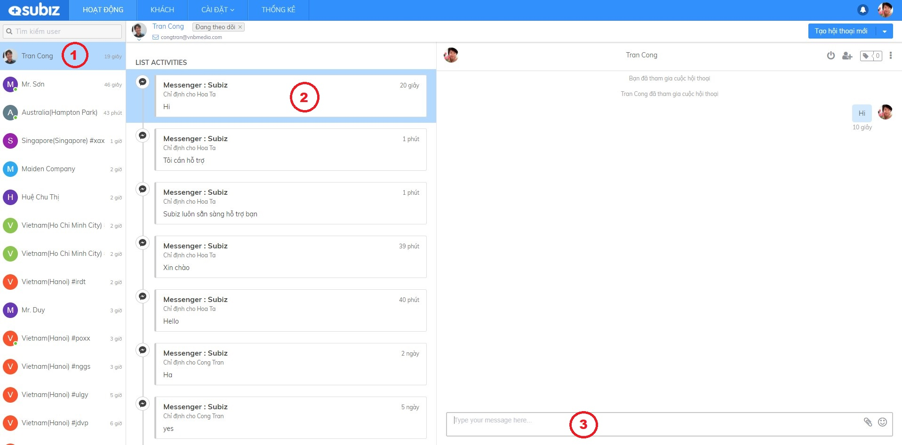
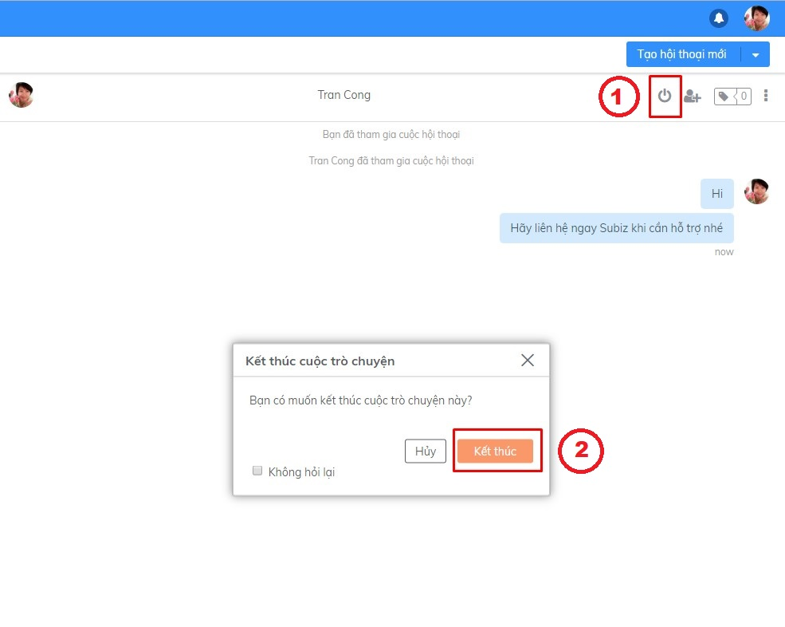
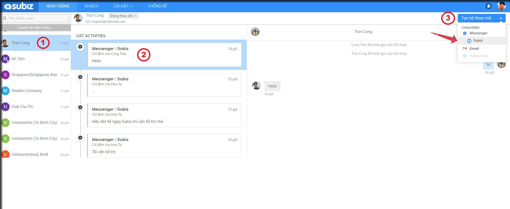
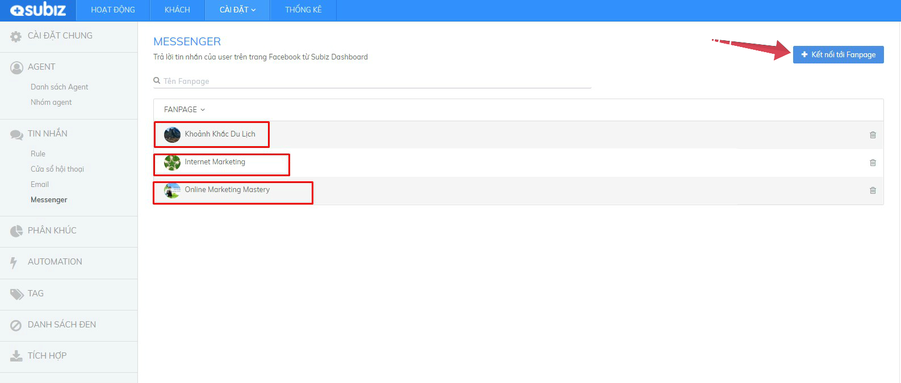
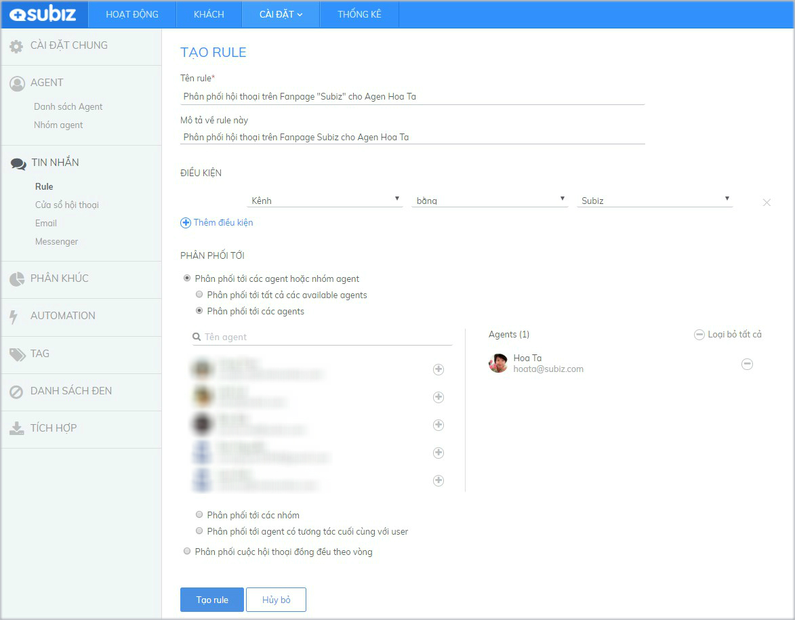

# Tương tác qua kênh Messenger

Tương tác qua kênh Messenger là cuộc hội thoại tương tác giữa khách hàng trên Fanpage và Agent Subiz. Sau khi [tích hợp Fanpage vào tài khoản Subiz](https://subiz.gitbook.io/subiz-document/~/edit/primary/bat-dau-voi-subiz/thiet-lap-moi-truong-tuong-tac/tich-hop-fanpage-facebook-vao-subiz), bạn sẽ dễ dàng quản lý tất cả tin nhắn nhận và gửi đi cho khách hàng ngay trên ứng dụng App.subiz.com

### Tương tác trên kênh Messenger

Subiz hiển thị tên kênh Messenger và tên trang Fanpage, giúp bạn nhận biết được nguồn khách hàng của mình. 

**Thao tác**: Chọn **Khách hàng** &gt; Xem trong **List Activities** &gt; Chọn **Messenger**

Với kênh Messenger, chỉ khi khách hàng trên Fanpage chủ động gửi tin nhắn trước, bạn \(Agent Subiz\) có thể bắt đầu tương tác và tạo hội thoại mới được.

**Hướng dẫn chi tiết như sau:**



Để trả lời tin nhắn của khách hàng, bạn thao tác:  Chọn **Khách hàng** &gt; Xem trong **List Activities** &gt; Chọn **Messenger** tin nhắn chưa đọc &gt; **Cửa sổ chat mở và nhắn tin tại đây**.




Khi đã hỗ trợ khách hàng xong một vấn đề, hãy kết thúc cuộc hội thoại: Chọn nút **End Chat** &gt; Xác nhận **Kết thúc.**

Sau này, bạn sẽ thuận tiện chủ động gửi tin nhắn cho khách hàng trên Messenger.




_Hướng dẫn tạo hội thoại mới trên kênh Messenger_: Chọn **khách hàng** &gt; Chọn **Tạo hội thoại mới** &gt; Chọn kênh **Messenger** &gt; Chọn **tên Fanpage** &gt; **Cửa sổ chat mở và nhắn tin tại đây**




### Một số tính năng hữu ích trên kênh Messenger

### 1. **Quản trị nhiều Fanpage trong ứng dụng Subiz**

Khi bạn là quản trị viên của nhiều Fanpage, Subiz sẽ giúp bạn dễ dàng tương tác và quản lý hiệu quả khách hàng trên từng trang.

### **2. Sử dụng thư viện câu trả lời**

Thư viện câu trả lời là những tin nhắn mẫu được soạn sẵn, giúp bạn trò chuyện với khách hàng một cách nhanh chóng và hiệu quả.

_Hướng dẫn sử dụng_: Tại cửa sổ chat, bạn bắt đầu bằng kí tự "**/**" + **shortcut** &gt; chọn **Câu trả lời mẫu** &gt; **Enter**


_**Lưu ý**_: Bạn có thể [thêm và chỉnh sửa Thư viện câu trả lời](https://docv4.subiz.com/thu-vien-cau-tra-loi/) theo hướng dẫn


### 3. Gắn Tag cuộc hội thoại

Subiz Tag là tính năng gắn thẻ Tag cho mỗi cuộc hội thoại, giúp Agent dễ dàng phân loại và quản lý các tương tác của khách hàng.



_Hướng dẫn gắn thẻ Tag_: Chọn nút **Tag** &gt; chọn **tên thẻ Tag** &gt; **Enter**


Lưu ý: Bạn cần cài đặt Tag trước khi gắn thẻ Tag cuộc hội thoại \([Xem chi tiết](https://docv4.subiz.com/cai-dat-tag/)\)




### 4. Rule tự động phân phối hội thoại 

Rule là các quy tắc do bạn thiết lập để tự động phân phối cuộc hội thoại tới một hoặc một nhóm Agent.   
_Hướng dẫn tạo Rule phân phối hội thoại trên trang Fanpage cho 1 Agent_**: Cài đặt Tài khoản** &gt; **Rule** &gt; **Tạo mới Rule &gt; Điền thông tin như trong ảnh.** 

### 5. Thêm Agent vào cuộc hội thoại 

 Khi bạn đang trò chuyện cùng khách hàng, bạn có thể Mời thêm Agent tham gia cuộc hội thoại và cùng hỗ trợ khách hàng.

_Hướng dẫn thêm Agent: Chọn nút  **"Add Agent"**  &gt; Chọn **Agent**  &gt; Chọn **Thêm**_


_**Lưu ý**_: Chỉ Agent được phân phối cuộc hội thoại mới có quyền thêm Agent khác.


### 6. Sử dụng Emojis cảm xúc và chia sẻ file

Tại vùng nhập tin nhắn, bạn có thể lựa chọn gửi kèm biểu tượng cảm xúc hoặc file đính kèm.

### 

