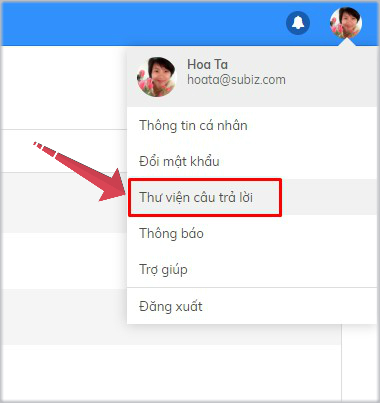

# Tương tác qua kênh Messenger

Tương tác qua kênh [Messenger ](https://subiz.com/vi/facebook-messenger.html)là cuộc hội thoại tương tác giữa khách hàng trên[ Fanpage](https://subiz.com/vi/facebook-messenger.html) và Agent [Subiz](https://subiz.com/vi/). Sau khi [tích hợp Fanpage vào tài khoản Subiz](https://subiz.gitbook.io/subiz-document/~/edit/primary/bat-dau-voi-subiz/thiet-lap-moi-truong-tuong-tac/tich-hop-fanpage-facebook-vao-subiz), bạn sẽ dễ dàng quản lý tất cả tin nhắn nhận và gửi đi cho khách hàng ngay trên ứng dụng [App.subiz.com](https://app.subiz.com/)

### Tương tác trên kênh[ Messenger](https://subiz.com/vi/facebook-messenger.html)

[Subiz](https://subiz.com/vi/) hiển thị tên kênh [Messenger](https://subiz.com/vi/facebook-messenger.html) và tên trang [Fanpage](https://subiz.com/vi/facebook-messenger.html), giúp bạn nhận biết được nguồn khách hàng của mình. 

Thao tác: Chọn **Khách hàng** &gt; Xem trong **List Activities** &gt; Chọn ****[**Messenger**](https://subiz.com/vi/facebook-messenger.html)\*\*\*\*

Với kênh [Messenger](https://subiz.com/vi/facebook-messenger.html), chỉ khi khách hàng trên [Fanpage ](https://subiz.com/vi/facebook-messenger.html)chủ động gửi tin nhắn trước, bạn \(Agent [Subiz](https://subiz.com/vi/)\) có thể bắt đầu tương tác và tạo hội thoại mới được.

**Hướng dẫn chi tiết như sau:**



Để trả lời tin nhắn của khách hàng, bạn thao tác: Chọn **Khách hàng** &gt; Xem trong **List Activities** &gt; Chọn ****[**Messenger** ](https://subiz.com/vi/facebook-messenger.html)tin nhắn chưa đọc &gt; **Cửa sổ chat mở và nhắn tin tại đây**.




Khi đã hỗ trợ khách hàng xong một vấn đề, hãy kết thúc cuộc hội thoại: Chọn nút **End Chat** &gt; Xác nhận **Kết thúc.**




Hướng dẫn tạo hội thoại mới trên kênh [Messenger](https://subiz.com/vi/facebook-messenger.html): Chọn **khách hàng** &gt; Chọn **Tạo hội thoại mới** &gt; Chọn kênh **Messenger** &gt; Chọn **tên Fanpage** &gt; **Cửa sổ chat mở và nhắn tin tại đây**




### Một số tính năng hữu ích trên kênh [Messenger](https://subiz.com/vi/facebook-messenger.html)

#### 1. **Quản trị nhiều** [**Fanpage** ](https://subiz.com/vi/facebook-messenger.html)**trong ứng dụng Subiz**

Khi bạn là quản trị viên của nhiều [Fanpage](https://subiz.com/vi/facebook-messenger.html), Subiz sẽ giúp bạn dễ dàng tương tác và quản lý hiệu quả khách hàng trên từng trang.

#### **2. Sử dụng thư viện câu trả lời**

Thư viện câu trả lời là những tin nhắn mẫu được soạn sẵn, giúp bạn trò chuyện với khách hàng một cách nhanh chóng và hiệu quả.

Mỗi Agent có quyền được tạo và quản lý thư viên câu trả lời của riêng mình. Hướng dẫn cài đặt như sau:



Hướng dẫn tạo câu trả lời mẫu: 

1. [Đăng nhập **App.subiz.com** &gt; Chọn **Ảnh đại diện của Agent** &gt; Chọn **Thư viện câu trả lời** ](https://app.subiz.com/profile/canned-response)\*\*\*\*

    2. Chọn **Tạo câu trả lời mẫu** &gt; **Nhập thông tin** &gt; **Tạo**


Lưu ý: Bạn có thể chọn **Chia sẻ câu trả lời mẫu với các Agent** **khác** để các Agent khác có thể sử dụng mẫu câu này.




Hướng dẫn sử dụng: Tại cửa sổ chat, bạn bắt đầu bằng kí tự "**/**" + **phím tắt** &gt; chọn **Câu trả lời mẫu** &gt; **Enter**




#### 3. Gắn Tag cuộc hội thoại

[Subiz ](https://subiz.com/vi/)Tag là tính năng gắn thẻ Tag cho mỗi cuộc hội thoại, giúp Agent dễ dàng phân loại và quản lý các tương tác của khách hàng.



Hướng dẫn tạo thẻ Tag mới:

1. [Đăng nhập **App.subiz.com** &gt; **Cài đặt** &gt; **Tài khoản** &gt; **Tag** &gt; **Tạo Tag mới**](https://app.subiz.com/settings/tags)\*\*\*\*

    2. Nhập **Tên Tag** &gt; **Tạo**




Hướng dẫn gắn thẻ Tag: Chọn nút **Tag** &gt; chọn **tên thẻ Tag** &gt; **Enter**




Hướng dẫn xóa thẻ Tag: Chọn nút **Tag** &gt; chọn **X** xóa Tag




#### 4. Rule tự động phân phối hội thoại 

Rule là các quy tắc do bạn thiết lập để tự động phân phối cuộc hội thoại tới một hoặc một nhóm Agent.

Hướng dẫn tạo Rule phân phối hội thoại trên trang Fanpage cho 1 Agent**:** [**Cài đặt Tài khoản** &gt; **Rule** &gt; **Tạo mới Rule**](https://app.subiz.com/settings/add-rule) **&gt; Điền thông tin như trong ảnh.** 

#### 5. Thêm Agent vào cuộc hội thoại 

 Khi bạn đang trò chuyện cùng khách hàng, bạn có thể Mời thêm Agent tham gia cuộc hội thoại và cùng hỗ trợ khách hàng.

Hướng dẫn thêm Agent: Chọn nút  **"Add Agent"**  &gt; Chọn **Agent**  &gt; Chọn **Thêm**


_**Lưu ý**_: Chỉ Agent được phân phối cuộc hội thoại mới có quyền thêm Agent khác.


#### 6. Sử dụng Emojis cảm xúc và chia sẻ file

Tại vùng nhập tin nhắn, bạn có thể lựa chọn gửi kèm biểu tượng cảm xúc hoặc file đính kèm.

### 

