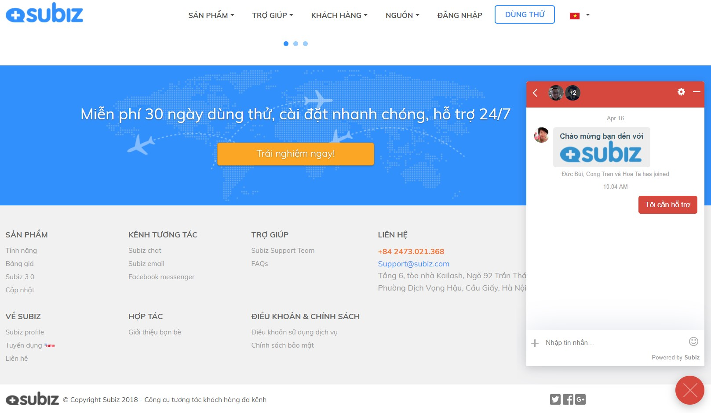
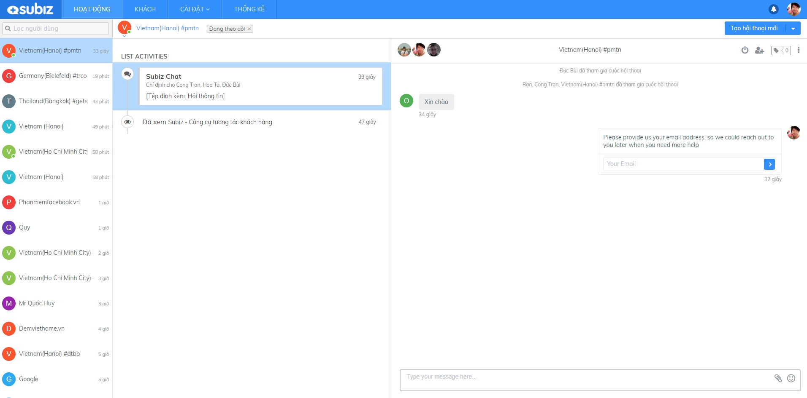
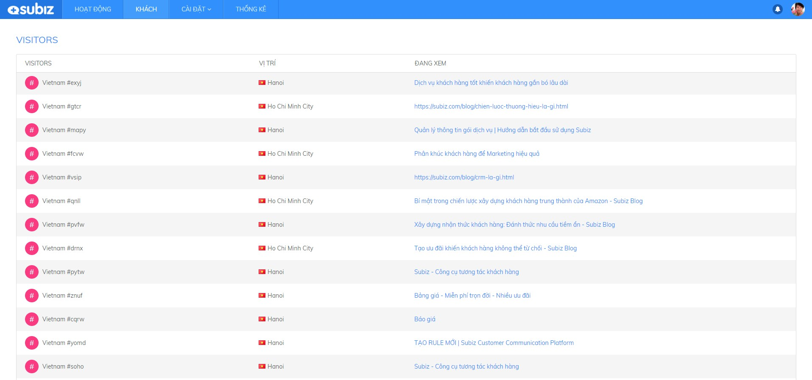
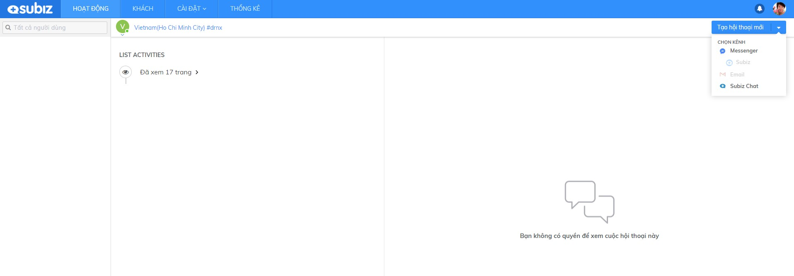
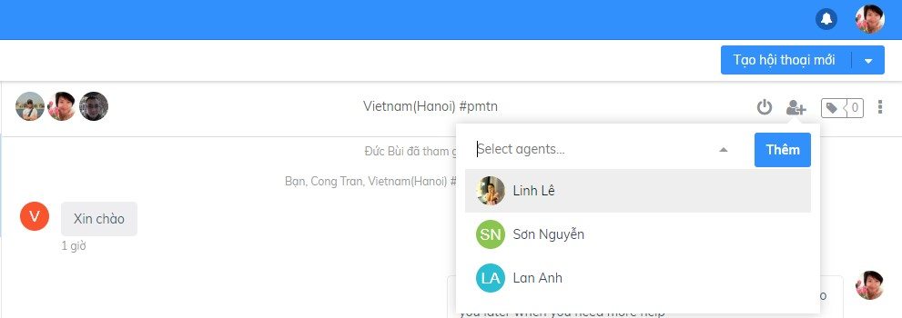

# Tương tác trên kênh Subiz chat

**Tương tác trên kênh Subiz chat là khởi tạo cuộc hội thoại để bắt đầu trò chuyện tư vấn khách truy cập website**. Đây là những khách hàng đang có nhu cầu tìm hiểu về sản phẩm, dịch vụ và thông tin của doanh nghiệp.

Bạn \(Agent\) cần đăng nhập [App.subiz.com](https://app.subiz.com) để bắt đầu online và sẵn sàng  tư vấn khách hàng.

### Tạo cuộc tương tác mới 

Có hai hình thức khởi tạo một cuộc tương tác với khách hàng:  
**1. Khách hàng chủ động khởi tạo cuộc tương tác  
2. Agent chủ động khởi tạo cuộc tương tác**



**Khách hàng chủ động khởi tạo cuộc tương tác**  
Khi truy cập website của bạn, khách hàng sẽ gửi tin nhắn yêu cầu hỗ trợ ngay trên cửa sổ chat Subiz.

_Để xem được tin nhắn từ khách hàng, bạn thao tác như sau: Vào mục **HÀNH ĐỘNG &gt;** Chọn **Khách hàng**  &gt; Chọn tương tác chưa đọc trong **LIST ACTIVITIES**  &gt; **Cửa sổ chat** mở và trả lời tại đây._


 _**Lưu ý**_: Nếu bạn không nhận được tin nhắn từ khách hàng, hãy xem lại cài đặt [tính năng RULE](https://docv4.subiz.com/tao-rule-moi/) tự động phân phối cuộc hội thoại cho bạn \(Agent\) hay chưa?


 Subiz sẽ thông báo âm thanh và thông báo màn hình khi có tin nhắn mới của khách hàng.


_**Lưu ý**_: Khi không nhận được thông báo, hãy kiểm tra lại máy tính của bạn, thiết lập trình duyệt cho phép Subiz thông báo âm thanh và màn hình.




**Agent chủ động khởi tạo cuộc tương tác**  
Nếu khách hàng không chủ động tương tác trước, thì bạn cần quan sát trên trang **KHÁCH** để biết khách hàng đang quan tâm điều gì và chủ động tương tác hỗ trợ khách hàng.

 _Để tạo cuộc hội thoại với khách truy cập website, bạn vào thao tác như sau:_

1. _Vào mục **KHÁCH**  &gt; Chọn **Khách hàng**_ 
2. _Chọn **Tạo hội thoại mới**  &gt; Chọn **Subiz Chat**_
3.  _**Cửa sổ chat mở** và bạn gửi tin nhắn tại đây._

### 



### Thêm Agent vào cuộc hội thoại 

 Khi bạn đang trò chuyện cùng khách hàng, bạn có thể Mời thêm Agent tham gia cuộc hội thoại và cùng hỗ trợ khách hàng.

_Hướng dẫn thêm Agent: Chọn nút  **"Add Agent"**  &gt; Chọn **Agent**  &gt; Chọn **Thêm**_


_**Lưu ý**_: Chỉ Agent được phân phối cuộc hội thoại mới có quyền thêm Agent khác.


### Gắn Tag

Subiz Tag là tính năng gắn thẻ Tag cho mỗi cuộc hội thoại, giúp Agent dễ dàng phân loại và quản lý các tương tác của khách hàng.



**Hướng dẫn gắn thẻ Tag**: Chọn nút **Tag** &gt; chọn **tên thẻ Tag** &gt; **Enter**


Lưu ý: Bạn cần cài đặt Tag trước khi gắn thẻ Tag cuộc hội thoại \([Xem chi tiết](https://docv4.subiz.com/cai-dat-tag/)\)




**Hướng dẫn xóa thẻ Tag**: Chọn nút **Tag** &gt; chọn **X** xóa Tag




### Kết thúc hội thoại

Subiz sẽ tính cuộc hội thoại được kết thúc bằng hành động **Kết thúc**. Hành động này được thực hiện bởi Agent hoặc khách truy cập.



**Agent**: Kết thúc bằng cách chọn nút "**End Chat**" và xác nhận kết thúc cuộc hội thoại. Khách hàng sẽ nhận được thông báo là Agent đã kết thúc cuộc trò chuyện.




**Khách truy cập** có thể kết thúc ngay trên cửa sổ chat bằng cách chọn dấu **"+" &gt;** chọn **Kết thúc hội thoại**. Agent cũng sẽ nhận được thông báo khi khách truy cập kết thúc hội thoại.





_**Lưu ý**_: Khi cuộc hội thoại kết thúc sẽ có thông báo trên cửa sổ chat, đồng thời phần nhập tin nhắn sẽ chuyển màu xám và không thể thao tác thêm. **Để tiếp tục trò chuyện, bạn cần Tạo hội thoại mới.**


### Sử dụng thư viện câu trả lời 

Thư viện câu trả lời là những tin nhắn mẫu được soạn sẵn, giúp bạn trò chuyện với khách hàng một cách nhanh chóng và hiệu quả.

_**Hướng dẫn sử dụng**_: Tại cửa sổ chat, bạn bắt đầu bằng kí tự "**/**" + **shortcut** &gt; chọn **Câu trả lời mẫu** &gt; **Enter**


_**Lưu ý**_: Bạn có thể [thêm và chỉnh sửa Thư viện câu trả lời](https://docv4.subiz.com/thu-vien-cau-tra-loi/) theo hướng dẫn


### Sử dụng Emojis cảm xúc và chia sẻ file

Tại vùng nhập tin nhắn, bạn có thể lựa chọn gửi kèm biểu tượng cảm xúc hoặc file đính kèm.

### Chặn khách hàng

 Agent có thể chặn khách hàng đã có tương tác như sau: Trong cửa sổ hội thoại  chọn nút **Chặn** &gt; bật **ON** chức năng **Chặn người này**

 Khi bạn chọn chức năng "**Chặn người này**", lưu ý:

+ Khách hàng bị chặn có ảnh đại diện hình gạch chéo.

+ Với kênh Subiz Chat, khách hàng sẽ  không nhìn thấy cửa sổ chat Subiz trên website.

+Với kênh Email, Email khách hàng gửi đến sẽ không hiển thị  cho Agent.

+ Với kênh Messenger, tin nhắn không hiển thị cho Agent. Nhưng tin nhắn vẫn tồn tại và hiển thị nếu bạn đăng nhập Fanpage.

## 

