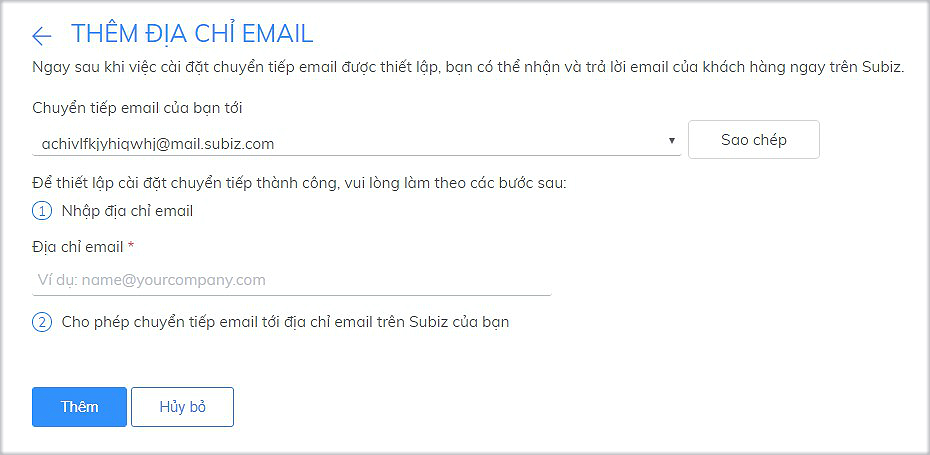

# Tích hợp Bizweb mail vào Subiz

Bạn đang sử dụng dịch vụ Bizweb mail của Sapo web. 

Bài viết này sẽ hướng dẫn bạn cài đặt tích hợp Bizweb mail vào Subiz để bạn có thể nhận và gửi email khách hàng ngay trên trang quản trị của Subiz.

### **Bước 1: Thêm địa chỉ email của doanh nghiệp vào Subiz**

Đây là danh sách email bạn muốn tích hợp trên Subiz để nhận và gửi email cho khách hàng.

Bạn làm theo các bước sau để thêm địa chỉ email:

* Đăng nhập Subiz và vào mục Cài đặt &gt; Tài khoản &gt; Email
* Chọn **Thêm địa chỉ Email**
* Nhập địa chỉ email của doanh nghiệp vào phần **Nhập địa chỉ email**
* Chọn **Thêm**

### **Bước 2: Cài đặt tự động chuyển tiếp thư trên Bizweb mail**

* Đăng nhập [Bizweb mail](https://mail.bizwebmail.vn/)
* Chọn Preferences  &gt; Mail &gt; Recieving Messages &gt; [Sao chép địa chỉ email trên Subiz của bạn](https://app.subiz.com/settings/email-add) và dán vào ô **Forward a copy to** &gt; Save để hoàn thành

Sau khi hoàn thành 2 bước tích hợp Bizweb mail vào Subiz, bạn đã có thể nhận và trả lời mail của khách hàngngay trên trang [HOẠT ĐỘNG của Subiz](https://app.subiz.com/activities).

> Bạn cần hỗ trợ thêm, vui lòng gửi yêu cầu qua Support@subiz.com hoặc chat online tại [Subiz.com](https://subiz.com/vi/feature.html)!

