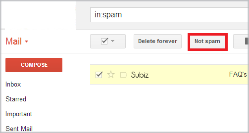

# Tôi không nhận được email của Subiz

Subiz sử dụng dịch vụ gửi email của những hệ thống lớn \( [AWS SES](https://aws.amazon.com/ses/); [Sendgrid](https://sendgrid.com/); [Mailgun](https://www.mailgun.com/) \) đảm bảo tính ổn định và gửi với số lượng lớn email trong ngày. Vì một lý do nào đó bạn không nhận được email của Subiz, bạn cần giải quyết như sau:

### Kiểm tra lại hòm email của bạn.

Nội dung email Subiz có thể chứa các đoạn chat giao dịch. Có nhiều từ ngữ có thể liên quan đến giá, báo giá… làm các hệ thống mail tưởng là thư quảng cáo, hoặc thư rác. Vậy hãy kiểm tra trong thư mục rác \(spam\) hoặc phần thư quảng cáo \( Promotion nếu là email Google \).

Nếu phát hiện, bạn sẽ xác nhận nó không phải là Spam để đảm bảo cho những lần sau.

Nếu là thư quảng cáo, bạn hãy di chuyển nó về thư mục chính \(Primary\).

Bạn cũng cần chú ý những bộ lọc email mà bạn tạo. Có thể nó được chuyển vào một thư mục riêng. Lúc này bạn cần tìm kiếm từ khóa Subiz trong hòm mail để xác định được vị trí của nó.

 Sau đây Subiz chia sẻ một số nguyên nhân thường gặp:

* **Domain của bạn bị coi là Spam**

Công cụ để kiếm tra: [MxToolbox](http://mxtoolbox.com/blacklists.aspx) . Cách giải quyết là bạn liên lạc với tổ chức liệt kê domain bạn là Spam để yêu cầu họ gỡ bỏ.

* **Email bị lỗi hoặc không tồn tại**

* **Máy chủ email không ổn định**

Máy chủ email bạn không ổn định \([soft bounce](http://kb.mailchimp.com/delivery/deliverability-research/soft-vs-hard-bounces)\) và gián đoạn đúng thời điểm Subiz gửi email tới email của bạn. Nếu 03 lần gửi liên tiếp không thành công thì hệ thống sẽ dừng \(block\) việc gửi tới email đó. Để giải quyết, bạn cần cho chúng tôi biết để mở lại đồng thời thông báo với bên cung cấp dịch vụ email để đảm bảo sự ổn định hơn.

Chúng tôi khuyến cáo, nếu lượng cuộc chat của bạn nhiều \(hơn 30 cuộc mỗi ngày\), bạn nên tắt chức năng nhận [lịch sử chat](https://docs.subiz.com/lich-su-chat/) qua email. Nó làm hòm mail của bạn thêm nhiều email mà chưa chắc bạn đã đọc được hết. Các cuộc chat này đã được Subiz lưu mà bạn có thể đọc bất cứ lúc nào.

### Liên hệ với Subiz để được hỗ trợ

 Sau khi thực hiện các bước trên, bạn vẫn không thấy email của Subiz gửi. Vậy có thể nó đã không được gửi tới hòm mail của bạn. Hãy liên lạc với Subiz qua email [support@subiz.com](mailto:support@subiz.com) hoặc cửa sổ chat tại [Subiz.com](https://subiz.com/vi/) để được hỗ trợ trực tiếp.

