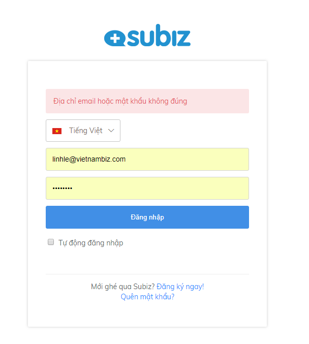
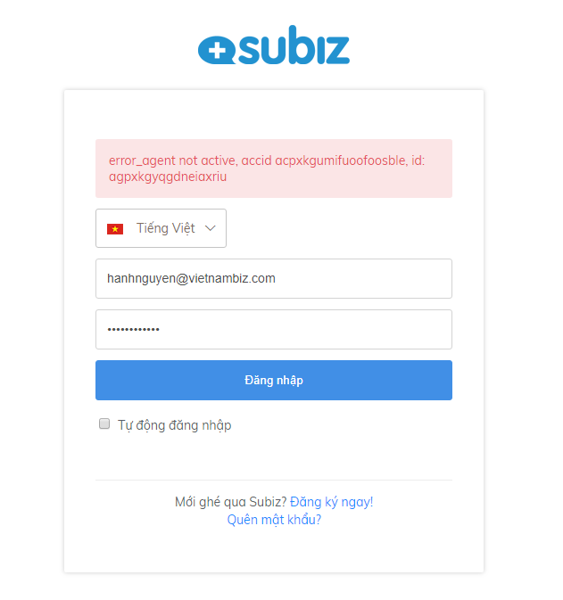
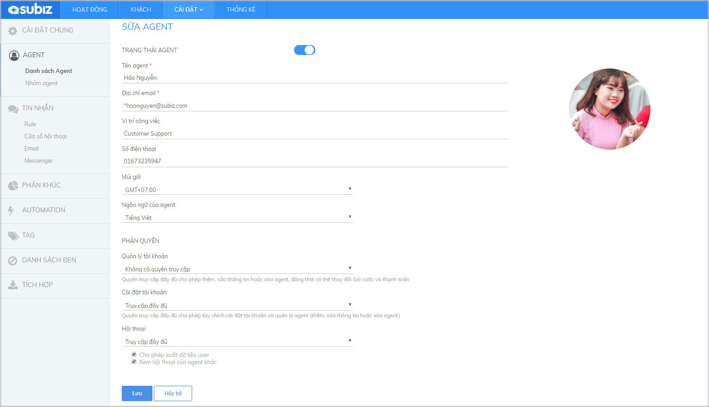
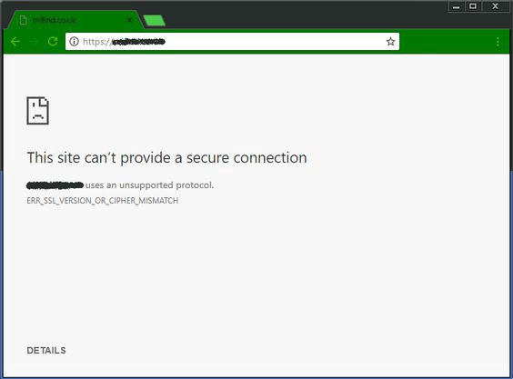

# Những vấn đề gặp phải khi đăng nhập Dashboard

Khi đăng nhập sử dụng trang quản lý Dashboard, bạn có thể gặp một số tình huống khiến bạn không thể đăng nhập tài khoản. Bài viết sau sẽ đề cập tới những trường hợp này và cách thực hiện để bạn đăng nhập thành công.

### Người dùng hoặc mật khẩu không đúng

* **Nguyên nhân:** Bạn nhập sai thông tin đăng nhập: Email hoặc mật khẩu

* **Cách khắc phục:** Với trường hợp này, bạn cần kiểm tra lại thông tin đăng nhập như: Email, mật khẩu xem đã chính xác chưa?

Nếu không chắc chắn về mật khẩu, bạn có thể thực hiện reset lại mật khẩu theo[ hướng dẫn](https://docv4.subiz.com/quan-ly-mat-khau/)

### Agent này đang bị khóa

* **Nguyên nhân:** Agent đang ở trạng thái Inactive

* **Cách khắc phục:** Để mở khóa, bạn cần liên hệ người quản lý tài khoản chính \(owner\) hoặc agent có quyền cài đặt tài khoản vào phần: Cài đặt&gt; Tài khoản &gt;Danh sách agent &gt; Lựa chon Agent và bật Active trạng thái.

### Agent này đã bị xóa

#### **Nếu tài khoản của bạn là owner \(tài khoản chính\)**:

* **Nguyên nhân:** Tài khoản của bạn đã bị xóa tự động khỏi hệ thống do không được xác nhận đăng ký qua email Subiz gửi về trong vòng 24h kể từ khi bạn hoàn tất form đăng ký.
* **Cách khắc phục:** Subiz chỉ cho phép 1 địa chỉ email sử dụng một lần duy nhất trong hệ thống, vì vậy bạn cần đăng ký lại bằng 1 email khác và nhớ xác nhận ngay khi đăng ký.

#### **Nếu agent không phải là owner**

* **Nguyên nhân:** Tài khoản của bạn đã bị xóa do agent có quyền cài đặt tài khoản hoặc agent owner thực hiện
* **Cách khắc phục:** Bạn có thể liên hệ agent có quyền cài đặt tài khoản đăng nhập Dashboard và [mời thêm agent mới ](https://docv4.subiz.com/moi-agent-moi/)trên trang quản lý.

### Lỗi trình duyệt

Một trong những lỗi trình duyệt phổ biến là  ERRERR\_SSL\_VERSION\_OR\_CIPHER\_MISMATCH, trình duyệt sẽ hiển thị lỗi khi hệ thống hoặc trình duyệt không thể thiết lập kết nối Dashboard Subiz.



* Kết nối Internet kém
* Bộ nhớ cache và cookie của trình duyệt không bị xóa
* Tiện ích bổ sung hoặc tiện ích không cần thiết được cài đặt trong trình duyệt
* Trang web bị chặn trong Tường lửa
* Trang web có thể bị chặn hoặc chuyển vào chương trình chống vi-rút.



* Kiểm tra kết nối internet của bạn
* Xóa bộ nhớ cache và cookie của trình duyệt.
* Loại bỏ tiện ích mở rộng và tiện ích không cần thiết
* Kiểm tra tường lửa, danh sách đen và danh sách trắng phần mềm chống vi rút.
* Bật TLS 1.3
* Tắt giao thức QUIC



Nếu bạn không đăng nhập được vì bất cứ lý do nào khác, hãy liên hệ ngay support@subiz.com để Subiz hỗ trợ ngay cho bạn

###  

