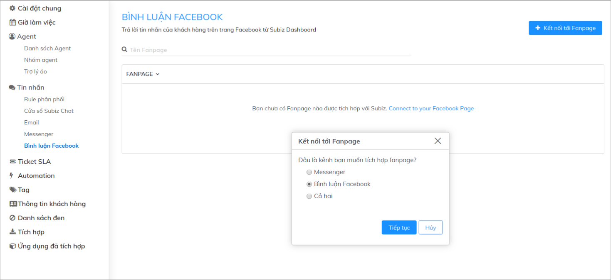
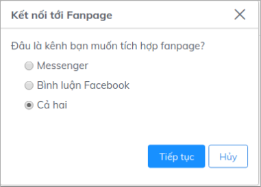
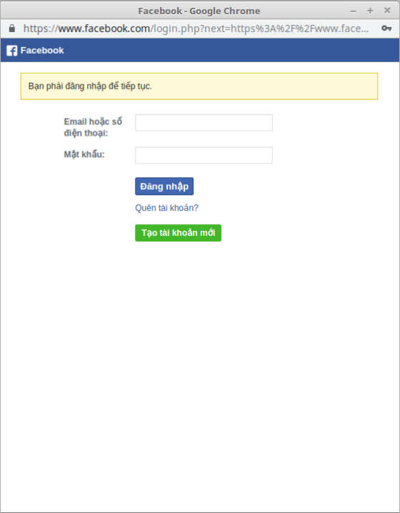
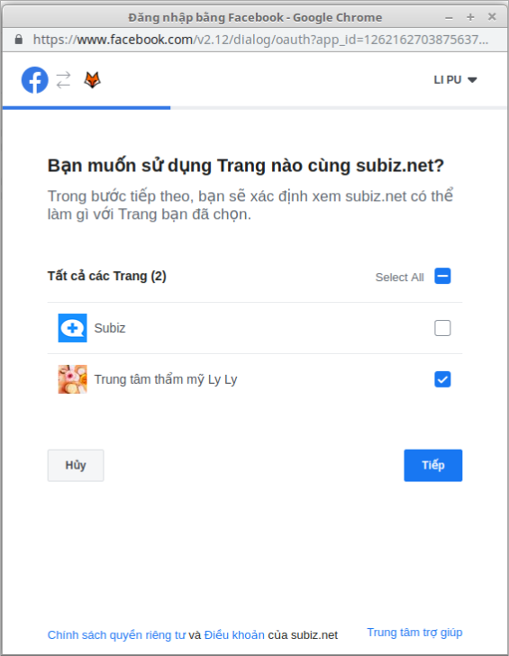
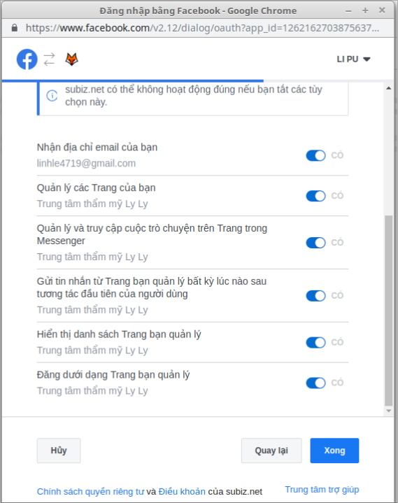
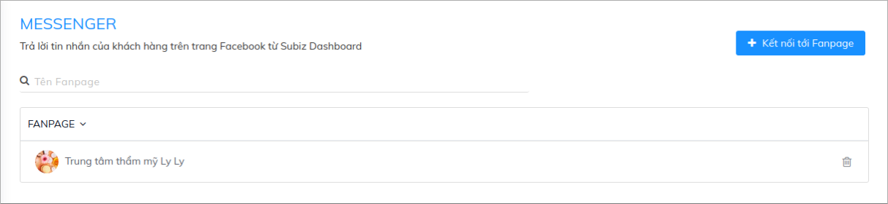

# Tích hợp Bình luận Facebook

Cùng với chức năng tích hợp Bình luận Facebook, Subiz sẽ hoạt động như một phần mềm quản lý Fanpage chuyên nghiệp, giúp bạn có thể quản lý tập trung tới hàng trăm fanpage, không giới hạn số lượng tin nhắn, bình luận và tăng tốc độ tương tác với khách hàng.

Giờ đây, bạn sẽ không còn cần phải làm việc trên nhiều trang độc lập và có thể hạn chế việc nhầm lẫn,bỏ sót khi lượng khách hàng qúa tải. Tất cả các tương tác trên website, fanpage, email của bạn sẽ cùng tập trung trên Subiz, giúp bạn có thể thể làm việc dễ dàng trên một trang quản trị.

Bài viết sau sẽ hướng dẫn bạn cách tích hợp **Bình luận Facebook** vào Subiz 

### Tích hợp Bình luận Facebook 

Bạn sẽ vào mục: [**Cài đặt &gt; Bình luận Facebook &gt; Kết nối Fanpage**](https://app.subiz.com/settings/facebook-comment#)\*\*\*\*

Trong trường hợp bạn muốn tích hợp cả Messenger và Bình luận, bạn sẽ lựa chọn **Cả hai**

Hãy chắc chắn rằng bạn đang đăng nhập đúng tài khoản có quyền quản trị các Fanpage để có thể hoàn thành bước tích hợp:

Khi đó bạn có thể lựa chọn các Fanpage bạn muốn quản lý trên Subiz:  

Và cấp quyền cho Subiz:

Sau khi click **Xong,** bạn có thể tích hợp các Fanpage lên Subiz

### Quản lý Bình luận Facebook trên Subiz 

Bây giờ bạn sẽ làm việc trên một giao diện hoàn toàn mới:

Bạn cũng có thể sử dụng các tương tác tự động như: **Tự động thích bình luận**, **tự động ẩn bình luận**, **tự động phản hồi bình luận** bằng việc thiết lập Automation trên Subiz : [Hướng dẫn ](https://help.subiz.com/su-dung-subiz-nang-cao/tuong-tac-tu-dong/mot-so-automation-thong-dung/quan-ly-comment-facebook-cung-automation)

Ngoài ra bạn cũng có thể chủ động nhắn tin cho khách hàng:

Hơn một phần mềm quản lý bình luận và tin nhắn Fanpage thông thường, bạn còn có thể xin thông tin của khách hàng như Tên, địa chỉ, số điện thoại, email... để lưu lại trên hệ thống. Và bạn hoàn toàn có thể tương tác với khách hàng qua những kênh khác, ví dụ như gửi email cho khách hàng.

Cần hỗ trợ thêm, hãy chat với Subiz qua website [Subiz.com](https://subiz.com/) nhé!


**Lưu ý:**

* Bạn có thể tích hợp **không giới hạn số lượng Fanpage** vào Subiz.
* Mỗi tin nhắn gửi từ Subiz sẽ tương đương với 1 lượt bình luận trên Fanpage.


