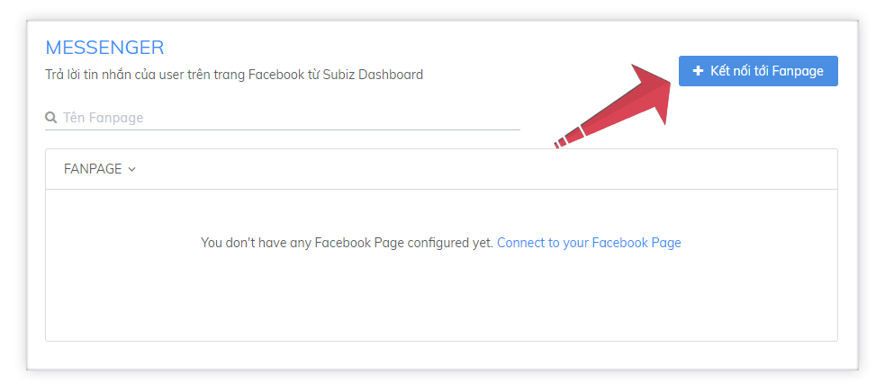
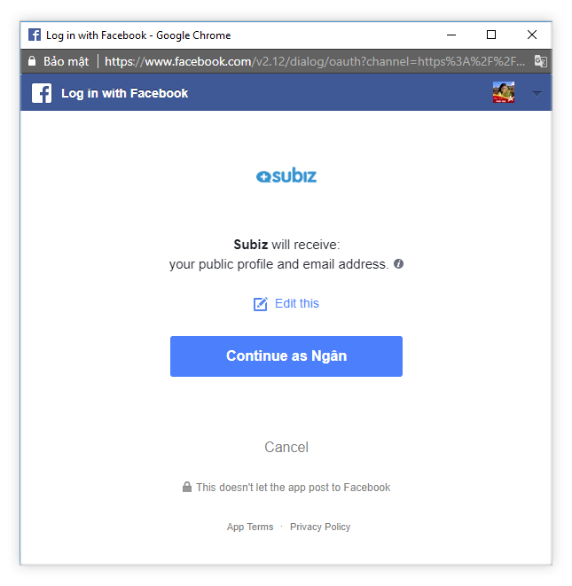

# Tích hợp Fanpage Facebook vào Subiz

[Messenger](https://subiz.com/vi/facebook-messenger.html) là một trong các kênh tương tác mà bạn có thể tích hợp cùng tài khoản [Subiz](https://subiz.com/vi/). Chỉ cần tích hợp [Subiz](https://subiz.com/vi/) và Fanpage Facebook, **bạn có thể nhận và trả lời tin nhắn mà khách hàng gửi cho bạn trên Fanpage ngay trên** [**Subiz**](https://subiz.com/vi/)**.**

**Bạn có thể tích hợp nhiều Fanpage lên cùng một tài khoản** [**Subiz**](https://subiz.com/vi/v)**,** rất tiện dụng để quản lý tập trung các tương tác trên Fanpage của doanh nghiệp.

Để tích hợp tài khoản Subiz và Fanpage Facebook, bạn thực hiện theo các bước sau:

### **Bước 1: Kết nối với Fanpage**

[**Đăng nhập tài khoản Subiz &gt; Cài đặt &gt; Tài khoản &gt; Tin nhắn &gt; Messenger**](https://app.subiz.com/settings/messenger)**.** Click chọn nút **Kết nối với Fanpage**

### **Bước 2: Nhập thông tin tài khoản Facebook của bạn** 


Nhập thông tin tài khoản Admin của Fanpage mà bạn dự định tích hợp


### **Bước 3: Cho phép Subiz truy cập dữ liệu trên Facebook của bạn**

Khi bạn cho phép [Subiz](https://subiz.com/vi/) quản lý tin nhắn của Fanpage, tất cả các tin nhắn của Fanpage được hiển thị và có thể trả lời \(reply\) từ [Subiz](https://subiz.com/vi/)

### **Bước 4: Lựa chọn các Fanpage mà bạn muốn tích hợp**

Sau khi bạn đăng nhập tài khoản và cho phép [Subiz](https://subiz.com/vi/) truy cập dữ liệu, tất cả các Fanpage mà bạn quản lý sẽ được hiển thị trên trang Messenger. Bạn có thể xóa các Fanpage mà bạn không muốn tích hợp bằng cách click vào nút xóa bên cạnh Fanpage đó.

​

