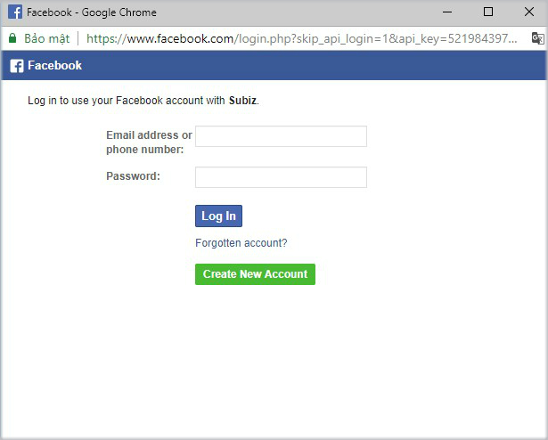
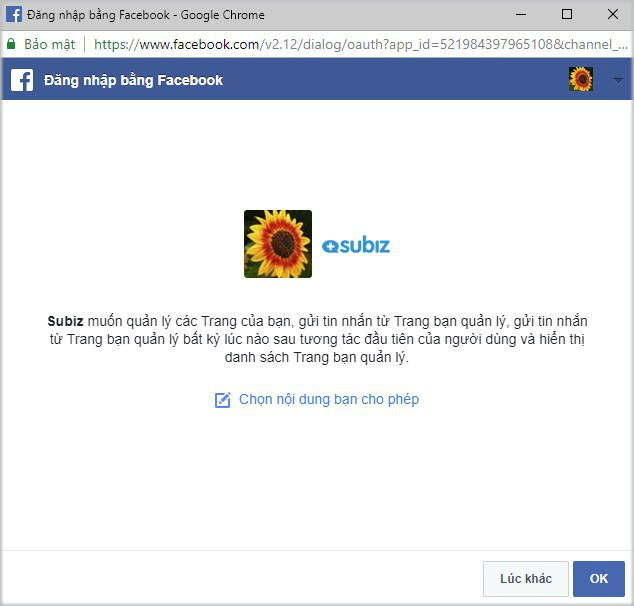
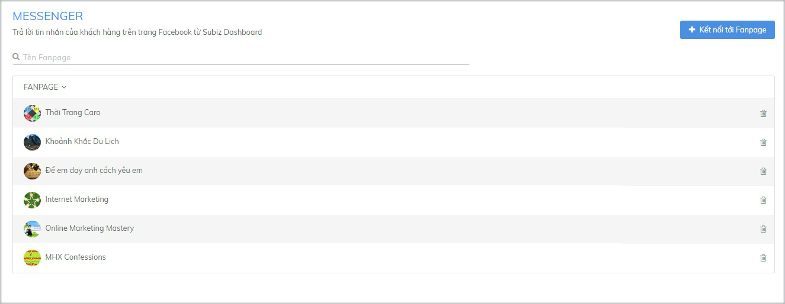

# Tích hợp Messenger Facebook vào Subiz

Messenger Facebook là một trong các kênh tương tác khách hàng trên Subiz. Khi tích hợp Messenger vào Subiz, bạn có thể nhận và trả lời tin nhắn khách hàng gửi từ Fanpage ngay trên trang quản lý Subiz.


Lưu ý:

* Bạn có thể cài đặt nhiều Fanpage cùng lúc vào Subiz để thuận tiện trò chuyện tư vấn khách hàng và quản lý dữ liệu khách hàng tập trung.
* Bạn quản lý nhiều Fanpage, bạn có thể chủ động lựa chọn Fanpage muốn cài đặt vào Subiz để làm việc.


## 3 bước tích hợp Messenger vào Subiz như sau: 

### Bước 1: Kết nối tới Fanpage

Bạn đăng nhập [App.subiz.com &gt; Cài đặt &gt; Tài khoản &gt; Messenger &gt; chọn Kết nối tới Fanpage ](https://app.subiz.com/settings/messenger)

### Bước 2: Đăng nhập tài khoản Facebook

Đăng nhập tài khoản Facebook cá nhân của bạn đang quản lý các Fanpage


Lưu ý: Chỉ những tài khoản Facebook có Vai trò trên Trang là **Quản trị viên**, **Biên tập viên**, **Người kiểm duyệt** được phép kết nối Fanpage vào Subiz.


### Bước 3: Chọn Fanpage bạn muốn kết nối vào Subiz

Bạn sẽ cấp quyền cho Subiz 4 nội dung: Quản lý các Trang của bạn; Gửi tin nhắn từ Trang bạn quản lý; Gửi tin nhắn từ Trang bạn quản lý bất kỳ lúc nào sau tương tác đầu tiên của người dùng và Hiển thị danh sách Trang bạn quản lý.  
  
Bạn có thể chọn kết nối tất cả Fanpage vào Subiz hoặc một số Fanpage như sau:

* Để kết nối tất cả Fanpage đang quản lý vào Subiz, bạn chỉ cần chọn OK 

* Để chọn kết nối một số Fanpage vào Subiz, bạn thao tác click "Chọn nội dung bạn cho phép" &gt; Click "Tất cả các Pages" &gt; Chọn Fanpage bạn muốn kết nối vào Subiz &gt; Lưu 

### Tích hợp Messenger thành công

Khi đã tích hợp Messenger thành công, danh sách các Fanpage được kết nối vào Subiz sẽ hiển thị như sau: 

## Một số lưu ý với kênh Messenger trên Subiz

### 1. Nhận và trả lời tin nhắn khách hàng từ Fanpage

Để nhận và trả lời tin nhắn khách hàng gửi từ các Fanpage, bạn vào trang HOẠT ĐỘNG và sử dụng các tính năng hữu ích của Subiz. [Xem thêm tại đây](https://help.subiz.com/bat-dau-voi-subiz/lam-viec-tren-subiz/tuong-tac-qua-kenh-messenger)

### 2. Thêm Fanpage mới bạn muốn kết nối vào Subiz

Để thêm Fanpage mới kết nối vào Subiz, bạn cần gỡ Subiz trong mục Tích hợp tiện ích cho doanh nghiệp và thực hiện lại theo 3 bước tích hợp Messenger như trên.

### 3. Xóa Fanpage bạn đã kết nối vào Subiz

Bạn cần thực hiện 2 bước để xóa hoàn toàn Fanpage đã kết nối vào Subiz và không nhận tin nhắn mới của khách hàng gửi từ Fanpage trên Subiz.

Bước 1: Xóa Fanpage trên Subiz

Bước 2: Xóa Subiz trên Fanpage

* Nếu bạn muốn xóa tất cả Fanpage trên Subiz, bạn thao tác như sau:  &gt; Đăng nhập tài khoản Facebook của bạn  &gt; chọn Cài đặt &gt; chọn Tiện ích tích hợp cho doanh nghiệp &gt; chọn Gỡ Subiz 

* Nếu bạn muốn xóa chỉ một số Fanpage trên Subiz, bạn thao tác như sau:  &gt; Đăng nhập tài khoản Facebook của bạn  &gt; chọn Fanpage muốn xóa trên Subiz &gt; chọn Cài đặt &gt; chọn Nền tảng Messenger  &gt;  chọn Gỡ cài đặt Subiz  &gt; Xác nhận

> Bạn có câu hỏi cần hỗ trợ, vui lòng chat trực tiếp với tư vấn viên trên [Subiz.com](https://subiz.com/vi/)

-----------------------------------------------

[Messenger](https://subiz.com/vi/facebook-messenger.html) là một trong các kênh tương tác mà bạn có thể tích hợp cùng tài khoản [Subiz](https://subiz.com/vi/). Chỉ cần tích hợp [Subiz](https://subiz.com/vi/) và Fanpage Facebook, **bạn có thể nhận và trả lời tin nhắn mà khách hàng gửi cho bạn trên Fanpage ngay trên** [**Subiz**](https://subiz.com/vi/)**.**

**Bạn có thể tích hợp nhiều Fanpage lên cùng một tài khoản** [**Subiz**](https://subiz.com/vi/v)**,** rất tiện dụng để quản lý tập trung các tương tác trên Fanpage của doanh nghiệp.

Để tích hợp tài khoản Subiz và Fanpage Facebook, bạn thực hiện theo các bước sau:

### **Bước 1: Kết nối với Fanpage**

[**Đăng nhập tài khoản Subiz &gt; Cài đặt &gt; Tài khoản &gt; Tin nhắn &gt; Messenger**](https://app.subiz.com/settings/messenger)**.** Click chọn nút **Kết nối với Fanpage**

### **Bước 2: Nhập thông tin tài khoản Facebook của bạn** 


Nhập thông tin tài khoản Admin của Fanpage mà bạn dự định tích hợp


### **Bước 3: Cho phép Subiz truy cập dữ liệu trên Facebook của bạn**

Khi bạn cho phép [Subiz](https://subiz.com/vi/) quản lý tin nhắn của Fanpage, tất cả các tin nhắn của Fanpage được hiển thị và có thể trả lời \(reply\) từ [Subiz](https://subiz.com/vi/)

### **Bước 4: Lựa chọn các Fanpage mà bạn muốn tích hợp**

Sau khi bạn đăng nhập tài khoản và cho phép [Subiz](https://subiz.com/vi/) truy cập dữ liệu, tất cả các Fanpage mà bạn quản lý sẽ được hiển thị trên trang Messenger. Bạn có thể xóa các Fanpage mà bạn không muốn tích hợp bằng cách click vào nút xóa bên cạnh Fanpage đó.

​

