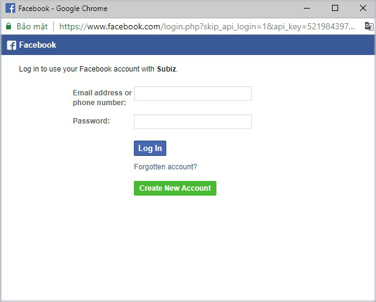
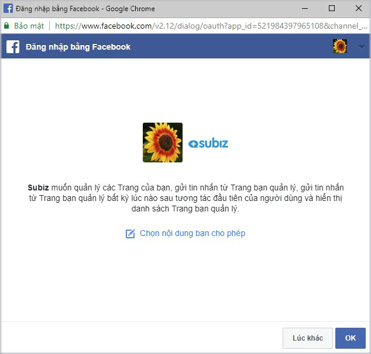
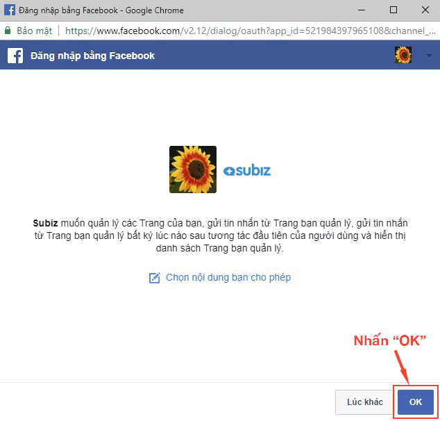
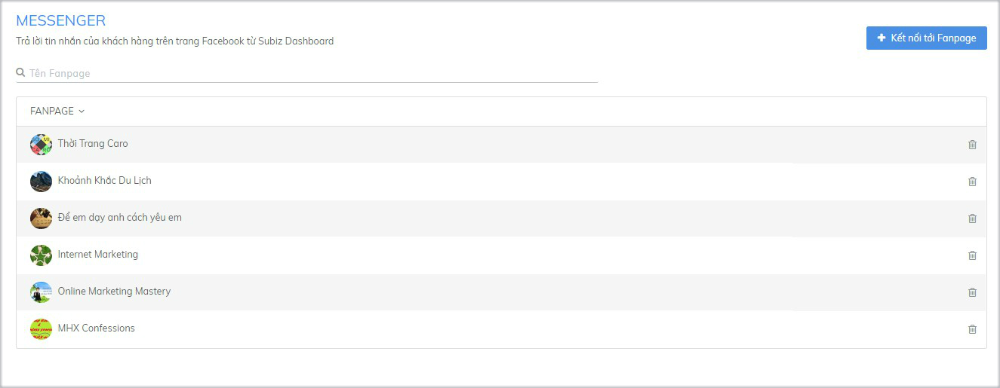
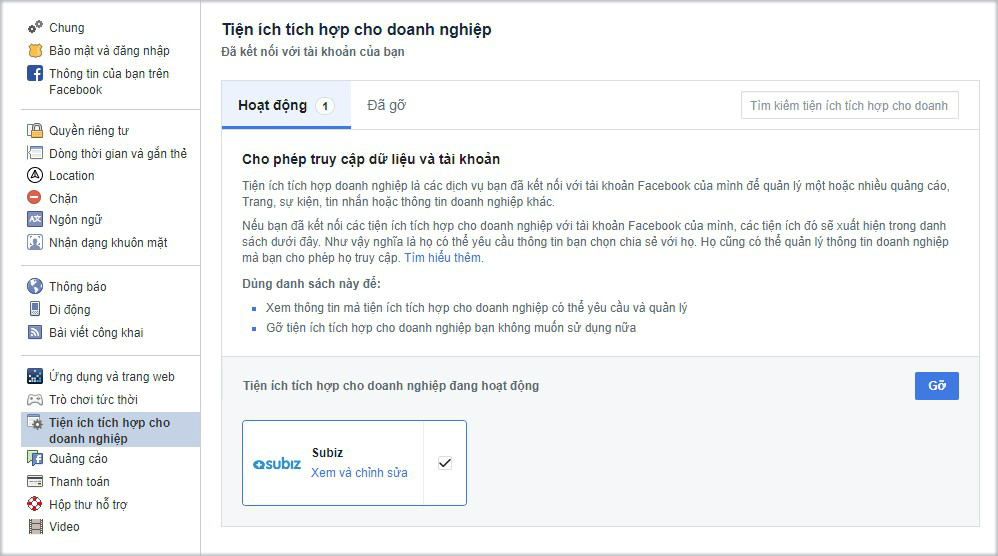
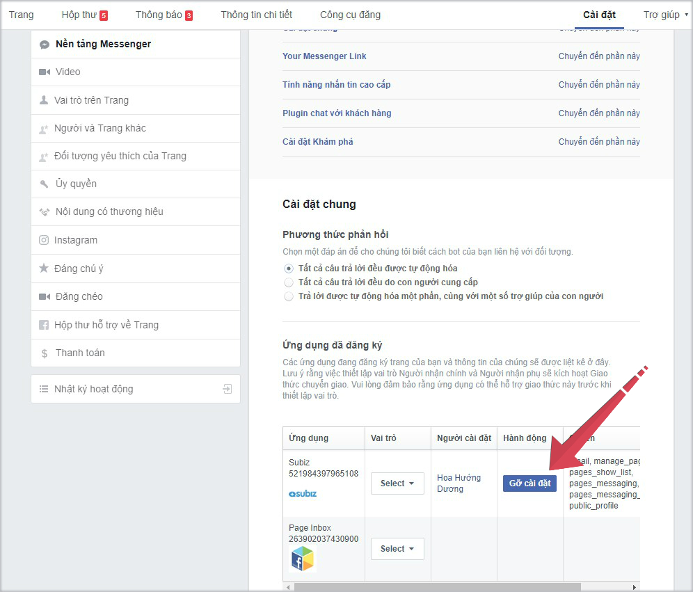

# Tích hợp Messenger Facebook vào Subiz

Messenger Facebook là một trong các kênh tương tác khách hàng trên Subiz. Khi tích hợp Messenger vào Subiz, bạn có thể nhận và trả lời tin nhắn khách hàng gửi từ Fanpage ngay trên trang quản lý Subiz.


Lưu ý:

* Cài đặt **không giới hạn số lượng Fanpage** cùng lúc vào Subiz để thuận tiện tư vấn khách hàng và quản lý dữ liệu khách hàng tập trung.
* Chủ động lựa chọn Fanpage muốn cài đặt vào Subiz để làm việc.


## 3 bước tích hợp Messenger vào Subiz như sau: 

### Bước 1: Kết nối tới Fanpage

Bạn đăng nhập [App.subiz.com &gt; Cài đặt &gt; Tài khoản &gt; Messenger &gt; chọn Kết nối tới Fanpage ](https://app.subiz.com/settings/messenger)

### Bước 2: Đăng nhập tài khoản Facebook

Đăng nhập tài khoản Facebook cá nhân của bạn đang quản lý các Fanpage


Lưu ý: Chỉ những tài khoản Facebook có Vai trò trên Trang là **Quản trị viên**, **Biên tập viên**, **Người kiểm duyệt** được phép kết nối Fanpage vào Subiz.


### Bước 3: Chọn Fanpage bạn muốn kết nối vào Subiz

Bạn sẽ cấp quyền cho Subiz 4 nội dung: Quản lý các Trang của bạn; Gửi tin nhắn từ Trang bạn quản lý; Gửi tin nhắn từ Trang bạn quản lý bất kỳ lúc nào sau tương tác đầu tiên của người dùng và Hiển thị danh sách Trang bạn quản lý.  
  
Bạn có thể chọn kết nối tất cả Fanpage vào Subiz hoặc một số Fanpage như sau:

* Để kết nối tất cả Fanpage đang quản lý vào Subiz, bạn chỉ cần chọn OK 

* Để chọn kết nối một số Fanpage vào Subiz, bạn thao tác click "Chọn nội dung bạn cho phép" &gt; Click "Tất cả các Pages" &gt; Chọn Fanpage bạn muốn kết nối vào Subiz &gt; Lưu 

### Tích hợp Messenger thành công

Khi đã tích hợp Messenger thành công, danh sách các Fanpage được kết nối vào Subiz sẽ hiển thị như sau: 

## Một số lưu ý với kênh Messenger trên Subiz

### 1. Nhận và trả lời tin nhắn khách hàng từ Fanpage

Để nhận và trả lời tin nhắn khách hàng gửi từ các Fanpage, bạn vào trang HOẠT ĐỘNG và sử dụng các tính năng hữu ích của Subiz. [Xem thêm tại đây](https://help.subiz.com/bat-dau-voi-subiz/lam-viec-tren-subiz/tuong-tac-qua-kenh-messenger)

### 2. Thêm Fanpage mới bạn muốn kết nối vào Subiz

Để thêm Fanpage mới kết nối vào Subiz, bạn cần gỡ Subiz trong mục Tích hợp tiện ích cho doanh nghiệp và thực hiện lại theo 3 bước tích hợp Messenger như trên.

### 3. Xóa Fanpage bạn đã kết nối vào Subiz

Có 2 cách xóa hoàn toàn Fanpage đã kết nối vào Subiz và không nhận tin nhắn mới của khách hàng gửi từ Fanpage trên Subiz.

#### Cách 1: Xóa Fanpage trên Subiz

#### Cách 2: Xóa Subiz trên Fanpage

* **Trường hợp 1:** Nếu bạn muốn xóa tất cả Fanpage trên Subiz, bạn thao tác như sau:  &gt; Đăng nhập tài khoản Facebook của bạn  &gt; chọn Cài đặt &gt; chọn Tiện ích tích hợp cho doanh nghiệp &gt; chọn Gỡ Subiz 

* **Trường hợp 2**: Nếu bạn muốn xóa chỉ một số Fanpage trên Subiz, bạn thao tác như sau:  &gt; Đăng nhập tài khoản Facebook của bạn  &gt; chọn Fanpage muốn xóa trên Subiz &gt; chọn Cài đặt &gt; chọn Nền tảng Messenger  &gt;  chọn Gỡ cài đặt Subiz  &gt; Xác nhận

> Bạn có câu hỏi cần hỗ trợ, vui lòng chat trực tiếp với tư vấn viên trên [Subiz.com](https://subiz.com/vi/)

