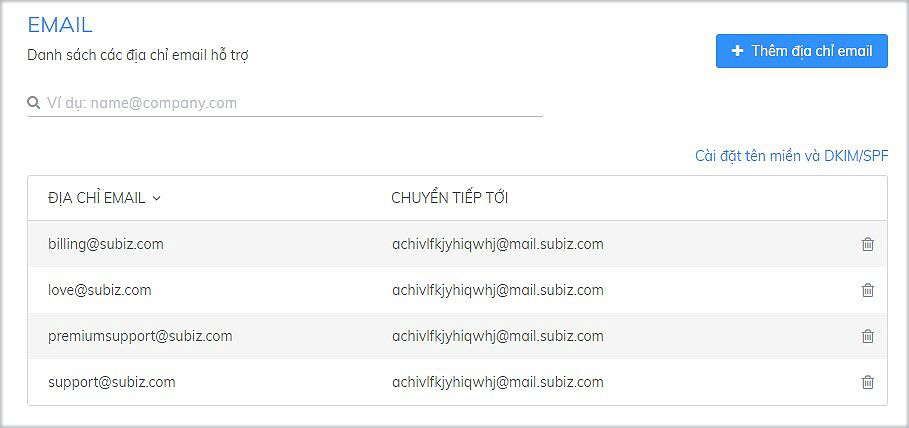
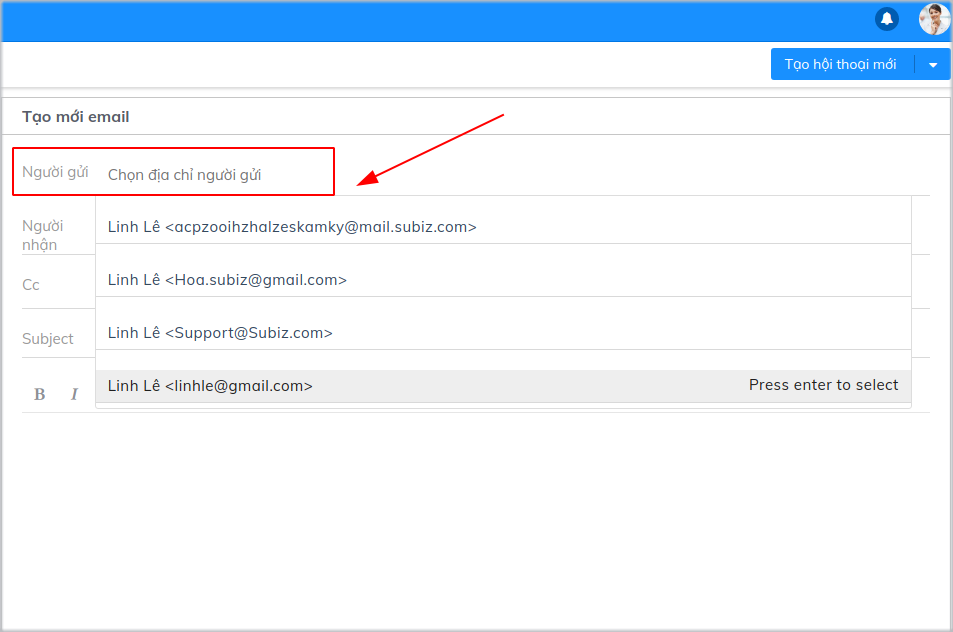
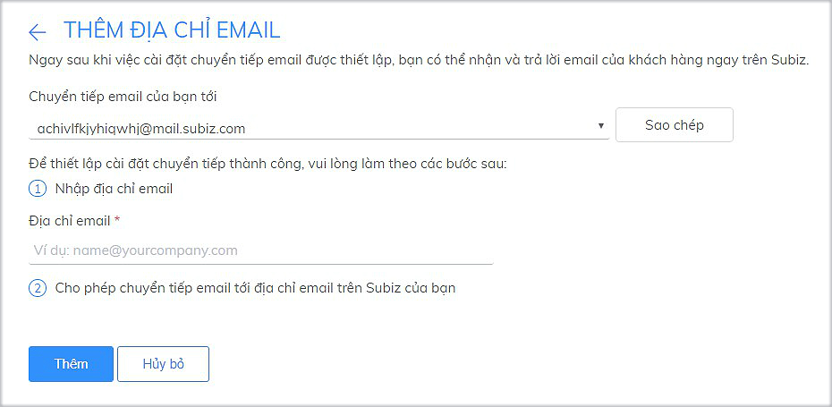
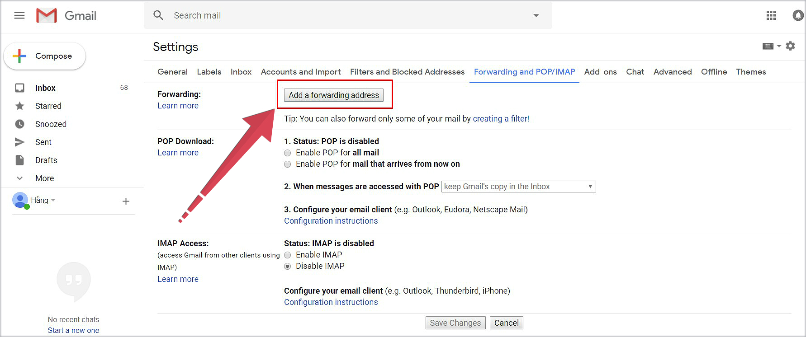
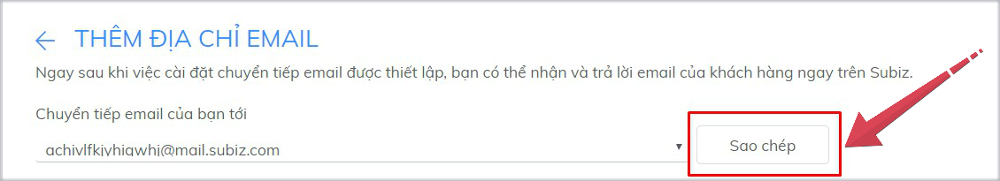
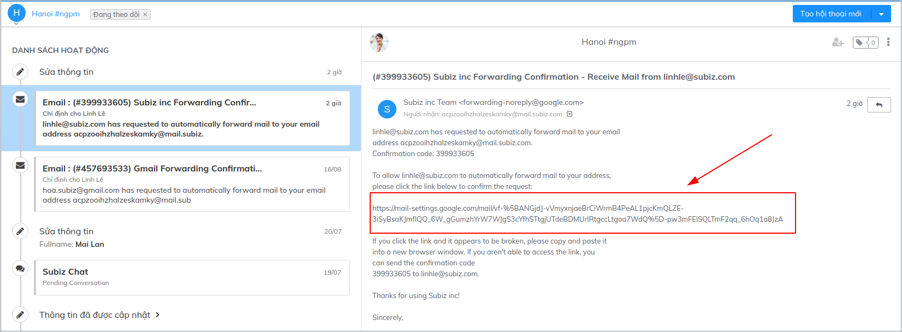

# Tích hợp sử dụng Email trên Subiz

Với việc tích hợp email, Subiz sẽ hoạt động giống như một hòm thư giúp bạn có thể nhận, trả lời và gửi các email cho khách hàng một cách nhanh chóng, tiện lợi mà không cần đăng nhập vào công cụ quản lý email khác.

## 1. Cách thức hoạt động của kênh Email Subiz

Bạn cần lưu ý 2 loại địa chỉ Email sau trong quá trình tích hợp:

* **Income Email** hay địa chỉ email trên Subiz**:**  Khi[ đăng ký tài khoản Subiz](https://app.subiz.com/register), bạn sẽ được cung cấp một địa chỉ email có dạng **abcxyz@mail.subiz.com**. Tất cả các email được gửi về địa chỉ này sẽ được coi như một cuộc hội thoại trên[ Subiz](https://subiz.com/vi/).

Tại trang Cài đặt Email, bạn sẽ theo dõi  danh sách các địa chỉ email của doanh nghiệp muốn chuyển tiếp email về địa chỉ mail trên Subiz của bạn **abcxyz@mail.subiz.com** để bạn có thể nhận email luôn trên Subiz


**Lưu ý:**  Danh sách này chỉ mang tính chất giúp quản lý địa chỉ email sử dụng trên Subiz \(quản lý số lượng, thêm, xóa các địa chỉ email đã được liệt kê\). Bạn cần thực hiện đủ 2 bước tích hợp Email trên Subiz để nhận và trả lời thư của khách hàng trên Subiz.


* **Outcome Email:** Là địa chỉ email sẽ gửi thư cho khách hàng. Bạn có thể lựa chọn sử dụng địa chỉ outcome email tại mục Người gửi khi soạn email.


**Lưu ý:** Sau khi bạn cài đặt tích hợp email trên Subiz thành công , thì địa chỉ email của doanh nghiệp sẽ được sử dụng để làm outcome email.


## 2. Cài đặt tích **hợp** Email trên Subiz

Để đảm bảo có thể gửi email ra và nhận email vào tài khoản Subiz của bạn, bạn cần thao tác theo 2 bước sau:

### **Bước 1: Thêm địa chỉ email của doanh nghiệp vào Subiz**

Đây là danh sách email bạn muốn tích hợp trên Subiz để nhận và gửi email cho khách hàng.

Bạn làm theo các bước sau để thêm địa chỉ email:

* Đăng nhập tài khoản và vào phần [**Cài đặt &gt; Tài khoản &gt; Email**](https://app.subiz.com/settings/email)
* Chọn **Thêm địa chỉ Email**
* Nhập địa chỉ email của doanh nghiệp vào phần **Nhập địa chỉ email**
* Chọn **Thêm**

### **Bước 2: Cài đặt chuyển tiếp tự động trên tài khoản email của doanh nghiệp**

Đây là bước cài đặt để cho phép tự động chuyển tiếp thư của khách hàng được gửi cho bạn vào tài khoản Subiz giúp bạn có thể nhận và trả lời email ngay trên Subiz.


Tham khảo hướng dẫn chi tiết cài đặt tự động chuyển tiếp trên [Google mail](https://support.google.com/mail/answer/10957?hl=vi), [Yahoo Mail](https://help.yahoo.com/kb/SLN22028.html), [Office 365](https://support.office.com/en-us/article/forward-email-from-office-365-to-another-email-account-1ed4ee1e-74f8-4f53-a174-86b748ff6a0e), [Outlook](https://support.office.com/en-us/article/turn-on-automatic-forwarding-in-outlook-on-the-web-7f2670a1-7fff-4475-8a3c-5822d63b0c8e), [Zoho mail](https://www.zoho.com/mail/help/email-forwarding.html), [Yandex mail](https://yandex.com/support/mail/web/preferences/filters/forwarding.html), [Bizweb mail](https://help.subiz.com/bat-dau-voi-subiz/thiet-lap-moi-truong-tuong-tac/faqs/tich-hop-bizweb-mail-vao-subiz),...


Dưới đây là hướng dẫn chi tiết Cài đặt chuyển tiếp trên Gmail.

* [Đăng nhập tài khoản Gmail](https://mail.google.com) mà bạn đã nhập thêm trên bước 1
* Click vào biểu tượng bánh xe và chọn **Settings**
* Tại phần Settings, chọn **Forwarding and POP/IMAP**
* Click vào **Add a forwarding address**

* Nhập địa chỉ email trên Subiz của bạn \(để tránh sai sót, bạn chọn nút **Sao chép** tại trang [**Cài đặt Email** trên Subiz](https://app.subiz.com/settings/email-add)\)​

* Chọn **Next &gt; Proceed** 
* Gmail sẽ gửi một thư xác nhận tới địa chỉ email mà Subiz đã cấp cho bạn. Bạn kiểm tra thư này ngay tại mục [HOẠT ĐỘNG](https://app.subiz.com/activities/) trên trang [app. subiz.com](https://app.subiz.com/) như một đoạn hội thoại mới. Click vào link xác nhận được gửi trong thư.

* Trở lại trang **Setting** trong tài khoản Gmail và tải lại trang \(nhấn F5\)
* Chọn **Forward a copy of incoming mail to**
* Chọn **Keep Gmail’s copy in the Inbox** nếu bạn muốn giữ các email đến trong hộp thư \(khuyến nghị sử dụng\)

Sau khi hoàn thành 2 bước trên, thư gửi tới địa chỉ mail của doanh nghiệp cũng sẽ được tự động chuyển tiếp về Subiz như một hội thoại mới. Khi bạn trả lời thư, người nhận sẽ nhìn thấy địa chỉ gửi đến là địa chỉ của doanh nghiệp.

## ​3. Cài đặt DKIM/ SPF cho tên miền để tối ưu việc gửi email

**DKIM \(Domain Keys Indentified Mail\)** là phương thức xác thực e-mail bằng chữ ký số của tên miền gửi thư. Việc thiết lập DKIM cho domain sẽ giúp thư của bạn gửi đi được xác thực và nâng cao tỷ lệ thư vào hộp thư đến của người nhận.

Để việc gửi email trên [Subiz](https://subiz.com/vi/) đạt hiệu quả cao nhất, bạn nên thiết lập DKIM và SPF trên domain của mình.

* ​[Đăng nhập tài khoản Subiz](http://app.subiz.com/), vào phần [**Cài đặt &gt; Tài khoản  &gt; Email**](https://app.subiz.com/settings/email)
* Chọn **Configure DKIM**
* Nhập tên miền hòm thư của bạn \(dạng company.com\)
* Liên hệ người quản lý domain công ty để thiết lập DKIM và SPF cho domain 

> Bạn cần hỗ trợ thêm? Hãy liên hệ tư vấn viên qua chat online tại Subiz.com hoặc gửi mail Support@subiz.com!

