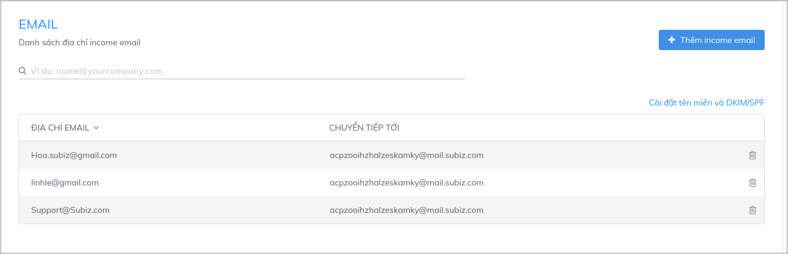
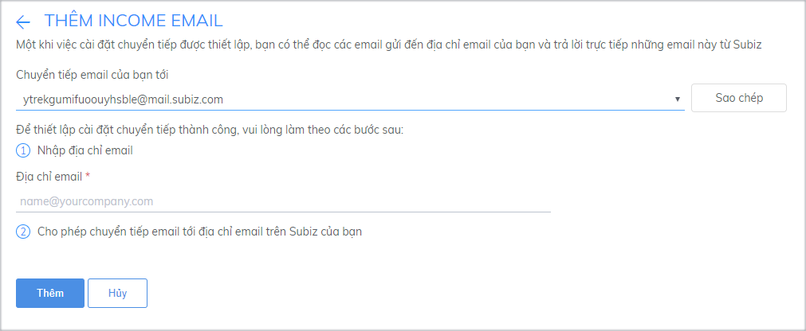
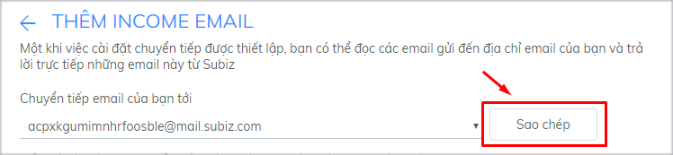

# Tích hợp sử dụng Email trên Subiz

Với việc tích hợp email, Subiz sẽ hoạt động giống như một hòm thư giúp bạn có thể nhận, trả lời và gửi các email cho khách hàng một cách nhanh chóng, tiện lợi mà không cần đăng nhập vào công cụ quản lý email khác.

### Cách thức hoạt động của kênh Email Subiz

Bạn cần lưu ý 2 loại địa chỉ Email sau trong quá trình tích hợp: chào

* **Income Email:**  Khi[ đăng ký tài khoản Subiz](https://app.subiz.com/register), bạn sẽ được cung cấp một địa chỉ email có dạng **abc@mail.subiz.com**. Tất cả các email được gửi về địa chỉ này sẽ được coi như một cuộc hội thoại trên[ Subiz](https://subiz.com/vi/).

Tại trang tích hợp Email, bạn sẽ theo dõi  danh sách các địa chỉ email muốn chuyển tiếp email về **abc@mail.subiz.com** để bạn có thể nhận email luôn trên Subiz


**Lưu ý:**  Danh sách này chỉ mang tính chất giúp quản lý dữ liệu \(quản lý số lượng, thêm, xóa các địa chỉ email đã được liệt kê\) chứ không  thể kiểm tra xem các địa chỉ email được thêm vào danh sách đã thiết lập chuyển tiếp email hay chưa.


* **Outcome Email:** Là địa chỉ email được sử dụng để hiển thị khi email được gửi đi từ tài khoản Subiz tới user


**Lưu ý:** Khi địa chỉ email của bạn đã đưọc cài đặt chuyển tiếp email , thì địa chỉ email này có thể được sử dụng để làm outcome email


### Thiết lập tích **hợp** Email trên Subiz {#thiet-lap-chuyen-tiep-email-tren-subiz}

Để đảm bảo có thể gửi email ra và nhận email vào tài khoản Subiz của bạn, bạn cần thao tác theo 2 bước sau

#### **Bước 1: Tích hợp email cá nhân vào Subiz**

Đây là danh sách email bạn muốn tích hợp trên Subiz để nhận và gửi email cho khách hàng.

Bạn làm theo các bước sau để thêm địa chỉ email:

* Đăng nhập tài khoản và vào phần [**Cài đặt &gt; Tài khoản &gt; Tin nhắn &gt; Email**](https://app.subiz.com/settings/email)
* Chọn **Thêm Income Email**
* Nhập địa chỉ email muốn chuyển tiếp vào phần **Nhập địa chỉ email**
* Chọn **Thêm**

#### **Bước 2: Cài đặt chuyển tiếp trên Email của bạn**

Đây là bước cài đặt để chuyển tiếp những email được gửi cho bạn vào tài khoản Subiz nhằm giúp bạn có thể nhận và trả lời email ngay trên Subiz.

**Đối với tài khoản Gmail**, bạn cài đặt chuyển tiếp theo hướng dẫn sau:

* Đăng nhập tài khoản gmail mà bạn đã nhập trong Income Email
* Click vào biểu tượng bánh xe và chọn **Setting**
* Tại phần Setting, chọn **Forwarding and POP/IMAP**
* Click vào **Add a forwarding address**

* Nhập địa chỉ email mà [Subiz](https://subiz.com/vi/) đã cung cấp cho bạn \(để tránh sai sót, bạn ấn vào nút **Sao chép** tại trang **Cài đặt email** trên [app.Subiz.com](https://app.subiz.com/) để copy địa chỉ email này\)​

* Chọn **Next &gt; Proceed**
* Gmail sẽ gửi một thư xác nhận tới địa chỉ email mà [Subiz](https://subiz.com/vi/) đã cấp cho bạn. Bạn kiểm tra thư này ngay tại phần Activities trên trang [app. subiz.com](https://app.subiz.com/) như một đoạn hội thoại mới. Click vào link xác nhận được gửi trong thư.

* Trở lại trang **Setting** trong tài khoản Gmail và tải lại trang \(nhấn F5\)
* Chọn **Forward a copy of incoming mail to**
* Chọn **Keep Gmail’s copy in the Inbox** nếu bạn muốn giữ các email đến trong hộp thư \(khuyến nghị sử dụng\)

Tham khảo hướng dẫn cài đặt chuyển tiếp với [Yahoo Mail](https://help.yahoo.com/kb/SLN22028.html), [Office 365](https://support.office.com/en-us/article/forward-email-from-office-365-to-another-email-account-1ed4ee1e-74f8-4f53-a174-86b748ff6a0e), [Outlook](https://support.office.com/en-us/article/turn-on-automatic-forwarding-in-outlook-on-the-web-7f2670a1-7fff-4475-8a3c-5822d63b0c8e) …

Sau khi hoàn thành 2 bước trên, thư gửi tới địa chỉ mail trong danh sách Income Email cũng sẽ được chuyển về Subiz như một hội thoại \(conversation\) mới. Khi bạn trả lời thư, người nhận sẽ nhìn thấy địa chỉ gửi đến là địa chỉ đã nhận thư \(địa chỉ email của bạn\).

### ​Cài đặt DKIM/ SPF cho tên miền để tối ưu việc gửi email

**DKIM \(Domain Keys Indentified Mail\)** là phương thức xác thực e-mail bằng chữ ký số của tên miền gửi thư. Việc thiết lập DKIM cho domain sẽ giúp thư của bạn gửi đi được xác thực và tránh vào hòm thư spam.

Để việc gửi email trên [Subiz](https://subiz.com/vi/) đạt hiệu quả cao nhất, bạn nên thiết lập DKIM và SPF trên domain của mình.

* ​[Đăng nhập tài khoản Subiz](http://app.subiz.com/), vào phần [**Cài đặt &gt; Tài khoản &gt; Tin nhắn &gt; Email**](https://app.subiz.com/settings/email)
* Chọn **Configure DKIM**
* Nhập tên miền hòm thư của bạn \(dạng company.com\)
* Liên hệ người quản lý domain công ty để thiết lập DKIM và SPF cho domain

