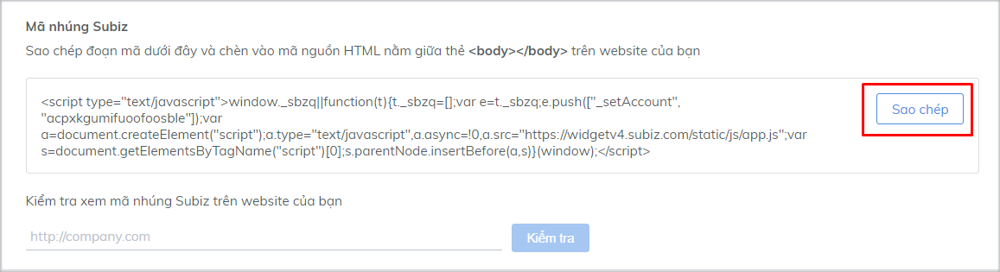
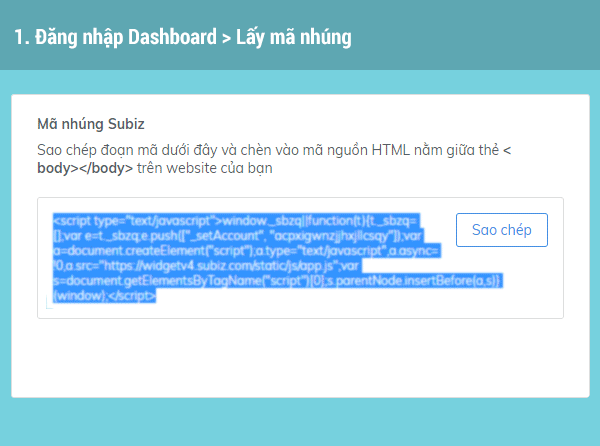
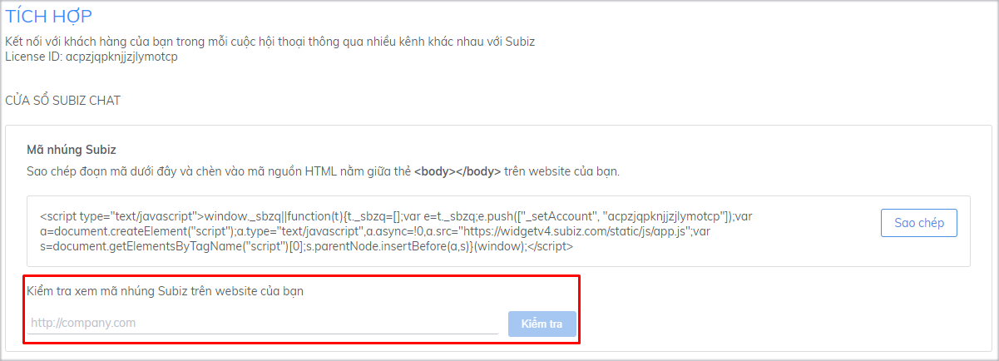
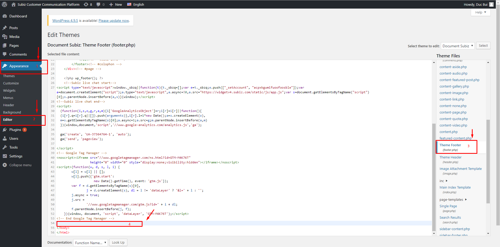
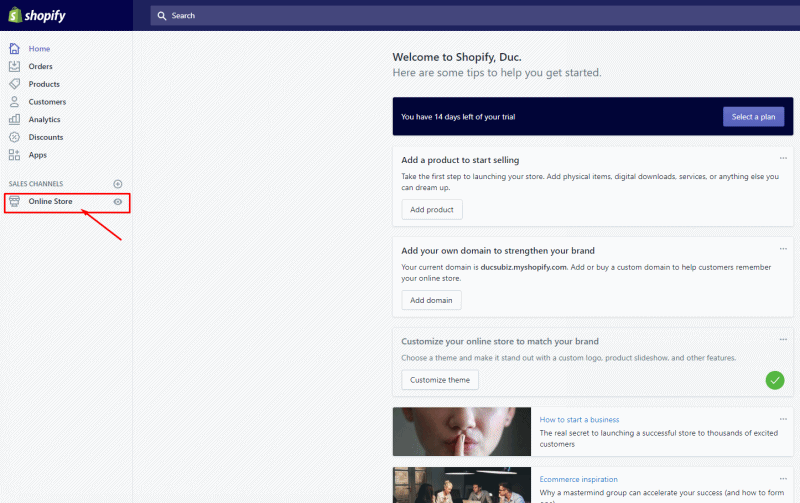

# Tích hợp Subiz lên Website

Subiz Live Chat là một kênh tương tác với khách hàng ghé thăm website của doanh nghiệp. Khi tích hợp cửa sổ tương tác Subiz trên Website, **sẽ giúp doanh nghiệp theo dõi, tiếp cận, tương tác và chuyển đổi khách hàng** ghé thăm website của bạn.

### Cách tích hợp Subiz lên website

Để tích hợp cửa sổ Subiz trên website, bạn thực hiện theo 03 bước sau:

#### Bước 1: Lấy mã nhúng của Subiz

Tích hợp Subiz vào website bằng việc copy đoạn mã nhúng Subiz \(không được thay đổi, copy toàn bộ mã\) và dán vào các trang mà bạn muốn đặt cửa sổ Subiz Chat.

Để lấy mã nhúng của Subiz bạn làm theo các bước sau:

1. [Đăng nhập tài khoản Subiz](http://app.subiz.com/)
2. Vào phần **Cài đặt &gt; Tài khoản &gt; Tích hợp**

Tại phần Mã nhúng Subiz, click nút Sao chép để thực hiện sao chép nhanh đoạn mã nhúng.


**Lưu ý:** Mỗi Tài khoản Subiz có một mã nhúng khác nhau, vì thế khi thay đổi Tài khoản Subiz, bạn đồng thời phải tích hợp lại mã nhúng.


#### Bước 2: Đặt mã nhúng Subiz vào website

Subiz tương thích với hầu hết các website xây dựng trên các nền tảng khác nhau. Việc đặt mã nhúng vào website khá đơn giản, chỉ cần Copy mã nhúng Subiz và dán vào mọi trang bạn muốn có cửa sổ Subiz Chat. Code nhúng Subiz phải được đặt ngay trước thẻ đóng &lt;/body&gt;.

#### Bước 3: Kiểm tra cửa sổ Subiz trên website

Sau khi tích hợp mã nhúng Subiz, quay lại trình duyệt và truy cập vào website. Bạn sẽ thấy cửa sổ Subiz Chat ở góc dưới cùng bên phải của website.

Nếu bạn vẫn không thấy cửa sổ Subiz Chat, bạn có thể kiểm tra trực tiếp trong trang Quản lý theo các bước sau:

1. [Đăng nhập tài khoản](http://app.subiz.com/)​
2. Chọn **Cài đặt** &gt; **Tài khoản** &gt; **Tích hợp**
3. Nhập đường dẫn **website** bạn và click nút **Kiểm tra**.


Nếu hệ thống báo không tìm thấy cửa sổ Chat, bạn kiểm tra lại mã nhúng Subiz trên website hoặc liên hệ với Subiz để được hỗ trợ.


### Tích hợp Subiz trên các nền tảng

Khi website của bạn được xây dựng trên các nền tảng khác, vui lòng chọn nền tảng web và xem hướng dẫn tích hợp cho từng nền tảng dưới đây:



1. Mở **WordPress Admin Panel** &gt; **Appearance** &gt; **Editor**
2. Tìm file **footer.php** bên cột bên phải và mở file này
3. Nhán mã nhúng Subiz vào ngay trước thẻ &lt;/body&gt; trong file **footer.php**




1. Đăng nhập tài khoản Shopify, tìm đến **Online Store** &gt; **Themes**.
2. Sau đó nhấn vào nút **Action** và chọn **Edit code**
3. Tìm file **theme.liquid** tại menu bên trái và nhúng mã Subiz trước thẻ &lt;/body&gt;. Nhấn **Save**.




1. Đăng nhập màn hình Dashboard của Win, chọn Manage & Edit Site
2. Nhấn vào **Edit Site** &gt; **Add button** &gt; **More** &gt; **HTML iframe**. Kéo phần **iframe** vừa được chọn xuống dưới **footer** \(có thể điều chỉnh vị trí của iframe\)
3. Nhần vào **Add code**  chèn code của Subiz. Nhấn **Save**



Để nhúng mã Subiz trên Magento của bạn, vui lòng tham khảo hai tùy chọn bên dưới:

**Lựa chọn 1**

1. Tìm Magento template tại app/design/frontend/{template}/page/html/head.phtml. Nếu tệp này không tồn tại, thì bạn cần phải kiểm tra xem tệp ứng dụng app/design/frontend/{template}/default/page/html/head.phtml có tồn tại hay không?
2. Khi tìm thấy, nhúng mã code Subiz ngay trước thẻ &lt;/head&gt; của tệp.

**Lựa chọn 2**

Bạn chỉ cần thực hiện theo lựa chọn này nếu các tệp mẫu được mô tả trong Lựa chọn 1 không tồn tại. Có trường hợp này do một số mẫu Magento có thể không có tệp head.phtml và sử dụng tệp mẫu cơ sở.

1. Sao chép tệp ứng dụng app/design/frontend/default/page/html/head.phtml từ mẫu cơ sở mặc địch vào thư mục tùy chỉnh tại app/design/frontend/{template}/page/html/head.phtml.
2. Mở tệp và dán mã nhũng Subiz trước thẻ &lt;/head&gt;



1. Vào Joomla Admin &gt; Template Manager &gt; Chọn mục **Template** và Filter theo Site 
2. Chọn Template đang sử dụng &gt; Click vào file **Index.php**
3. Paste mã nhúng Subiz vào trước thẻ &lt;/body&gt;




Nếu bạn đang dùng nền tảng **không** có trong danh sách này, hãy liên lạc ngay cho Subiz để được trợ giúp.


