# Sáng tạo cửa sổ chat Subiz ấn tượng

### Sáng tạo cách giới thiệu trên cửa sổ chat

Vào những dịp đặc biệt, hoặc khi có các chương trình khuyến mại, bạn nên thay đổi và sáng tạo lời giới thiệu về doanh nghiệp ngay trên cửa sổ chat để tăng sự thu hút và tạo sự ấn tượng với khách truy cập website.







Đoạn mã giúp bạn gắn link trên lời giới thiệu

```text
<p> Normal text <a href="http://example.com"> <font color="yellow">Linked text</font></a></p>
```

Những thành phần bạn có thể thay đổi trong đoạn mã trên:

* **Normal text:** Là đoạn giới thiệu ban đầu bạn muốn trình bày
* [**http://example.com**](http://example.com)**:** Là đường link trang đích bạn muốn khách hàng xem sau khi bấm vào Linked text
* **Yellow:** Là màu bạn muốn chọn cho Linked text
* **Linked text:** Là đoạn chữ chứa đường link trang đích

**Ví dụ:** &lt;p&gt; Kỷ niệm sinh nhật lần thứ 5. Chúng tôi giảm giá 50% nhiều mặt hàng. Vui lòng xem chi tiết 
&lt;a href="http://example.com"&gt; &lt;font color="yellow"&gt;tại đây!&lt;/font&gt;&lt;/a&gt;&lt;/p&gt;

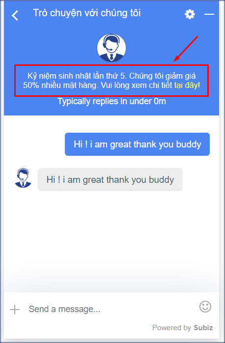




### Tùy chỉnh CSS cho cửa sổ chat Subiz

Bên cạnh việc sử dụng những cài đặt cửa sổ chat trên website mà Subiz đã cung cấp. Bạn có thể dễ dàng tùy chỉnh những thành phần khác trên cửa sổ chat bằng cách sử dụng mã CSS.

CSS là viết tắt của cụm từ “Cascading Style Sheet”, nó là một ngôn ngữ quy định cách trình bày của các thẻ html trên trang web. Với việc sử dụng CSS bạn có thể tùy chỉnh một số thành phần của cửa sổ Subiz chat theo ý muốn một cách dễ dàng và đơn giản.

#### Tùy chỉnh CSS ở đâu? {#tuy-chinh-css-o-dau}

Bạn sẽ đăng nhập vào trang app.subiz.com, vào phần **Cài đặt &gt; Tài khoản &gt; Tin nhắn &gt; Cửa sổ hội thoại &gt; Tùy chỉnh CSS** để thực hiện những thay đổi về CSS này.


Tiếp theo, **bạn Copy và paste đoạn css tương ứng để tùy chỉnh thành phần bạn muốn, sau đó quay lại màn hình cài đặt cửa sổ chat và Lưu thay đổi**

Dưới đây là một số tùy chỉnh css một số thành phần trên cửa sổ chat bạn có thể tham khảo.

#### Thay đổi kích thước cửa sổ chat

Bạn có thể thay đổi chiều cao và chiều rộng theo ý muốn:



Đoạn mã tùy chỉnh chiều cao cửa sổ chat Subiz

```text
.widget_mini .widget_body {
 height: 800px !important;
 max-height: 900px !important;
}
```

Phần **800**px bạn có thể điều chỉnh con số cho phù hợp với website.





Đoạn mã tùy chỉnh chiều rộng cửa sổ chat Subiz

```text
.widget_mini .widget_body{ width:600px;}
```

Phần **600**px bạn có thể điều chỉnh con số cho phù hợp với website.





#### Tùy chỉnh cỡ chữ {#tuy-chinh-co-chu}

Đoạn mã tùy chỉnh cỡ chữ trên cửa sổ chat Subiz

```text
.message-content{ font-size:20px;}
```

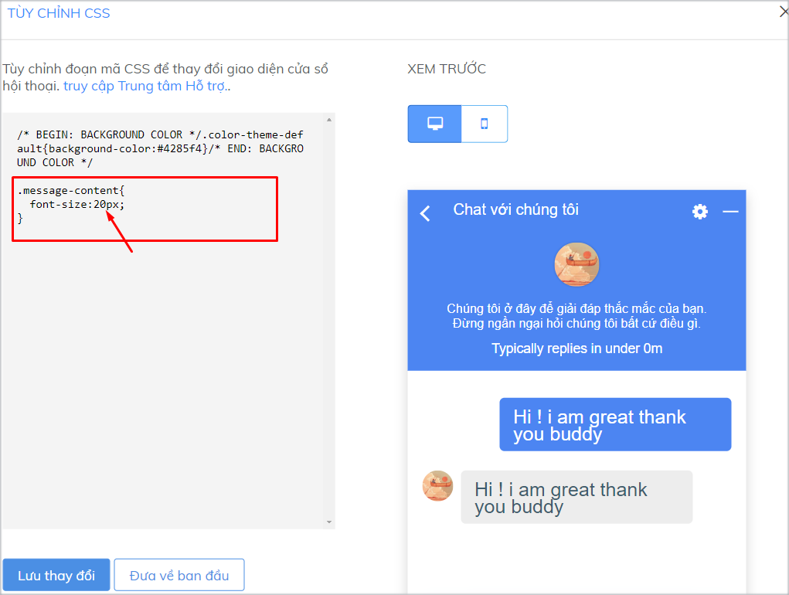

#### Tùy chỉnh màu sắc trên cửa sổ chat Subiz {#tuy-chinh-mau-sac-tung-phan-tren-cua-so-chat}




Khi bạn chọn cách tùy chỉnh màu sắc toàn bộ cửa sổ chat, bạn sẽ không thể tùy chỉnh màu sắc cho từng phần riêng biệt như header, khung tin nhắn hay nút tạo mới được nữa


Bạn có thể tùy chỉnh theo màu sắc đơn hoặc theo dải màu chuyển tiếp.

* **Mã code tùy chỉnh toàn bộ cửa sổ chat theo màu sắc đơn**

```text
.color-theme-default
{background-color:#000000;}
```

Phần **\#00000** bạn có thể điều chỉnh cho phù hợp với website.

* **Mã code tùy chỉnh toàn bộ cửa sổ chat theo dải màu chuyển tiếp**

```text
.color-theme-default
{background-image: linear-gradient(to right top, #056587, #0085a3, #00a6ac, #00c59f, #0be17f);}
```

Phần dải màu **\#056587, \#0085a3, \#00a6ac, \#00c59f, \#0be17f** bạn có thể điều chỉnh cho phù hợp với website.

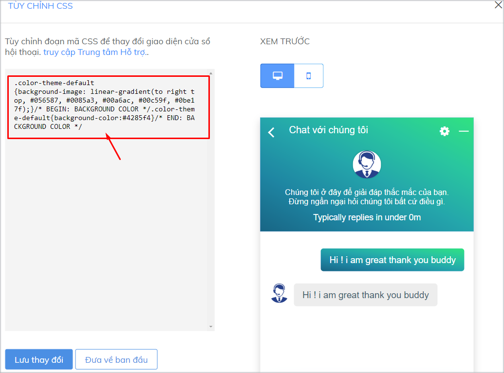



Bạn có thể tùy chỉnh theo màu sắc đơn hoặc theo dải màu chuyển tiếp:

* **Mã code tùy chỉnh màu sắc đơn của header**

```text
.widget-header {background-color:#00000;}
```

Phần **\#00000** bạn có thể điều chỉnh cho phù hợp với website.

* **Mã code tùy chỉnh dài màu chuyển tiếp của header**

```text
.widget-header
{background-image: linear-gradient(to right top, #056587, #0085a3, #00a6ac, #00c59f, #0be17f);}
```

Phần dải màu **\#056587, \#0085a3, \#00a6ac, \#00c59f, \#0be17f** bạn có thể điều chỉnh cho phù hợp với website

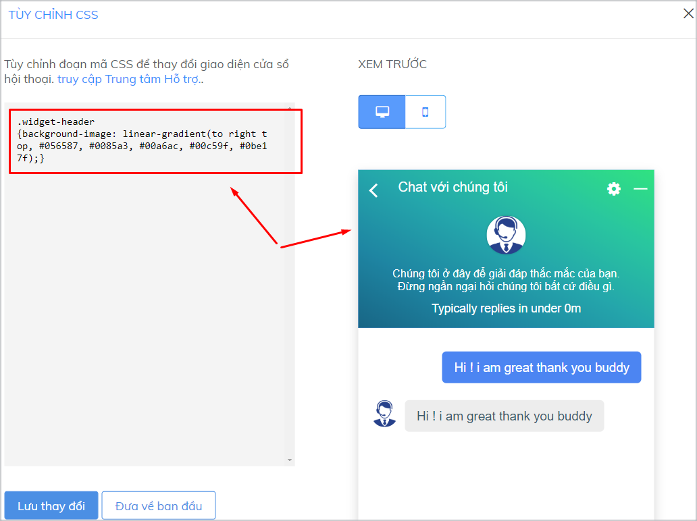



Bạn có thể tùy chỉnh theo màu sắc đơn hoặc theo dải màu chuyển tiếp:

* **Mã code tùy chỉnh theo màu sắc đơn cho khung tin nhắn**

```text
.message-body {background-color:#00000;}
```

Phần **\#00000** bạn có thể điều chỉnh cho phù hợp với website.

* **Mã code tùy chỉnh theo dài màu chuyển tiếp cho khung tin nhắn**

```text
.message-body
{background-image: linear-gradient(to right top, #056587, #0085a3, #00a6ac, #00c59f, #0be17f);}
```

Phần dải màu **\#056587, \#0085a3, \#00a6ac, \#00c59f, \#0be17f** bạn có thể điều chỉnh cho phù hợp với website

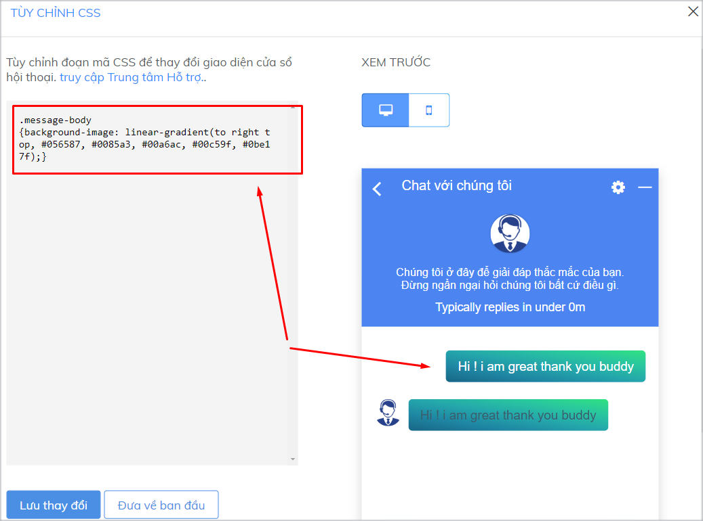



Bạn có thể tùy chỉnh theo màu sắc đơn hoặc theo dải màu chuyển tiếp:

* **Mã code tùy chỉnh theo màu sắc đơn cho nút "Tạo mới"**

```text
.add-new-conversation
{background-color:#000000;}
```

Phần **\#00000** bạn có thể điều chỉnh cho phù hợp với website.

* **Mã code tùy chỉnh theo dải màu chuyển tiếp cho nút "Tạo mới"**

```text
.add-new-conversation
{background-image: linear-gradient(to right top, #056587, #0085a3, #00a6ac, #00c59f, #0be17f);}
```

Phần dải màu **\#056587, \#0085a3, \#00a6ac, \#00c59f, \#0be17f** bạn có thể điều chỉnh cho phù hợp với website.

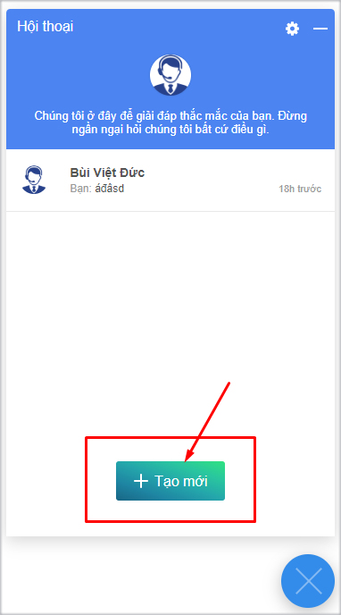



### Tùy chỉnh ngôn ngữ cửa sổ Subiz chat qua file .Po

Hiện tại, Subiz hỗ trợ 2 ngôn ngữ là Tiếng Việt và Tiếng Anh. Trên cửa sổ Subiz, bạn có thể tùy chỉnh tiêu đề cửa sổ và lời giới thiệu theo từng ngôn ngữ.

Ngoài ra, nếu bạn muốn sử dụng một ngôn ngữ khác ngoài các ngôn ngữ được hỗ trợ. Giả sử bạn muốn thay ngôn ngữ Tiếng Anh bằng Tiếng Đức. Hoặc bạn có nhu cầu chỉnh sửa nhiều hơn ở phần ngôn ngữ trên cửa sổ, bạn có thể tùy chỉnh theo file ngôn ngữ .po theo các bước dưới đây:

#### Bước 1: Tải file ngôn ngữ mẫu {#buoc-1-tai-file-ngon-ngu-mau}

Đăng nhập tài khoản và vào [Cài đặt cửa sổ hội thoại](https://app.subiz.com/settings/widget-setting), phần **Ngôn ngữ**. Chọn 1 ngôn ngữ cụ thể và click vào “Tùy chỉnh ngôn ngữ”.

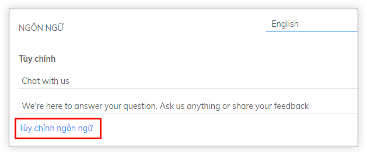

Chọn “Nhấn để tải xuống file tùy chỉnh ngôn ngữ cho widget” để tải về file .po mẫu.

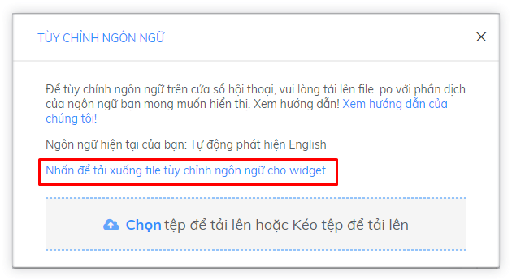

#### Bước 2: Tùy chỉnh file ngôn ngữ {#buoc-2-tuy-chinh-file-ngon-ngu}

* Truy cập [https://localise.biz/free/poeditor](https://localise.biz/free/poeditor), tải lên file mẫu mà bạn vừa tải về.

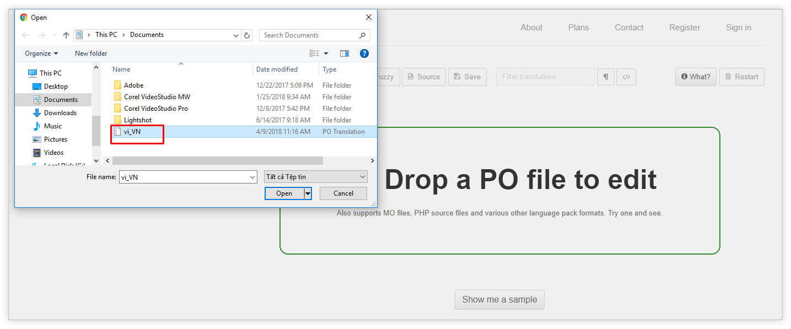

* Tại Source text là phần ngôn ngữ gốc. Bạn có thể dịch ra các ngôn ngữ mà bạn muốn tại phần Translation. Ví dụ, dịch sang tiếng Đức: Email and Name = Email und Name.

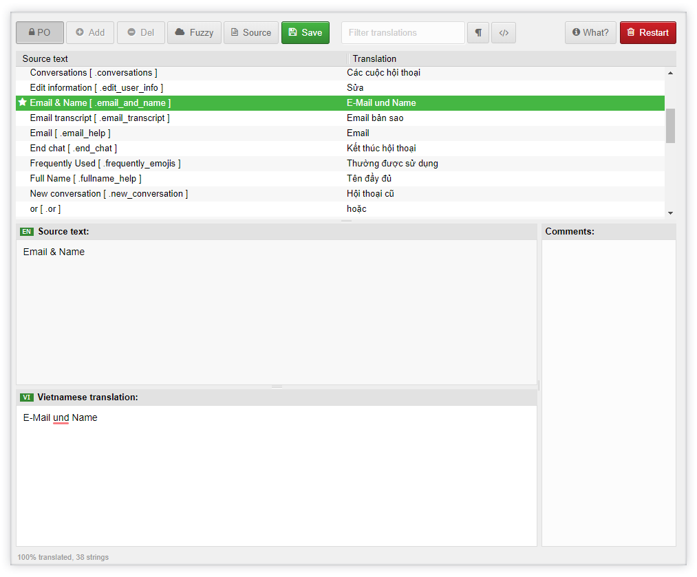

* Chọn Save để Lưu thay đổi sau khi hoàn tất.

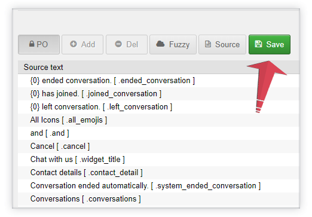

* Click vào file để tải về.

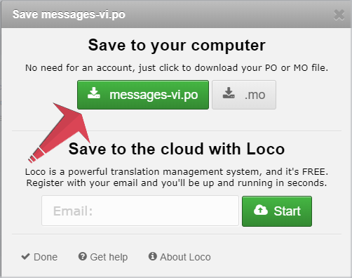

#### Bước 3: Tải lên file .po đã chỉnh sửa và lưu thay đổi {#buoc-3-tai-len-file-po-da-chinh-sua-va-luu-thay-doi}

Tại phần cài đặt Ngôn ngữ, bạn chọn 1 ngôn ngữ và chọn Tùy chỉnh ngôn ngữ. Sau khi tải file mới lên, ngôn ngữ mới sẽ được ghi đè lên ngôn ngữ bạn vừa chọn.

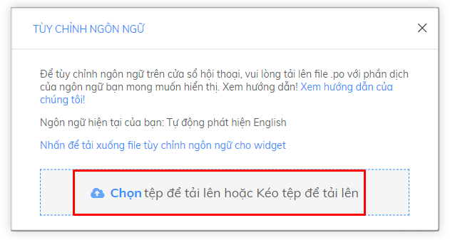

Sau khi có thông báo file tải lên thành công, bạn thoát ra ngoài và Lưu thay đổi.

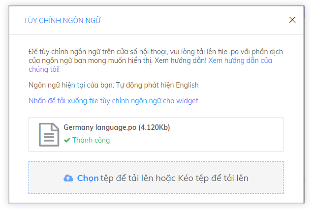

###  {#loi-khi-tich-hop-len-website}


