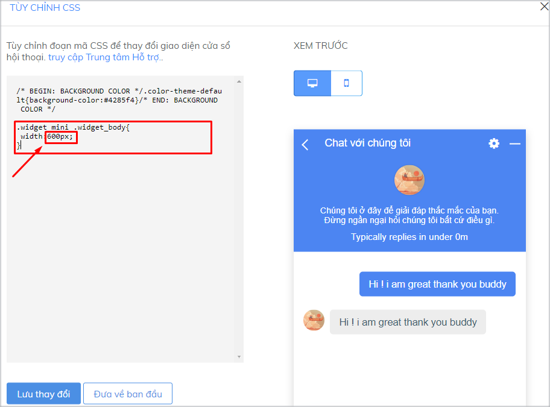

# Sáng tạo cửa sổ chat Subiz ấn tượng

### Tùy chỉnh CSS cho cửa sổ chat Subiz

Bên cạnh việc sử dụng những cài đặt cửa sổ chat trên website mà Subiz đã cung cấp. Bạn có thể dễ dàng tùy chỉnh những thành phần khác trên cửa sổ chat bằng cách sử dụng mã CSS.

CSS là viết tắt của cụm từ “Cascading Style Sheet”, nó là một ngôn ngữ quy định cách trình bày của các thẻ html trên trang web. Với việc sử dụng CSS bạn có thể tùy chỉnh một số thành phần của cửa sổ Subiz chat theo ý muốn một cách dễ dàng và đơn giản.

#### Tùy chỉnh CSS ở đâu? {#tuy-chinh-css-o-dau}

Bạn sẽ đăng nhập vào trang app.subiz.com, vào phần **Cài đặt &gt; Tài khoản &gt; Tin nhắn &gt; Cửa sổ hội thoại &gt; Tùy chỉnh CSS** để thực hiện những thay đổi về CSS này.


Tiếp theo, **bạn Copy và paste đoạn css tương ứng để tùy chỉnh thành phần bạn muốn, sau đó quay lại màn hình cài đặt cửa sổ chat và Lưu thay đổi**

Dưới đây là một số tùy chỉnh css một số thành phần trên cửa sổ chat bạn có thể tham khảo.

#### Thay đổi kích thước cửa sổ chat

Bạn có thể thay đổi chiều cao và chiều rộng theo ý muốn



Đoạn mã tùy chỉnh chiều cao cửa sổ chat Subiz

```text
.widget_mini .widget_body {
 height: 800px !important;
 max-height: 900px !important;
}
```

Phần **800**px bạn có thể điều chỉnh con số cho phù hợp với website.





Đoạn mã tùy chỉnh chiều rộng cửa sổ chat Subiz

```text
.widget_mini .widget_body{ width:600px;}
```

Phần **600**px bạn có thể điều chỉnh con số cho phù hợp với website.






#### Tùy chỉnh cỡ chữ {#tuy-chinh-co-chu}

| 123 | .message-content{ font-size:20px;} |
| --- |


Phần **20**px bạn có thể điều chỉnh con số cho phù hợp với website.

### ​ {#undefined-1}

#### Tùy chỉnh màu sắc toàn bộ cửa sổ chat {#tuy-chinh-mau-sac-toan-bo-cua-so-chat}

Khi bạn chọn cách tùy chỉnh màu sắc toàn bộ cửa sổ chat, bạn sẽ không thể tùy chỉnh màu sắc cho từng phần riêng biệt như header, khung tin nhắn hay nút tạo mới được nữa

Bạn có thể tùy chỉnh theo màu sắc đơn hoặc theo dải màu chuyển tiếp.

* Màu sắc đơn

| 12 | .color-theme-default{background-color:\#000000;} |
| --- |


Phần **\#00000** bạn có thể điều chỉnh cho phù hợp với website.

* Dài màu chuyển tiếp

| 12 | .color-theme-default{background-image: linear-gradient\(to right top, \#056587, \#0085a3, \#00a6ac, \#00c59f, \#0be17f\);} |
| --- |


Phần dải màu **\#056587, \#0085a3, \#00a6ac, \#00c59f, \#0be17f** bạn có thể điều chỉnh cho phù hợp với website.

#### Tùy chỉnh màu sắc từng phần trên cửa sổ chat {#tuy-chinh-mau-sac-tung-phan-tren-cua-so-chat}

**1. Tuy chỉnh màu sắc header cửa sổ chat**

Bạn có thể tùy chỉnh theo màu sắc đơn hoặc theo dải màu chuyển tiếp:

* Màu sắc đơn

| 1 | .widget-header {background-color:\#00000;} |
| --- |


Phần **\#00000** bạn có thể điều chỉnh cho phù hợp với website.

* Dài màu chuyển tiếp

| 12 | .widget-header{background-image: linear-gradient\(to right top, \#056587, \#0085a3, \#00a6ac, \#00c59f, \#0be17f\);} |
| --- |


Phần dải màu **\#056587, \#0085a3, \#00a6ac, \#00c59f, \#0be17f** bạn có thể điều chỉnh cho phù hợp với website.

**2. Tùy chỉnh màu sắc khung tin nhắn trên cửa sổ chat**

Bạn có thể tùy chỉnh theo màu sắc đơn hoặc theo dải màu chuyển tiếp:

* Màu sắc đơn

| 1 | .message-body {background-color:\#00000;} |
| --- |


Phần **\#00000** bạn có thể điều chỉnh cho phù hợp với website.

* Dài màu chuyển tiếp

| 12 | .message-body{background-image: linear-gradient\(to right top, \#056587, \#0085a3, \#00a6ac, \#00c59f, \#0be17f\);} |
| --- |


Phần dải màu **\#056587, \#0085a3, \#00a6ac, \#00c59f, \#0be17f** bạn có thể điều chỉnh cho phù hợp với website.

**3. Tùy chỉnh màu sắc nút “Tạo mới” tin nhắn trên cửa sổ chat**

Bạn có thể tùy chỉnh theo màu sắc đơn hoặc theo dải màu chuyển tiếp:

* Màu sắc đơn

| 1 | .add-new-conversation {background-color:\#00000;} |
| --- |


Phần **\#00000** bạn có thể điều chỉnh cho phù hợp với website.

* Dài màu chuyển tiếp

| 12 | .add-new-conversation{background-image: linear-gradient\(to right top, \#056587, \#0085a3, \#00a6ac, \#00c59f, \#0be17f\);} |
| --- |


Phần dải màu **\#056587, \#0085a3, \#00a6ac, \#00c59f, \#0be17f** bạn có thể điều chỉnh cho phù hợp với website.


### 

### Tùy chỉnh ngôn ngữ cửa sổ Subiz chat qua file .Po

Hiện tại, Subiz hỗ trợ 2 ngôn ngữ là Tiếng Việt và Tiếng Anh. Trên cửa sổ Subiz, bạn có thể tùy chỉnh tiêu đề cửa sổ và lời giới thiệu theo từng ngôn ngữ.

Ngoài ra, nếu bạn muốn sử dụng một ngôn ngữ khác ngoài các ngôn ngữ được hỗ trợ. Giả sử bạn muốn thay ngôn ngữ Tiếng Anh bằng Tiếng Đức. Hoặc bạn có nhu cầu chỉnh sửa nhiều hơn ở phần ngôn ngữ trên cửa sổ, bạn có thể tùy chỉnh theo file ngôn ngữ .po theo các bước dưới đây:

#### Bước 1: Tải file ngôn ngữ mẫu {#buoc-1-tai-file-ngon-ngu-mau}

Đăng nhập tài khoản và vào [Cài đặt cửa sổ hội thoại](https://app.subiz.com/settings/widget-setting), phần **Ngôn ngữ**. Chọn 1 ngôn ngữ cụ thể và click vào “Tùy chỉnh ngôn ngữ”.

Chọn “Nhấn để tải xuống file tùy chỉnh ngôn ngữ cho widget” để tải về file .po mẫu.

#### Bước 2: Tùy chỉnh file ngôn ngữ {#buoc-2-tuy-chinh-file-ngon-ngu}

* Truy cập [https://localise.biz/free/poeditor](https://localise.biz/free/poeditor), tải lên file mẫu mà bạn vừa tải về.


* Tại Source text là phần ngôn ngữ gốc. Bạn có thể dịch ra các ngôn ngữ mà bạn muốn tại phần Translation. Ví dụ, dịch sang tiếng Đức: Email and Name = Email und Name.


* Chọn Save để Lưu thay đổi sau khi hoàn tất.


* Click vào file để tải về.


#### Bước 3: Tải lên file .po đã chỉnh sửa và lưu thay đổi {#buoc-3-tai-len-file-po-da-chinh-sua-va-luu-thay-doi}

Tại phần cài đặt Ngôn ngữ, bạn chọn 1 ngôn ngữ và chọn Tùy chỉnh ngôn ngữ. Sau khi tải file mới lên, ngôn ngữ mới sẽ được ghi đè lên ngôn ngữ bạn vừa chọn.

Sau khi có thông báo file tải lên thành công, bạn thoát ra ngoài và Lưu thay đổi.

###  {#loi-khi-tich-hop-len-website}


