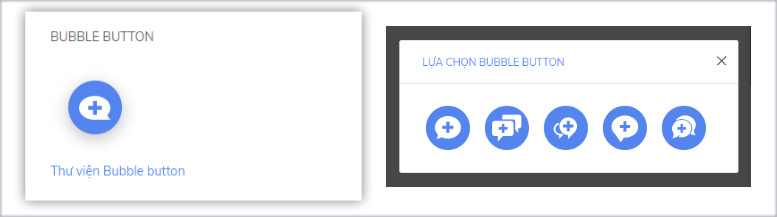

# Tùy chỉnh cửa sổ chat Subiz trên website

**Cửa sổ tương tác Subiz trên website của doanh nghiệp là nơi khách truy cập trò chuyện với tư vấn viên của doanh nghiệp.** Không đơn giản là nơi bạn tương tác hỗ trợ khách hàng, mà còn là nơi bạn khẳng định thương hiệu, chất lượng dịch vụ và tiếng nói của doanh nghiệp.

Để tùy chỉnh cửa sổ chat, bạn đăng nhập tài khoản **Subiz &gt; Cài đặt &gt; Tài khoản &gt; Tin nhắn &gt; Cửa sổ hội thoại**

Tại trang **Cửa sổ hội thoại**, bạn có thể thực hiện các tùy chỉnh các thành phần của cửa sổ cho phù hợp với nhu cầu của bạn:

### Chọn l**oại cửa sổ**

Subiz đã tạo sẵn 2 dạng kích thước **thu gọn** hoặc **mở rộng** cho cửa sổ chat trên website của bạn. Bạn hãy chọn cho website của mình kiểu dáng bạn thích:

* **Thu gọn:** Kích thước tiêu chuẩn
* **Mở rộng:** Chiều dài cửa sổ toàn màn hình, giúp khách hàng dễ theo dõi cuộc chat với bạn

### Chọn v**ị trí cửa sổ chat**

Bạn có thể chọn vị trí cửa sổ chat xuất hiện trên website tại **Góc trái** hoặc **Góc phải**


**Vị trị đặt cửa sổ Subiz cần phù hợp với thiết kế của website, sao cho dễ nhận biết, không đè lên các thiết kế hay ứng dụng khác của website.** Hiện tại, một tỷ lệ lớn các doanh nghiệp đặt cửa sổ Subiz tại góc bên phải.


### Chỉnh sửa **màu sắc**

Bạn có thể tùy chỉnh màu sắc cho cửa sổ Subiz bằng cách chọn 1 trong các màu được gợi ý, hoặc tùy chỉnh màu riêng biệt của doanh nghiệp.


Lưu ý, **cần chọn màu sắc cửa sổ chat tương đồng với màu sắc của thương hiệu,** nhưng cũng cần chọn màu sắc để dễ nhận biết trên website của bạn


### **Tùy chỉnh bubble**

Tại phần Bubble Button, bạn click chọn **Thư viện Bubble Button** và chọn mẫu Bubble theo ý muốn.


Lưu ý, màu sắc của bubble sẽ tương ứng với màu sắc của cả cửa sổ Subiz mà bạn đã chọn.


### **Tùy chọn ngôn ngữ**

Bạn chọn ngôn ngữ sử dụng cho cửa sổ Subiz tại mục **Ngôn ngữ**.

* Khi chọn chế độ **Tự động**, Subiz sẽ tự động nhận diện vị trí của khách truy cập và hiển thị ngôn ngữ phù hợp theo nội dung đã được thiết lập trước.
* Khi bạn chọn **1 ngôn ngữ cụ thể**, bạn cần **tùy chỉnh tiêu đề và lời giới thiệu hiển thị trên cửa sổ**. Ví dụ với ngôn ngữ Tiếng Việt:

 ****Các tùy chỉnh sẽ hiển thị trên cửa sổ như sau:


Hãy chỉnh sửa lời chào, lời giới thiệu theo đúng bản sắc văn hóa và điều bạn muốn phục vụ khách hàng.



**Nếu bạn muốn sử dụng một ngôn ngữ chưa được hỗ trợ**, hoặc muốn tùy chỉnh thêm các phần ngôn ngữ khác, bạn có thể tùy chỉnh ngôn ngữ bằng cách tải lên file ngôn ngữ dạng po \([hướng dẫn chi tiết tùy chỉnh ngôn ngữ qua file .Po](https://docv4.subiz.com/tuy-chinh-ngon-ngu-cua-so-subiz-qua-file-po/)\)


### **Cài đặt Whitelist domain**

**Whitelist domain** là danh sách các tên miền mà bạn cho phép hiển thị cửa sổ Subiz trên trang đó. Các trang ngoài danh sách whitelist sẽ không thể hiển thị cửa sổ Subiz sau khi đặt mã nhúng.

Ví dụ: Bạn nhập _domain1.com_ và _domain2.com_ tại whitelist thì chỉ có thể đặt mã nhúng cài đặt cửa sổ Subiz trên 2 trang này. Nếu bạn đặt mã nhúng tại trang _domain3.com_ thì cửa sổ sẽ không hiển thị tại trang đó.


Khi danh sách whitelist domain trống, mặc định cửa sổ sẽ hiển thị trên tất cả các trang được đặt mã nhúng.

Cài đặt whitelist domain giúp bạn kiểm soát các trang hiển thị cửa sổ Subiz, tránh trường hợp mã nhúng bị đặt trên các trang bạn không mong muốn.


Thực hiện cài đặt tại phần **Quản lý Whitelist Domain**.

Tại trang Whitelist Domain, click chọn Thêm Whitelist Domain mới.

Nhập tên miền và chọn **Thêm** để thêm domain vào danh sách whitelist.

**Để xóa một domain khỏi whitelist,** bạn ấn vào biểu tượng xóa bên cạnh tên domain trong danh sách.

