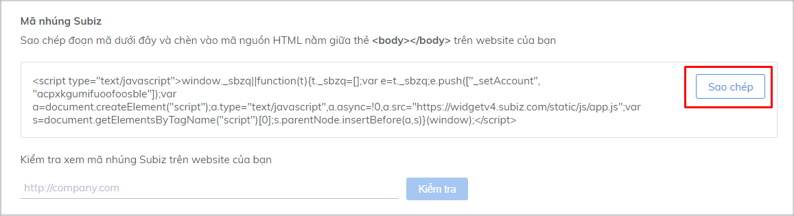
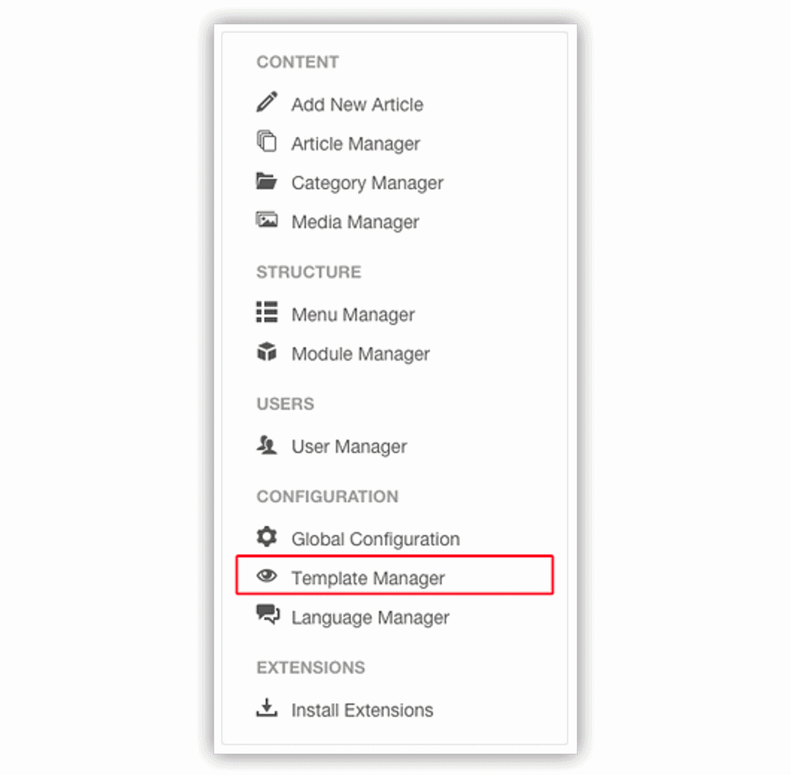
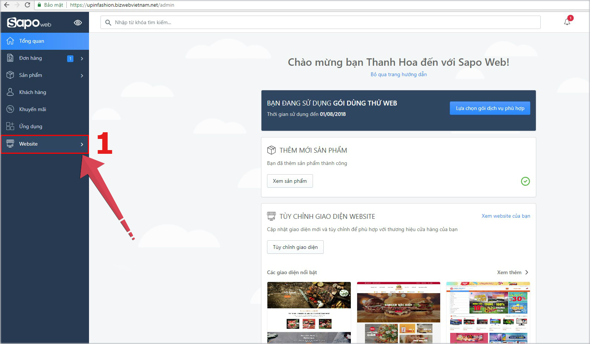
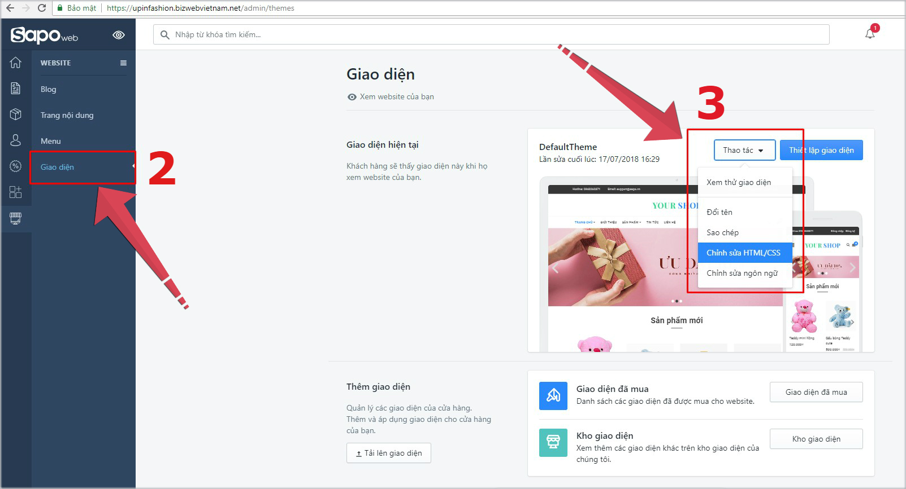
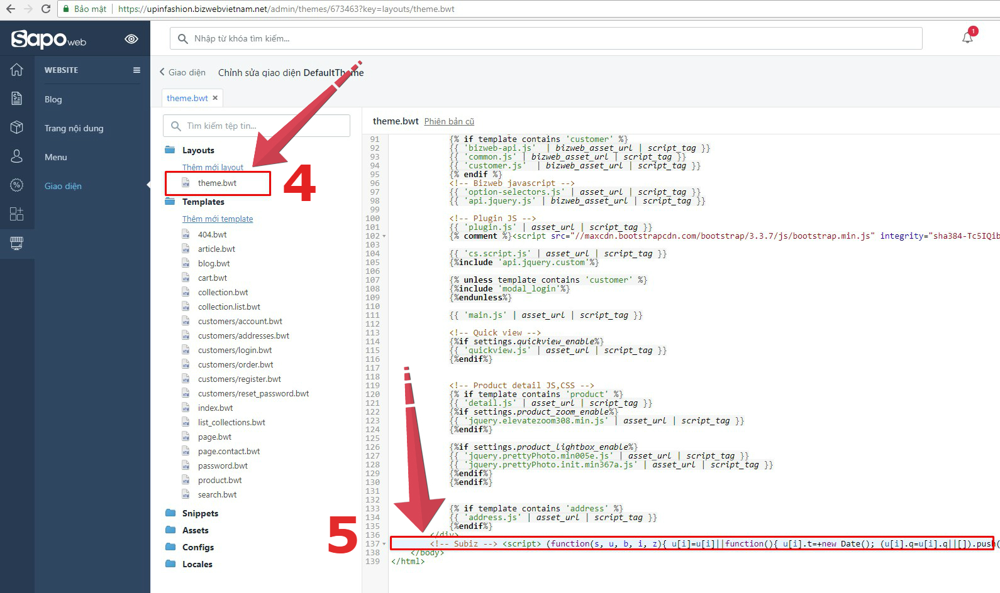

# Tích hợp Subiz Chat

### Subiz chat là gì?

[Subiz Chat](https://subiz.com/vi/live-chat.html%20) là một kênh tương tác với khách hàng ghé thăm website của doanh nghiệp. Khi tích hợp cửa sổ tương tác [Subiz](https://subiz.com/vi/) trên Website, **sẽ giúp doanh nghiệp theo dõi, tiếp cận, tương tác và chuyển đổi khách hàng** ghé thăm website của bạn.

### Cách tích hợp Subiz chat lên website

Tích hợp [Subiz](https://subiz.com/vi/) vào website bằng việc **copy đoạn mã nhúng Subiz** \(không được thay đổi, copy toàn bộ mã\) và **dán vào các trang mà bạn muốn** đặt cửa sổ [Subiz Chat](https://subiz.com/vi/live-chat.html%20). Bạn thực hiện theo 03 bước sau:

#### Bước 1: Lấy mã nhúng của Subiz

Để lấy mã nhúng của [Subiz](https://subiz.com/vi/) bạn làm theo các bước sau:

1. [Đăng nhập tài khoản Subiz](http://app.subiz.com/)
2. Vào phần [**Cài đặt &gt; Tài khoản &gt; Tích hợp**](https://app.subiz.com/settings/install)
3. Tại phần **Mã nhúng Subiz**, click nút **Sao chép** để thực hiện sao chép nhanh đoạn mã nhúng.


**Lưu ý:** Mỗi Tài khoản [Subiz](https://subiz.com/vi/) có một mã nhúng khác nhau, vì thế khi thay đổi Tài khoản [Subiz](https://subiz.com/vi/), bạn đồng thời phải tích hợp lại mã nhúng.


#### Bước 2: Đặt mã nhúng Subiz vào website

[Subiz](https://subiz.com/vi/) tương thích với hầu hết các website xây dựng trên các nền tảng khác nhau. Việc đặt mã nhúng vào website khá đơn giản, chỉ cần Copy mã nhúng [Subiz](https://subiz.com/vi/) và dán vào mọi trang bạn muốn có cửa sổ [Subiz Chat](https://subiz.com/vi/live-chat.html%20). Code mã nhúng Subiz phải được **đặt ngay trước thẻ đóng &lt;/body&gt;.**

#### Bước 3: Kiểm tra cửa sổ Subiz trên website

Sau khi tích hợp mã nhúng Subiz, quay lại trình duyệt và truy cập vào website. Bạn sẽ thấy cửa sổ [Subiz Chat](https://subiz.com/vi/live-chat.html%20) ở góc dưới cùng bên phải của website.

Nếu bạn vẫn không thấy cửa sổ [Subiz Chat](https://subiz.com/vi/live-chat.html%20), bạn có thể kiểm tra trực tiếp trong trang Quản lý theo các bước sau:

1. [Đăng nhập tài khoản](http://app.subiz.com/)​ Subiz
2. Chọn[ **Cài đặt** &gt; **Tài khoản** &gt; **Tích hợp**](https://app.subiz.com/settings/install)
3. Nhập đường dẫn **website** bạn và click nút **Kiểm tra**.


Nếu hệ thống báo không tìm thấy cửa sổ Chat, bạn kiểm tra lại mã nhúng Subiz trên website hoặc liên hệ với [Subiz](https://subiz.com/vi/) để được hỗ trợ.


### Tích hợp Subiz trên các nền tảng

Khi website của bạn được xây dựng trên các nền tảng khác, vui lòng chọn nền tảng web và xem hướng dẫn tích hợp cho từng nền tảng dưới đây:


Nếu bạn đang dùng nền tảng **không** có trong danh sách này, hãy liên lạc ngay cho Subiz để được trợ giúp.




1. Mở **WordPress Admin Panel** &gt; **Appearance** &gt; **Editor**
2. Tìm file **footer.php** bên cột bên phải và mở file này
3. Nhán mã nhúng Subiz vào ngay trước thẻ &lt;/body&gt; trong file **footer.php**




1. Đăng nhập tài khoản Shopify, tìm đến **Online Store** &gt; **Themes**.
2. Sau đó nhấn vào nút **Action** và chọn **Edit code**
3. Tìm file **theme.liquid** tại menu bên trái và nhúng mã Subiz trước thẻ &lt;/body&gt;. Nhấn **Save**.




1. Đăng nhập màn hình Dashboard của Win, chọn Manage & Edit Site
2. Nhấn vào **Edit Site** &gt; **Add button** &gt; **More** &gt; **HTML iframe**. Kéo phần **iframe** vừa được chọn xuống dưới **footer** \(có thể điều chỉnh vị trí của iframe\)
3. Nhần vào **Add code**  chèn code của Subiz. Nhấn **Save**



Để nhúng mã Subiz trên Magento của bạn, vui lòng tham khảo hai tùy chọn bên dưới:

**Lựa chọn 1**

1. Tìm Magento template tại **app/design/frontend/{template}/page/html/head.phtml**. Nếu tệp này không tồn tại, thì bạn cần phải kiểm tra xem tệp ứng dụng **app/design/frontend/{template}/default/page/html/head.phtml** có tồn tại hay không?
2. Khi tìm thấy, nhúng mã code Subiz ngay trước thẻ &lt;/head&gt; của tệp.

**Lựa chọn 2**

Bạn chỉ cần thực hiện theo lựa chọn này nếu các tệp mẫu được mô tả trong Lựa chọn 1 không tồn tại. Có trường hợp này do một số mẫu Magento có thể không có tệp head.phtml và sử dụng tệp mẫu cơ sở.

1. Sao chép tệp ứng dụng **app/design/frontend/default/page/html/head.phtml** từ mẫu cơ sở mặc địch vào thư mục tùy chỉnh tại **app/design/frontend/{template}/page/html/head.phtml.**
2. Mở tệp và dán mã nhũng Subiz trước thẻ &lt;/head&gt;



1. Vào Joomla Admin &gt; Template Manager &gt; Chọn mục **Template** và Filter theo Site 
2. Chọn Template đang sử dụng &gt; Click vào file **Index.php**
3. Paste mã nhúng Subiz vào trước thẻ &lt;/body&gt;




Bước 1: [Đăng nhập Subiz và sao chép mã nhúng](https://app.subiz.com/settings/install)

Bước 2: [Đăng nhập trang quản trị website của Sapo](https://www.sapo.vn/dang-nhap-kenh-ban-hang.html)

 1. Chọn **Website**

2. Chọn **Giao diện &gt; Thao tác &gt; Chỉnh sửa HTML/CSS**

3. Chọn **Them.bwt** &gt; Tìm thẻ **&lt;/body&gt;**  &gt; **Đặt mã nhúng Subiz trước thẻ body** &gt; **Lưu** 




### Tích hợp Subiz qua Google Tag Manager

Subiz kết hợp mạnh mẽ với Google Tag Manager. 

Khi bạn sử dụng Google Tag Manager trên website, bạn có thể tích hợp Subiz chat vào website thông qua Google Tag Manager theo các bước như sau:

1. Đăng nhập[ Tagmanager.google.com](https://tagmanager.google.com/#/home)
2. Chọn account quản lý website sẽ tích hợp Subiz chat tại All account.
3. Tạo Tag mới: Tại WORKSPACE chọn Tags &gt; NEW

* **Untitled Tag**: Điền tên Tag để phân biệt các Tag và chức năng của Tag
* **Tag Configuration**: Chọn Custom HTML &gt; [Sao chép mã nhúng Subiz](https://app.subiz.com/settings/install) và dán vào ô HTML
* Chọn ****\(tick\) **Support document.write**
* **Triggering**: Chọn All Pages nếu muốn hiển thị cửa sổ chat Subiz trên tất cả các trang của website


**Lưu ý**: Trigger là điều kiện bạn muốn thẻ Tag Subiz chat sẽ hoạt động. Bạn có thể tùy chọn Trigger theo nhu cầu riêng. Ví dụ:

* Tất cả các trang của website \(All Pages\) sẽ hiển thị cửa sổ Subiz chat.
* Chỉ một số trang \(Some Pages\) sẽ hiển thị cửa sổ Subiz chat.
* Khách có một hành động cụ thể như Click, kéo scroll chuột, hay sau một khoảng thời gian vào website,.... sẽ hiển thị cửa sổ Subiz chat.


* Chọn **SAVE** &gt;  chọn **SUBMIT** ở góc phải màn hình &gt; Điền thông tin mô tả trong mục **Publish and Create Version** &gt; chọn **PUBLISH** để hoàn thành.

Bạn hãy vào website và chọn F5 tải lại trang, kiểm tra cửa sổ chat Subiz đã hiển thị trên website.

> Bạn còn băn khoăn? Hãy chat trực tuyến với hỗ trợ viên ngay trên website [Subiz.com](https://subiz.com/vi/feature.html)!

