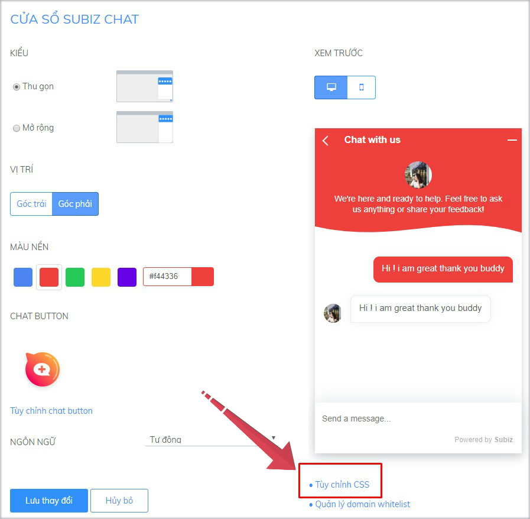

# Bảng CSS tùy chỉnh cửa sổ chat

CSS là chữ viết tắt của **Cascading Style Sheets**,  được dùng để miêu tả cách trình bày các tài liệu viết bằng ngôn ngữ HTML và XHTML.

Bạn cần sao chép đúng CSS bên dưới và dán vào mục [Tùy chỉnh CSS trong cửa sổ Subiz chat](https://app.subiz.com/settings/widget-setting) &gt; Lưu thay đổi tại bảng tùy chỉnh CSS và Lưu thay đổi ở mục Cửa sổ Subiz chat.



### Kích thước chiều rộng, chiều cao cửa sổ chat

Bạn cần xác định [KIỂU CỬA SỔ CHAT](https://app.subiz.com/settings/widget-setting) đang sử dụng là Thu gọn hay Mở rộng để chọn mã CSS tùy chỉnh kích thước cửa sổ chat đúng dưới đây.



```csharp
.widget_mini .widget_body 
{height: 500px !important;
max-height: 580px !important;}
/* Thay đổi chiều cao 500px */

.widget_mini .widget_body 
{width:360px;}
/* Thay đổi chiều rộng 360px */
```



```csharp
.widget_full .widget_body 
{height: 700px !important;
max-height: 800px !important;}
/* Thay đổi chiều cao 700px */

.widget_full .widget_body 
{width:400px;}
/* Thay đổi chiểu rộng 400px */
```



### Tùy biến màu sắc trên cửa sổ chat

Màu sắc cửa sổ chat sẽ đồng bộ trên cả bản destop và mobile. Bạn có thể sử dụng màu sắc đơn hoặc theo dải màu chuyển tiếp; chọn tùy chỉnh màu sắc chung cho toàn bộ cửa sổ chat hoặc màu sắc riêng của từng khung.

<table>
  <thead>
    <tr>
      <th style="text-align:left">V&#xED; tr&#xED; thay &#x111;&#x1ED5;i m&#xE0;u s&#x1EAF;c</th>
      <th style="text-align:left">M&#xE0;u s&#x1EAF;c &#x111;&#x1A1;n</th>
      <th style="text-align:left">D&#x1EA3;i m&#xE0;u chuy&#x1EC3;n ti&#x1EBF;p</th>
    </tr>
  </thead>
  <tbody>
    <tr>
      <td style="text-align:left">To&#xE0;n b&#x1ED9; c&#x1EED;a s&#x1ED5; chat</td>
      <td style="text-align:left">
        <p><code>.color-theme-default <br />{background-color:#000000;}</code>
        </p>
        <p><em><code>/* Thay &#x111;&#x1ED5;i m&#xE3; m&#xE0;u: #000000;} */</code></em>
        </p>
      </td>
      <td style="text-align:left">
        <p><code>.color-theme-default <br />{background-image: linear-gradient<br />(to right top, #056587, #0085a3, <br />#00a6ac, #00c59f, #0be17f);}</code>
        </p>
        <p><em><code>/* Thay &#x111;&#x1ED5;i d&#x1EA3;i m&#xE3; m&#xE0;u: #056587, #0085a3, <br />#00a6ac, #00c59f, #0be17f */</code></em>
        </p>
      </td>
    </tr>
    <tr>
      <td style="text-align:left">Khung ti&#xEA;u &#x111;&#x1EC1;</td>
      <td style="text-align:left">
        <p><code>.widget-header <br />{background-color:#00000;}</code>
        </p>
        <p><em><code>/* Thay &#x111;&#x1ED5;i m&#xE3; m&#xE0;u: #000000;} */</code></em>
        </p>
      </td>
      <td style="text-align:left">
        <p><code>.widget-header <br />{background-image: linear-gradient<br />(to right top, #056587, #0085a3, <br />#00a6ac, #00c59f, #0be17f);}</code>
        </p>
        <p><em><code>/*  Thay &#x111;&#x1ED5;i d&#x1EA3;i m&#xE3; m&#xE0;u: #056587, #0085a3, <br />#00a6ac, #00c59f, #0be17f */</code></em>
        </p>
      </td>
    </tr>
    <tr>
      <td style="text-align:left">Khung tin nh&#x1EAF;n</td>
      <td style="text-align:left">
        <p><code>.message-body <br />{background-color:#00000;}</code>
        </p>
        <p><em><code>/* Thay &#x111;&#x1ED5;i m&#xE3; m&#xE0;u: #000000;} */</code></em>
        </p>
      </td>
      <td style="text-align:left">
        <p><code>.message-body <br />{background-image: linear-gradient<br />(to right top, #056587, #0085a3, <br />#00a6ac, #00c59f, #0be17f);}</code>
        </p>
        <p><em><code>/* Thay &#x111;&#x1ED5;i d&#x1EA3;i m&#xE3; m&#xE0;u: #056587, #0085a3, <br />#00a6ac, #00c59f, #0be17f */</code></em>
        </p>
      </td>
    </tr>
    <tr>
      <td style="text-align:left">N&#xFA;t &quot;B&#x1EAF;t &#x111;&#x1EA7;u tr&#xF2; chuy&#x1EC7;n&quot;</td>
      <td
      style="text-align:left">
        <p><code>.add-new-conversation {background-color:#000000;}</code>
        </p>
        <p><em><code>/* Thay &#x111;&#x1ED5;i m&#xE3; m&#xE0;u: #000000;} */</code></em>
        </p>
        </td>
        <td style="text-align:left">
          <p><code>.add-new-conversation <br />{background-image: linear-gradient(to right top, #056587, #0085a3, <br />#00a6ac, #00c59f, #0be17f);}</code>
          </p>
          <p><em><code>/* Thay &#x111;&#x1ED5;i d&#x1EA3;i m&#xE3; m&#xE0;u: #056587, #0085a3, <br />#00a6ac, #00c59f, #0be17f */ </code></em>
          </p>
        </td>
    </tr>
  </tbody>
</table>### Sáng tạo tiêu đề cửa sổ chat

Thay đổi bố cục tiêu đề  của cửa sổ chat gia tăng nhận diện hình ảnh thương hiệu của Doanh Nghiệp.  
Lưu ý: Ảnh logo là ảnh .png trong suốt \(background transparent\), kích thước dài x cao: 160px x 100px

```csharp
.color-theme-default {background-color:#f44336;} 
.list-agents { float:left; width:45%; } 
.avatar-team { position:absolute; top:-70%; 
background: url(
https://filev4.subiz.com/fiqbqxbalnpxeeandtdr-image.png
); 
height: 100px; background-size: 150px; 
background-repeat: no-repeat; background-position: center; } 
.full { width:160px !important; } 
.avatar-team .avatar-agent{ display:none; } 
.team-intro { width:55%; margin-bottom:12px; } 
.team-intro p{ padding: 0 0 0 0; font-size:13px;}

/* Thay đường link ảnh của bạn tại: https://filev4.subiz.com/fiqbqxbalnpxeeandtdr-image.png */
```

### Thay đổi ảnh tiêu đề cửa sổ chat

Bước 1: Kiểm tra đúng kích thước tiêu đề cửa sổ chat trên website của bạn.

Bước 2: Tải ảnh lên Subiz để lấy link ảnh, ví dụ: http://example.com

Bước 3: Sử dụng mã CSS dưới đây để cập nhật ảnh cho tiêu đề cửa sổ chat

```css
.widget-header {
background :url(http://example.com)}
```

### Tùy chỉnh cỡ chữ của tin nhắn

Cỡ chữ mặc định trong tin nhắn là 13px, bạn có thể thay đổi cỡ chữ nhỏ hơn hoặc lớn hơn:

```csharp
 .message-content
{ font-size:13px;}
/* Thay đổi cỡ chữ 13px */
```

### Vị trí chat button, cửa sổ chat trên website

Bạn muốn thay đổi vị trí chat button và cửa sổ chat lên cao hay xuống thấp trên website , hãy sử dụng mã CSS dưới đây:

* Kiểm tra cài đặt Cửa sổ chat [Kiểu Thu gọn hay Mở rộng](https://app.subiz.com/settings/widget-setting) để dùng đúng CSS.
* Xem thêm [Tùy chỉnh hình ảnh chat button thu hút](https://help.subiz.com/bat-dau-voi-subiz/thiet-lap-moi-truong-tuong-tac/tich-hop-subiz-len-website/tuy-chinh-cua-so-chat-subiz#tuy-chinh-chat-button).



Trên bản destop:

```csharp
.widget-button {bottom:0;}
.widget_mini .widget_body {bottom:0;}
 /* Kích thước thay đổi khoảng 0 - 40px */
```

Trên bản mobile

```csharp
 .widget_mobile .widget-button 
{bottom:40px;right:40px;}
/* Kích thước thay đổi khoảng 0 - 40px */
```



Trên destop:

```csharp
.widget-button {bottom:0;}
.widget_full .widget_body {bottom:0;}
 //Kích thước thay đổi khoảng 0 - 40px
```

Trên mobile:

```csharp
.widget_mobile .widget-button 
{ bottom:0;left:0;}
 //Kích thước thay đổi khoảng 0 - 40px
```



###  Hạ thấp **chiều cao cửa sổ chat trên mobile**

 Cửa sổ Subiz chat sẽ mặc định hiển thị khoảng 90% màn hình điện thoại, để khách vẫn nhìn thấy link của website mua hàng.

Bạn muốn hạ cửa sổ chat trên mobile sẽ hiển thị thấp hơn so với mặc định, hãy dùng mã CSS dưới đây, có thể thay tỷ lệ 90%:

```csharp
.widget_mobile .widget_body {height: 90%;}
/* Thay đổi tỷ lệ chiều cao 90% */
```

### Tùy chỉnh chat button riêng bản mobile

Website bản destop và bản mobile đang hiển thị chung một chat button. Để sử dụng riêng hình ảnh chat button trên bản mobile, bạn sẽ sử dụng CSS sau:

```csharp
.widget_mobile .button-chat { border-radius: 0; background-image: url(
https://filev4.subiz.com/fiqezwgriaddsetqxoig-button_mobile_3.png
); background-repeat: no-repeat; } 
.widget_mobile .button-chat-icon { display: none; } @supports (-ms-ime-align:auto) { .widget_mobile .button-chat { border-radius: 50%; } 
.widget_mobile .button-chat-icon { display: inline-block; } } 
.widget_mobile .widget-button { width: 120px; height: 100px; } 
.widget_mobile .button-chat { border-radius: 0 !important; } 
.widget_mobile .widget-button:after { display: none; } 
.widget_mobile .widget_mini .close-widget-icon { display: none; } 
.widget_mobile .button-chat .avatar-preview img { display: none; } 
.widget_mobile .button-chat { box-shadow: none; background-color: transparent !important; }
.widget_mobile .widget-button {bottom:0;right:10px;}

/* Thay đường link ảnh chat button khác như:
https://filev4.subiz.com/fiqezwgrhzzwishdocxj-button_mobile_1.png
https://filev4.subiz.com/fiqezwgriaaqusgqymat-button_mobile_2.png
Thay đổi kích thước ảnh chat button width: 120px; height: 100px
Tùy chỉnh vị trí chat button trên website: left hay right, từ 0 đến 40px trong
{bottom:0;right:10px;} */
```

### Ẩn cửa sổ chat



```text
.widget_desktop { display: none; }
```



```csharp
.widget_mobile {display: none; }
```



### Ẩn chat button



Kiểu cửa sổ chat THU GỌN:

```csharp
.widget-button {display:none;}
.widget_desktop .widget_mini .widget_body {bottom:0;}
```

Kiểu cửa sổ chat MỞ RỘNG:

```csharp
.widget_desktop .widget-button {display:none;}
```



```csharp
.widget_mobile .widget-button { display: none; }
```



### 


