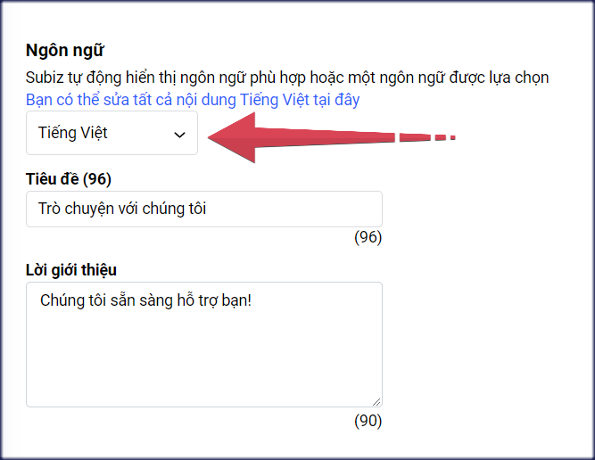
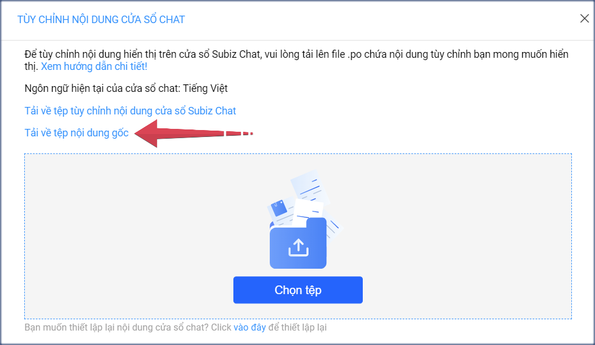
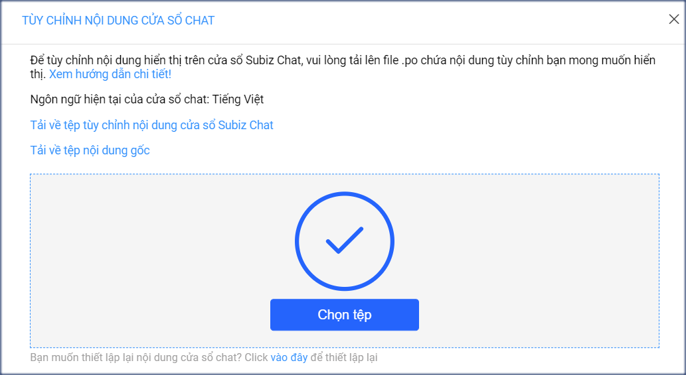

# Các ngôn ngữ hỗ trợ trên cửa sổ Subiz chat

[Cửa sổ Subiz chat](https://app.subiz.com/settings/widget-setting/set-up-subiz-chat) là nơi đầu tiên khách truy cập website tiếp cận và tương tác với doanh nghiệp. Thiết lập ngôn ngữ hiển thị trên cửa sổ Subiz chat giúp khách hàng dễ dàng liên hệ và yêu cầu hỗ trợ khi cần thiết.

Hiện tại cửa sổ Subiz chat hỗ trợ hai ngôn ngữ mặc định: Tiếng Việt và Tiếng Anh. Dưới đây là bảng tên ngôn ngữ và mã ký hiệu dùng cho API:

| **TÊN NGÔN NGỮ** | **MÃ** |
| :--- | :--- |
| English | en-US |
| Tiếng Việt | vi-VI |

Mã ngôn ngữ là Mã đại diện của ngôn ngữ theo chuẩn [ISO 639-1](https://en.wikipedia.org/wiki/ISO_639-1) \(hai ký tự\).

### **1.Tùy chỉnh ngôn ngữ cửa sổ Subiz chat**

Bạn có thể tùy chọn ngôn ngữ phù hợp với đối tượng khách hàng của mình tại trang [**Cài đặt Cửa sổ Subiz chat &gt; Thiết kế cửa sổ Subiz chat**](https://app.subiz.com/settings/widget-setting/set-up-subiz-chat)\*\*\*\*



Trong đó :

* **Tự động**: Cửa sổ [Subiz chat](https://subiz.com/vi/live-chat.html) tự động nhận diện và hiển thị ngôn ngữ tiếng Anh hoặc tiếng Việt theo địa chỉ IP của khách hàng.
* **Tiếng Việt**: chọn khi doanh nghiệp chỉ phục vụ khách hàng Việt Nam và website hỗ trợ chỉ ngôn ngữ Việt Nam.
* **English**: chọn khi doanh nghiệp phục vụ khách quốc tế và website chỉ hỗ trợ ngôn ngữ tiếng Anh.

### 2. API js thay đổi ngôn ngữ cửa sổ chat theo ngôn ngữ website

[Cửa sổ Subiz chat](https://app.subiz.com/settings/widget-setting/set-up-subiz-chat) sẽ tự động hiển thị ngôn ngữ tiếng Anh hoặc tiếng Việt theo ngôn ngữ trên website.

Rất đơn giản, bạn chỉ cần đặt mã API javascript này ngay sau mã nhúng Subiz trong code website. Khi đó, tất cả nội dung trên cửa sổ chat sẽ tự động hiện thị đúng theo ngôn ngữ Tiếng Anh hoặc Tiếng Việt của website.

**API is thiết lập ngôn ngữ tiếng Anh**  
Đặt mã API js này sau mã nhúng Subiz trên code web trang tiếng Anh

```javascript
<script>
subiz('setLanguage', 'en-US');
</script>
```

Khi bạn muốn thay đổi ngôn ngữ tiếng Anh cho một số nội dung cụ thể trên cửa sổ chat, bạn sẽ sử dụng mã API js cụ thể sau:

```javascript
<script>
subiz('setLanguage', 'en-US', {
widget_title: 'Chat with us',
team_intro: 'We are here and ready to help. Feel free to ask us anything or share us your feedback!',
empty_convo_text: 'Send message to start conversation',
powered_by: 'Powered by',
message_input_help: 'Type a message...',
joined_the_conversation: 'Joined',
typing: 'Typing....',
menu_back: 'Back',
conversations: 'Conversations',
start_conversation: 'Start a conversation',
sent_you_a_message: 'Send you a message',
agent_online: 'Agent is online',
agent_offline: 'Agent is offline',
})</script>	
// Thay đổi các nội dung trên cửa sổ chat

<script>var newsetting=subiz('getSetting');
newsetting.account_setting.greeting.message="Welcome to our website!";
subiz('setSetting', newsetting);</script>
// Thay đổi lời chào chạy cùng button chat
```

```javascript

```

**API thiết lập ngôn ngữ tiếng Việt**  
Đặt mã API js này sau mã nhúng Subiz trên code web trang tiếng Việt

```javascript
<script>
subiz('setLanguage', 'vi-VN');
</script>
```

Khi bạn muốn thay đổi ngôn ngữ tiếng Việt cho một số nội dung cụ thể trên cửa sổ chat, bạn sẽ sử dụng mã API js cụ thể sau:

```javascript
<script>
subiz('setLanguage', 'vi-VN', {
widget_title: 'Trò chuyện với chúng tôi',
team_intro: 'Chúng tôi sẵn sàng hỗ trợ bạn! Vui lòng hỏi chúng tôi bất cứ điều gì hoặc chia sẻ phản hồi của bạn',
empty_convo_text: 'Nhắn tin để bắt đầu hội thoại',
powered_by: 'Phát triển bởi',
message_input_help: 'Nhập tin nhắn...',
joined_the_conversation: 'Tham gia',
typing: 'Đang nhắn tin....',
menu_back: 'Quay lại',
conversations: 'Danh sách hội thoại',
start_conversation: 'Tạo hội thoại mới',
sent_you_a_message: 'Gửi tin nhắn',
agent_online: 'Hỗ trợ viên đang online',
agent_offline: 'Hỗ trợ viên đang offline',
})</script>
// Thay đổi các nội dung trên cửa sổ chat

<script>var newsetting=subiz('getSetting');
newsetting.account_setting.greeting.message="Chào mừng bạn đã ghé thăm trang web của chúng tôi!";
subiz('setSetting', newsetting);</script>	
// Thay đổi lời chào chạy cùng button chat
```

### 3. File .po tùy chỉnh nội dung cố định trên cửa sổ chat

Hiện tại, [Subiz](https://subiz.com/vi/) hỗ trợ 2 ngôn ngữ là Tiếng Việt và Tiếng Anh để bạn có thể tùy chỉnh nội dung **tiêu đề cửa sổ chat và lời giới thiệu** theo từng ngôn ngữ này.

Đặc biệt,  Subiz cung cấp thêm file tùy chỉnh ngôn ngữ gốc .po khi bạn có nhu cầu riêng như:

* Sử dụng một ngôn ngữ khác ngoài Tiếng Việt và Tiếng Anh. Ví dụ: Tiếng Pháp, Tiếng Nhật,..
* Tùy chỉnh nội dung của nhiều mục khác trên cửa sổ chat. Ví dụ: Tin nhắn trong Automation hỏi thông tin,...

**Hướng dẫn các bước tùy chỉnh ngôn ngữ cửa sổ chat với file .po gồm 3 bước sau:**

**Bước 1: Tải xuống tệp tùy chỉnh nội dung cửa sổ chat**

* [Đăng nhập App.subiz.com &gt; Cài đặt &gt;  Cửa sổ Subiz chat](https://app.subiz.com/settings/widget-setting/set-up-subiz-chat)
* Tại mục NGÔN NGỮ &gt; chọn Tiếng Việt &gt; chọn **Bạn có thể sửa tất cả nội dung Tiếng Việt tại đây**
* Chọn **Tải về tệp nội dung gốc** **&gt;** Tệp định dạng .po sẽ được lưu về máy tính

**Bước 2: Tùy chỉnh tệp nội dung gốc .po**

*  Truy cập [https://localise.biz/free/poeditor](https://localise.biz/free/poeditor), tải lên tệp .po mà bạn vừa lưu trong máy tính


* Source text là phần ngôn ngữ gốc, **Translation là phần dịch để bạn tùy chỉnh, thay đổi ngôn ngữ theo nhu cầu.** Kéo chuột hoặc tìm kiếm nội dung cần thay đổi.


* Chọn **Save** sau khi tùy chỉnh xong và chọn Save to your computer tải tệp .po đã tùy chỉnh về máy tính.


**Bước 3: Tải lên Subiz tệp nội dung đã tùy chỉnh** 

* Tại bảng **Bạn có thể sửa tất cả nội dung Tiếng Việt tại đây** của Subiz, bạn chọn Tệp .po đã sửa để tải lên.



* Khi tải lên thành công, bạn chọn **X** để hoàn thành và chọn Lưu thay đổi.



> Bạn đang cần hỗ trợ thêm về ngôn ngữ cửa sổ chat, vui lòng gửi email tới Support@Subiz.com!


