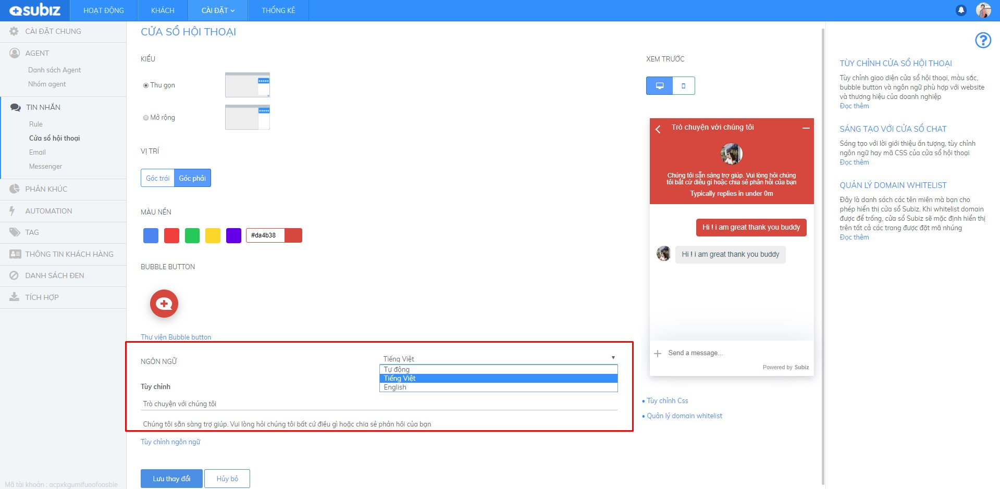

# Các ngôn ngữ hỗ trợ trên cửa sổ Subiz chat

Cửa sổ [Subiz chat](https://subiz.com/vi/live-chat.html) là nơi đầu tiên khách truy cập website tiếp cận và tương tác với doanh nghiệp. Thiết lập ngôn ngữ hiển thị trên cửa sổ [Subiz chat](https://subiz.com/vi/live-chat.html) giúp khách hàng dễ dàng liên hệ và yêu cầu hỗ trợ khi cần thiết.

Hiện tại cửa sổ Subiz chat hỗ trợ hai ngôn ngữ mặc định: Tiếng Việt và Tiếng Anh. Dưới đây là bảng tên ngôn ngữ và mã ký hiệu dùng cho API:

| **TÊN NGÔN NGỮ** | **MÃ** |
| :--- | :--- |
| English | en |
| Tiếng Việt | vi |

Mã ngôn ngữ là Mã đại diện của ngôn ngữ theo chuẩn [ISO 639-1](https://en.wikipedia.org/wiki/ISO_639-1) \(hai ký tự\).

### **1.Tùy chỉnh ngôn ngữ cửa sổ Subiz chat**

Bạn có thể tùy chọn ngôn ngữ phù hợp với đối tượng khách hàng của mình.  




Trong đó :

* **Tự động**: Cửa sổ [Subiz chat](https://subiz.com/vi/live-chat.html) tự động nhận diện và hiển thị ngôn ngữ tiếng Anh hoặc tiếng Việt theo địa chỉ IP của khách hàng.
* **Tiếng Việt**: chọn khi doanh nghiệp chỉ phục vụ khách hàng Việt Nam và website hỗ trợ chỉ ngôn ngữ Việt Nam.
* **English**: chọn khi doanh nghiệp phục vụ khách quốc tế và website chỉ hỗ trợ ngôn ngữ tiếng Anh.

### 2. Sử dụng HTML sáng tạo lời giới thiệu trên cửa sổ chat

Ngay trên cửa sổ Subiz chat, bạn có thể tùy chỉnh và sáng tạo lời giới thiệu về doanh nghiệp, số hotline hay chương trình khuyến mãi để gia tăng nhận diện thương hiệu và thu hút khách hàng.

#### **Một số mã HTML thường dùng để định dạng chữ viết.**

* HTML định dạng chữ viết  
  `<strong>text`: In đậm chữ viết.   
  `<i>text`: In nghiêng chữ viết.

  `<u>text`: Gạch chân chữ viết.  

* HTML xuống dòng đoạn văn bản `<br>text`: ****Đặt mã &lt;br&gt; trước đoạn văn bản bạn muốn xuống dòng. 
* HTML thay đổi màu sắc chữ viết `<font color="yellow">text</font>`: Thay đổi màu sắc vào ô "yellow" như red, white, blue.... 
* HTML gắn đường link URL vào chữ viết  
  `<a href="http://example.com">Text</a>`: Thay link của bạn vào  http://example.com.

* HTML gắn link số điện thoại để có thể click số điện thoại và Gọi ngay trên điện thoại `<a href="tel:02473021368">02473021368</a>`: Thay số điện thoại của bạn vào 02473021368. 

#### **Ví dụ kết hợp HTML tùy chỉnh ngôn ngữ trên cửa sổ chat**



Đoạn mã HTM gắn link và thay đổi màu chữ trên lời giới thiệu:  
`<a href="http://example.com"> <font color="yellow">Text</font></a>`

Những thành phần bạn có thể thay đổi trong đoạn mã trên:

* **http://example.com:** Là đường link trang đích bạn muốn khách hàng xem sau khi bấm vào đoạn chữ viết được gắn link.
* **Yellow:** Là màu bạn muốn chọn cho chữ viết được gắn link.
* **Text:** Là đoạn chữ viết được gắn link .

**Ví dụ:**  

Tưng bừng khuyến mãi tới 50%. Vui lòng xem chi tiết  &lt;a href="http://example.com"&gt; &lt;font color="yellow"&gt;TẠI ĐÂY!&lt;/font&gt;&lt;/a&gt;.





Đoạn mã HTML xuống dòng và thay đổi màu chữ trên lời giới thiệu:  
`<br><font color="yellow">Text</font>`

Bạn đặt đoạn mã HTML trên trước đoạn chữ viết  mà bạn muốn nó xuống dòng.

**Ví dụ**: Tưng bừng khuyến mãi tới 50%. &lt;br&gt; Vui lòng xem chi tiết  &lt;a href="http://example.com"&gt; &lt;font color="yellow"&gt;TẠI ĐÂY!&lt;/font&gt;&lt;/a&gt;





* Mã HTML gắn link vào số điện thoại: `<a href="tel:02473021368">02473021368</a>`
* Mã HTML gắn link vào số điện thoại, in đậm và thay màu sắc số điện thoại: `<a href="tel:02473021368"><strong><u><font color="white">02473021368</font color></u></strong></a>`

Những thành phần bạn có thể thay đổi trong đoạn mã trên:

* **02473021368**: Số điện thoại bạn muốn gắn lên cửa sổ chat 
* **white**: là màu bạn muốn thay đổi cho số điện thoại 

**Ví dụ**: 
SUBIZ HOTLINE: &lt;a href="tel:02473021368"&gt;&lt;strong&gt;&lt;u&gt;&lt;font color="white"&gt;02473021368&lt;/font color&gt;&lt;/u&gt;&lt;/strong&gt;&lt;/a&gt;





### **3. Thay đổi ngôn ngữ cửa sổ Subiz chat theo website**

Website của bạn đang hỗ trợ hai ngôn ngữ English và tiếng Việt.

Cửa sổ [Subiz chat](https://subiz.com/vi/live-chat.html) sẽ tùy biến hiển thị ngôn ngữ tiếng Anh hoặc tiếng Việt theo ngôn ngữ trên website.

Rất đơn giản, bạn chỉ cần đặt mã API javascript này ngay sau mã nhúng Subiz trong code website.

**API thiết lập ngôn ngữ tiếng Anh**

```text
<script>
subiz('setLanguage', 'en');
</script>
```

**API thiết lập ngôn ngữ tiếng Việt**

```text
<script>
subiz('setLanguage', 'vi');
</script>
```

### 3. Tùy chỉnh nội dung cửa sổ chat với file .po

Hiện tại, [Subiz](https://subiz.com/vi/) hỗ trợ 2 ngôn ngữ là Tiếng Việt và Tiếng Anh để bạn có thể tùy chỉnh nội dung **tiêu đề cửa sổ chat và lời giới thiệu** theo từng ngôn ngữ này.

Đặc biệt,  Subiz cung cấp thêm file tùy chỉnh ngôn ngữ gốc .po khi bạn có nhu cầu riêng như:

* Sử dụng một ngôn ngữ khác ngoài Tiếng Việt và Tiếng Anh. Ví dụ: Tiếng Pháp, Tiếng Nhật,..
* Tùy chỉnh nội dung của nhiều mục khác trên cửa sổ chat. Ví dụ: Tin nhắn trong Automation hỏi thông tin,...

**Hướng dẫn các bước tùy chỉnh ngôn ngữ cửa sổ chat với file .po gồm 3 bước sau:**

**Bước 1: Tải xuống tệp tùy chỉnh nội dung cửa sổ chat**

* [Đăng nhập App.subiz.com &gt; Cài đặt &gt; Tài khoản &gt; Cửa sổ Subiz chat hội thoại ](https://app.subiz.com/settings/widget-setting)
* Tại mục NGÔN NGỮ &gt; chọn Tiếng Việt &gt; chọn Tùy chỉnh nội dung
* Chọn **Tải về tệp nội dung gốc tại đây** **&gt;** Tệp định dạng .po sẽ được lưu về máy tính

**Bước 2: Tùy chỉnh tệp nội dung gốc .po**

*  Truy cập [https://localise.biz/free/poeditor](https://localise.biz/free/poeditor), tải lên tệp .po mà bạn vừa lưu trong máy tính


* Source text là phần ngôn ngữ gốc, **Translation là phần dịch để bạn tùy chỉnh, thay đổi ngôn ngữ theo nhu cầu.** Kéo chuột hoặc tìm kiếm nội dung cần thay đổi.


* Chọn **Save** sau khi tùy chỉnh xong và chọn Save to your computer tải tệp .po đã tùy chỉnh về máy tính.


**Bước 3: Tải lên Subiz tệp nội dung đã tùy chỉnh** 

* Tại bảng **Tùy chỉnh nội dung** của Subiz, bạn chọn tải lên tệp nội dung đã tùy chỉnh


* Khi tải lên thành công, bạn chọn **X** để hoàn thành và không cần lưu lại.


> Bạn đang cần hỗ trợ thêm, vui lòng chat trực tiếp với Subiz trên website [Subiz.com](https://subiz.com/vi/feature.html) nhé!


