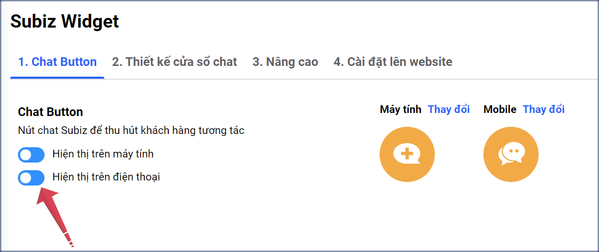

# Đặt chat button mọi nơi trên website với API Js

Chat button Subiz là hình ảnh mặc định của [Subiz](https://subiz.com/vi/), được hiển thị mặc định góc bên phải hoặc bên trái trên website sau khi tích hợp cửa sổ Subiz chat. Khách hàng click vào button sẽ mở ra cửa sổ [Subiz chat](https://subiz.com/vi/live-chat.html).

Bạn hoàn toàn có thể sáng tạo hình ảnh chat button Subiz và linh hoạt đặt button này ở bất cứ vị trí nào trên website, với bất cứ hình dáng nào phù hợp với giao diện trang web.


Bạn cần thực hiện hai bước sau:

### Bước 1: Ẩn hình ảnh chat button Subiz mặc định

Bạn có thể chọn ẩn chat button Subiz trên website bản máy tính và điện thoại bằng cách tắt **OFF** **Hiển thị trên máy tính** và **OFF** **Hiển thị trên điện thoại**



###  **Bước 2: Gắn link cửa sổ Subiz chat vào bất kỳ vị trí trên website**

Khi cài đặt ẩn chat button Subiz, khách hàng sẽ không nhìn thấy hình ảnh button và cửa sổ [Subiz chat.](https://subiz.com/vi/live-chat.html)

Sử dụng API Js trong code website sẽ giúp bạn gắn link cửa sổ chat Subiz vào hình ảnh hoặc đoạn text bất kỳ trên website và tự động mở cửa sổ chat.

* API Js phổ thông đặt vào vùng chứa trong code website , vùng sẽ gắn link cửa sổ Subiz chat.

```csharp
<script type="text/javascript">window.subiz('expandWidget') </script>
```

* API Js gắn link cửa sổ Subiz chat vào hình ảnh.

```csharp
<a href="#nogo" onclick="subiz('expandWidget')"></a>
```

* API Js gắn link cửa sổ Subiz chat vào đoạn text.

```csharp
<a href="#nogo" onclick="subiz('expandWidget')">đoạn text của bạn</a>
```


Lưu ý: Bạn cần đặt API Js này vào trong trang code website. Nếu bạn không hiểu rõ code, bạn có thể gửi hướng dẫn này cho người thiết kế website để họ cài đặt nhanh chóng nhất.

Xem thêm [API Javascript của Subiz Widget](https://help.subiz.com/su-dung-subiz-nang-cao/api-javascript-cua-subiz-widget)


> Bạn gặp khó khăn khi cài đặt, vui lòng gửi yêu cầu hỗ trợ tới Support@Subiz.com!


