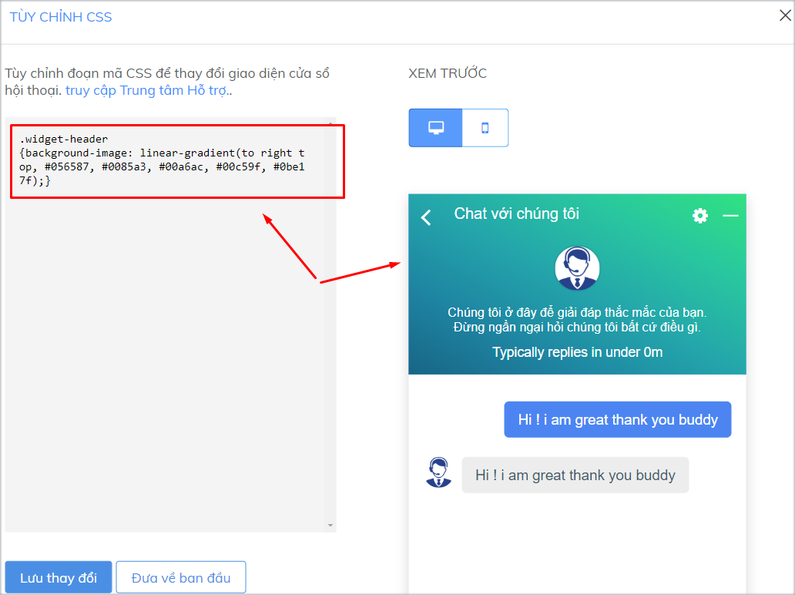
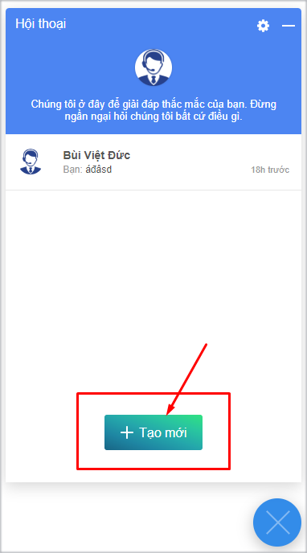

# Sáng tạo cửa sổ chat Subiz ấn tượng

## Sử dụng HTML tùy biến lời giới thiệu trên cửa sổ chat

Ngay trên cửa sổ Subiz chat, bạn có thể tùy chỉnh và sáng tạo lời giới thiệu về doanh nghiệp, số hotline hay chương trình khuyến mãi để gia tăng nhận diện thương hiệu và thu hút khách hàng.

### **Một số mã HTML thường dùng để định dạng chữ viết.**

* HTML định dạng chữ viết  
  `<strong>text`: In đậm chữ viết.   
  `<i>text`: In nghiêng chữ viết.

  `<u>text`: Gạch chân chữ viết.  

* HTML xuống dòng đoạn văn bản `<br>text`: ****Đặt mã &lt;br&gt; trước đoạn văn bản bạn muốn xuống dòng 
* HTML thay đổi màu sắc chữ viết `<font color="yellow">text</font>`: Thay đổi màu sắc vào ô "yellow" như red, white, blue.... 
* HTML gắn đường link URL vào chữ viết  
  `<a href="http://example.com">Text</a>`: Thay link của bạn vào  http://example.com

* HTML gắn link số điện thoại để có thể click số điện thoại và Gọi ngay trên điện thoại `<a href="tel:02473021368">02473021368</a>`: Thay số điện thoại của bạn vào 02473021368 

### **Ví dụ kết hợp HTML tùy chỉnh ngôn ngữ trên cửa sổ chat**



Đoạn mã HTM gắn link và thay đổi màu chữ trên lời giới thiệu:  
`<a href="http://example.com"> <font color="yellow">Text</font></a>`

Những thành phần bạn có thể thay đổi trong đoạn mã trên:

* **http://example.com:** Là đường link trang đích bạn muốn khách hàng xem sau khi bấm vào đoạn chữ viết được gắn link
* **Yellow:** Là màu bạn muốn chọn cho chữ viết được gắn link
* **Text:** Là đoạn chữ viết được gắn link 

**Ví dụ:**  

Tưng bừng khuyến mãi tới 50%. Vui lòng xem chi tiết  &lt;a href="http://example.com"&gt; &lt;font color="yellow"&gt;TẠI ĐÂY!&lt;/font&gt;&lt;/a&gt;





Đoạn mã HTML xuống dòng và thay đổi màu chữ trên lời giới thiệu:  
`<br><font color="yellow">Text</font>`

Bạn đặt đoạn mã HTML trên trước đoạn chữ viết  mà bạn muốn nó xuống dòng.

**Ví dụ**: Tưng bừng khuyến mãi tới 50%. &lt;br&gt; Vui lòng xem chi tiết  &lt;a href="http://example.com"&gt; &lt;font color="yellow"&gt;TẠI ĐÂY!&lt;/font&gt;&lt;/a&gt;





* Mã HTML gắn link vào số điện thoại: `<a href="tel:02473021368">02473021368</a>`
* Mã HTML gắn link vào số điện thoại, in đậm và thay màu sắc số điện thoại: `<a href="tel:02473021368"><strong><u><font color="white">02473021368</font color></u></strong></a>`

Những thành phần bạn có thể thay đổi trong đoạn mã trên:

* **02473021368**: Số điện thoại bạn muốn gắn lên cửa sổ chat 
* **white**: là màu bạn muốn thay đổi cho số điện thoại 

**Ví dụ**: 
SUBIZ HOTLINE: &lt;a href="tel:02473021368"&gt;&lt;strong&gt;&lt;u&gt;&lt;font color="white"&gt;02473021368&lt;/font color&gt;&lt;/u&gt;&lt;/strong&gt;&lt;/a&gt;





## CSS tùy chỉnh cửa sổ chat Subiz trên bản máy tính

Bên cạnh việc sử dụng những [cài đặt cửa sổ chat trên website](https://app.subiz.com/settings/widget-setting) mà Subiz đã cung cấp. Bạn có thể dễ dàng tùy chỉnh những thành phần khác trên cửa sổ chat bằng cách sử dụng mã CSS.

CSS là viết tắt của cụm từ “Cascading Style Sheet”, nó là một ngôn ngữ quy định cách trình bày của các thẻ html trên trang web. Với việc sử dụng CSS bạn có thể tùy chỉnh một số thành phần của cửa sổ Subiz chat theo ý muốn một cách dễ dàng và đơn giản.

#### Tùy chỉnh CSS ở đâu? <a id="tuy-chinh-css-o-dau"></a>

Bạn sẽ đăng nhập vào trang app.subiz.com, vào phần [**Cài đặt &gt; Tài khoản &gt; Tin nhắn &gt; Cửa sổ hội thoại &gt; Tùy chỉnh CSS**](https://app.subiz.com/settings/widget-setting) để thực hiện những thay đổi về CSS này.


Tiếp theo, **bạn sao chép và dán đoạn CSS tương ứng** để tùy chỉnh thành phần bạn muốn, sau đó quay lại màn hình cài đặt cửa sổ chat và **Lưu thay đổi**

Dưới đây là một số tùy chỉnh css một số thành phần trên cửa sổ chat bạn có thể tham khảo.

### Thay đổi kích thước cửa sổ chat

Bạn cần xác định [KIỂU CỬA SỔ CHAT](https://app.subiz.com/settings/widget-setting) đang sử dụng là Thu gọn hay Mở rộng để chọn mã CSS tùy chỉnh kích thước cửa sổ chat đúng dưới đây.



* Đoạn mã tùy chỉnh chiều cao cửa sổ chat [Subiz](https://subiz.com/vi/)

```text
.widget_full .widget_body
{height: 750px !important;
max-height: 800px !important;}
```

* Đoạn mã tùy chỉnh chiều rộng cửa sổ chat [Subiz](https://subiz.com/vi/)

```text
.widget_full .widget_body
{width:600px;}
```

Phần 750px, 600px bạn có thể điều chỉnh con số cho phù hợp với website.





* Đoạn mã tùy chỉnh chiều cao cửa sổ chat Subiz

```text
.widget_mini .widget_body
{height: 750px !important;
max-height: 800px !important;}
```

* Đoạn mã tùy chỉnh chiều rộng cửa sổ chat Subiz

```text
.widget_mini .widget_body
{width:600px;}
```

Phần 750px, 600px bạn có thể điều chỉnh con số cho phù hợp với website.





### Tùy chỉnh cỡ chữ của tin nhắn

Đoạn mã tùy chỉnh cỡ chữ tin nhắn trên cửa sổ Subiz chat

```text
.message-content{ font-size:20px;}
```


### Tùy chỉnh màu sắc trên cửa sổ chat Subiz




Khi bạn chọn cách tùy chỉnh màu sắc toàn bộ cửa sổ chat, bạn sẽ **không thể** tùy chỉnh màu sắc cho từng phần riêng biệt như khung tiêu đề, khung tin nhắn hay nút tạo mới được nữa


Bạn có thể tùy chỉnh theo màu sắc đơn hoặc theo dải màu chuyển tiếp.

* **Mã code tùy chỉnh toàn bộ cửa sổ chat theo màu sắc đơn**

```text
.color-theme-default
{background-color:#000000;}
```

Phần **\#00000** bạn có thể điều chỉnh cho phù hợp với website.

* **Mã code tùy chỉnh toàn bộ cửa sổ chat theo dải màu chuyển tiếp**

```text
.color-theme-default
{background-image: linear-gradient(to right top, #056587, #0085a3, #00a6ac, #00c59f, #0be17f);}
```

Phần dải màu **\#056587, \#0085a3, \#00a6ac, \#00c59f, \#0be17f** bạn có thể điều chỉnh cho phù hợp với website.





Bạn có thể tùy chỉnh theo màu sắc đơn hoặc theo dải màu chuyển tiếp:

* **Mã code tùy chỉnh màu sắc đơn của khung tiêu đề**

```text
.widget-header {background-color:#00000;}
```

Phần **\#00000** bạn có thể điều chỉnh cho phù hợp với website.

* **Mã code tùy chỉnh dài màu chuyển tiếp của khung tiêu đề**

```text
.widget-header
{background-image: linear-gradient(to right top, #056587, #0085a3, #00a6ac, #00c59f, #0be17f);}
```

Phần dải màu **\#056587, \#0085a3, \#00a6ac, \#00c59f, \#0be17f** bạn có thể điều chỉnh cho phù hợp với website





Bạn có thể tùy chỉnh theo màu sắc đơn hoặc theo dải màu chuyển tiếp:

* **Mã code tùy chỉnh theo màu sắc đơn cho khung tin nhắn**

```text
.message-body {background-color:#00000;}
```

Phần **\#00000** bạn có thể điều chỉnh cho phù hợp với website.

* **Mã code tùy chỉnh theo dài màu chuyển tiếp cho khung tin nhắn**

```text
.message-body
{background-image: linear-gradient(to right top, #056587, #0085a3, #00a6ac, #00c59f, #0be17f);}
```

Phần dải màu **\#056587, \#0085a3, \#00a6ac, \#00c59f, \#0be17f** bạn có thể điều chỉnh cho phù hợp với website





Bạn có thể tùy chỉnh theo màu sắc đơn hoặc theo dải màu chuyển tiếp:

* **Mã code tùy chỉnh theo màu sắc đơn cho nút "Tạo mới" \(Bắt đầu trò chuyện\)**

```text
.add-new-conversation
{background-color:#000000;}
```

Phần **\#00000** bạn có thể điều chỉnh cho phù hợp với website.

* **Mã code tùy chỉnh theo dải màu chuyển tiếp cho nút "Tạo mới"**

```text
.add-new-conversation
{background-image: linear-gradient(to right top, #056587, #0085a3, #00a6ac, #00c59f, #0be17f);}
```

Phần dải màu **\#056587, \#0085a3, \#00a6ac, \#00c59f, \#0be17f** bạn có thể điều chỉnh cho phù hợp với website.





### Tùy chỉnh giao diện tiêu đề cửa sổ chat

Cửa sổ chat tùy biến mới lạ và tăng tính nhận diện thương hiệu với việc hiển thị logo công ty và thông tin doanh nghiệp.


Bạn có thể tùy chỉnh được bố cục, giao diện khung tiêu đề cửa sổ chat bắt mắt hơn với sự kết hợp của các mã CSS sau:  
`.color-theme-default {background-color:#f44336;}  
  
.list-agents {   
float:left;   
width:45%; }   
  
.avatar-team {   
position:absolute;   
top:-70%;   
background: url(`[`https://filev4.subiz.com/fiqbqxbalnpxeeandtdr-image.png`](https://filev4.subiz.com/fiqbqxbalnpxeeandtdr-image.png) `);   
  
height: 100px;   
background-size: 150px;   
background-repeat: no-repeat;   
background-position: center;  
 }  
.full { width:160px !important; }  
  
.avatar-team .avatar-agent{   
display:none;   
}   
  
.team-intro {   
width:55%;   
margin-bottom:0;   
} .team-intro p{   
padding: 0 0 0 0; font-size:13px;   
}`   


Trong đó, bạn có thể thay đổi các thông số của từng mã CSS để giao diện khung tiêu đề được hài hòa.

<table>
  <thead>
    <tr>
      <th style="text-align:left">Mã CSS</th>
      <th style="text-align:left">Ý nghĩa và thông số có thể thay đổi</th>
    </tr>
  </thead>
  <tbody>
    <tr>
      <td style="text-align:left"><code>.color-theme-default {background-color:#f44336;}</code>
      </td>
      <td style="text-align:left">Thay đổi mã màu khung tiêu đề: <code>#f44336</code>
      </td>
    </tr>
    <tr>
      <td style="text-align:left"><code>.list-agents { <br />float:left; <br />width:45%; }</code>
      </td>
      <td style="text-align:left">
        <p>Ví trí ảnh trên khung tiêu đề: bên trái - left</p>
        <p>Độ rộng ảnh khoảng 45% khung tiêu đề</p>
      </td>
    </tr>
    <tr>
      <td style="text-align:left"><code>.avatar-team { <br />position:absolute; <br />top:-70%; <br />background: url(</code>
        <a
        href="https://filev4.subiz.com/fiqbqxbalnpxeeandtdr-image.png"><code>https://filev4.subiz.com/fiqbqxbalnpx<br />eeandtdr-image.png</code>
          </a><code> ); </code>
      </td>
      <td style="text-align:left">Link ảnh hiển thị trên khung tiêu đề: https://filesv4.subiz.com/fiqbqxabalnpxeeandtdr-image.png
        <br
        />Kích thước của ảnh chuẩn: dài 160px, cao 60px</td>
    </tr>
    <tr>
      <td style="text-align:left">
        <p><code>height: 100px; <br />background-size: 150px; <br />background-repeat: no-repeat; <br />background-position: center;<br /> } </code>
        </p>
        <p><code>.full { width:160px !important; }</code>
        </p>
      </td>
      <td style="text-align:left">
        <p>Chiều cao của ảnh: 100px</p>
        <p>Kích thước của ảnh: 150px</p>
      </td>
    </tr>
    <tr>
      <td style="text-align:left"><code>.team-intro { <br />width:55%; <br />margin-bottom:0; <br />} .team-intro p{ <br />padding: 0 0 0 0; <br />font-size:13px; <br />} </code>
      </td>
      <td style="text-align:left">
        <p>Nội dung giới thiệu khoản 55% khung tiêu đề</p>
        <p>Kích thước chữ viết: 13 px</p>
      </td>
    </tr>
  </tbody>
</table>> Bạn muốn tùy chỉnh cửa sổ chat theo nhu cầu riêng, vui lòng chat trực tiếp với tư vấn viên tại [Subiz.com](https://subiz.com/vi/feature.html) hoặc email Support@subiz.com!

