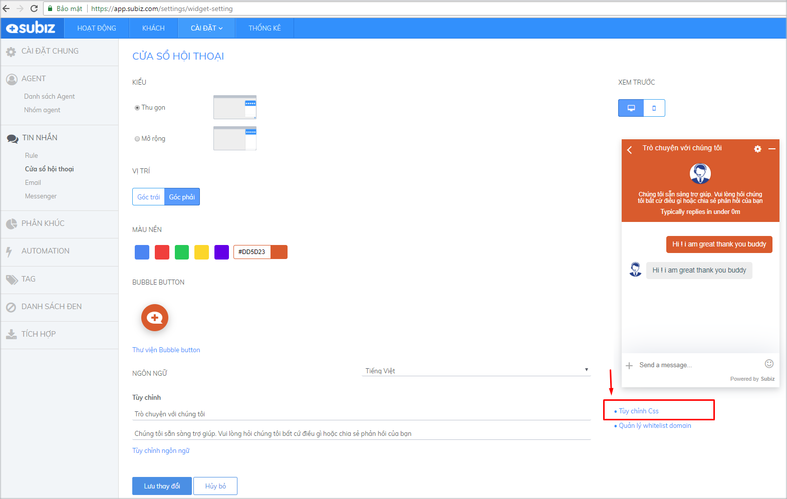
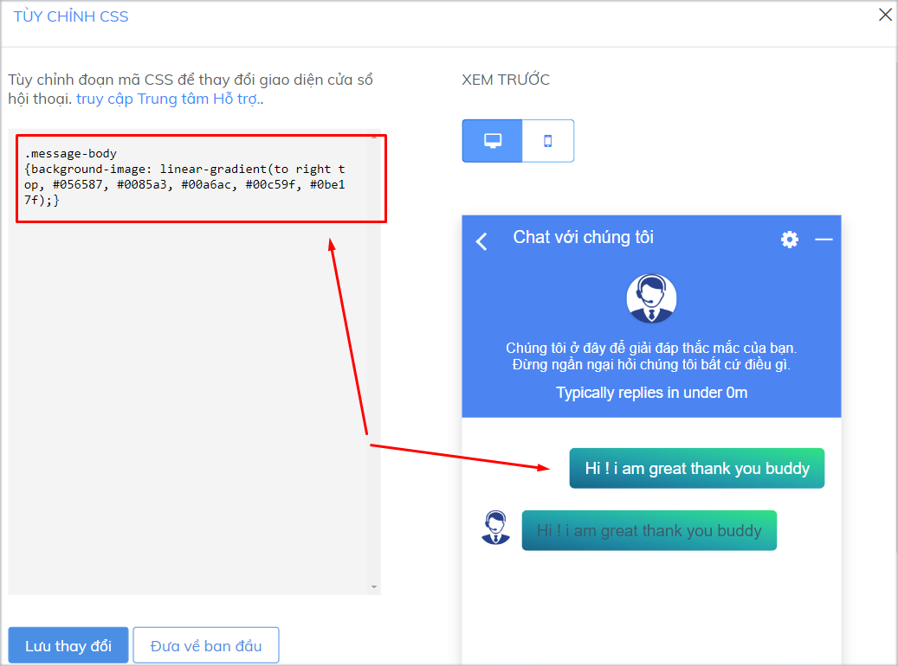

# Sáng tạo cửa sổ chat Subiz

### Sáng tạo lời giới thiệu trên cửa sổ chat

Vào những dịp đặc biệt, hoặc khi có các chương trình khuyến mại, bạn nên thay đổi và sáng tạo lời giới thiệu về doanh nghiệp ngay trên cửa sổ chat để tăng sự thu hút và tạo sự ấn tượng với khách truy cập website.



Đoạn mã giúp bạn gắn link trên lời giới thiệu

```text
<p> Normal text <a href="http://example.com"> <font color="yellow">Linked text</font></a></p>
```

Những thành phần bạn có thể thay đổi trong đoạn mã trên:

* **Normal text:** Là đoạn giới thiệu bạn muốn trình bày
* [**http://example.com**](http://example.com)**:** Là đường link trang đích bạn muốn khách hàng xem sau khi bấm vào Linked text
* **Yellow:** Là màu bạn muốn chọn cho Linked text
* **Linked text:** Là đoạn chữ chứa đường link trang đích

**Ví dụ:** &lt;p&gt; Kỷ niệm sinh nhật lần thứ 5. Chúng tôi giảm giá 50% nhiều mặt hàng. Vui lòng xem chi tiết 
&lt;a href="http://example.com"&gt; &lt;font color="yellow"&gt;tại đây!&lt;/font&gt;&lt;/a&gt;&lt;/p&gt;





Đoạn mã giúp bạn xuống dòng trên lời giới thiệu

```text
<br>Text
```

Bạn đặt đoạn mã trên trước đoạn Text \(chữ\) mà bạn muốn nó xuống dòng.

Ví dụ: &lt;p&gt; Kỷ niệm sinh nhật lần thứ 5. 
Chúng tôi giảm giá 50% nhiều mặt hàng cao cấp. &lt;br&gt;
Vui lòng xem chi tiết 
&lt;a href="http://example.com"&gt; &lt;font color="yellow"&gt;tại đây!&lt;/font&gt;&lt;/a&gt;&lt;/p&gt;





* Gắn link vào số điện thoai

```text
<a href="tel:02473021368">02473021368</a>
```

* Tùy chỉnh màu sắc của số điện thoại

```text
<a href="tel:02473021368"><strong><u><font color="white">02473021368</font color></u></strong></a>
```

Những thành phần bạn có thể thay đổi trong đoạn mã trên:

* Số điện thoại bạn muốn gắn l
* White: là màu bạn muốn thay đổi cho số điện thoại 





### CSS tùy chỉnh cửa sổ chat Subiz trên máy tính

Bên cạnh việc sử dụng những [cài đặt cửa sổ chat trên website](https://app.subiz.com/settings/widget-setting) mà Subiz đã cung cấp. Bạn có thể dễ dàng tùy chỉnh những thành phần khác trên cửa sổ chat bằng cách sử dụng mã CSS.

CSS là viết tắt của cụm từ “Cascading Style Sheet”, nó là một ngôn ngữ quy định cách trình bày của các thẻ html trên trang web. Với việc sử dụng CSS bạn có thể tùy chỉnh một số thành phần của cửa sổ Subiz chat theo ý muốn một cách dễ dàng và đơn giản.

#### Tùy chỉnh CSS ở đâu? <a id="tuy-chinh-css-o-dau"></a>

Bạn sẽ đăng nhập vào trang app.subiz.com, vào phần [**Cài đặt &gt; Tài khoản &gt; Tin nhắn &gt; Cửa sổ hội thoại &gt; Tùy chỉnh CSS**](https://app.subiz.com/settings/widget-setting) để thực hiện những thay đổi về CSS này.



Tiếp theo, **bạn Copy và paste đoạn css tương ứng** để tùy chỉnh thành phần bạn muốn, sau đó quay lại màn hình cài đặt cửa sổ chat và **Lưu thay đổi**

Dưới đây là một số tùy chỉnh css một số thành phần trên cửa sổ chat bạn có thể tham khảo.

### Thay đổi kích thước cửa sổ chat

Bạn có thể thay đổi chiều cao và chiều rộng theo ý muốn:



* Đoạn mã tùy chỉnh chiều cao cửa sổ chat [Subiz](https://subiz.com/vi/)

```text
.widget_full .widget_body
{height: 750px !important;
max-height: 800px !important;}
```

* Đoạn mã tùy chỉnh chiều rộng cửa sổ chat [Subiz](https://subiz.com/vi/)

```text
.widget_full .widget_body
{width:600px;}
```

Phần 750px, 600px bạn có thể điều chỉnh con số cho phù hợp với website.





* Đoạn mã tùy chỉnh chiều cao cửa sổ chat Subiz

```text
.widget_mini .widget_body
{height: 750px !important;
max-height: 800px !important;}
```

* Đoạn mã tùy chỉnh chiều rộng cửa sổ chat Subiz

```text
.widget_mini .widget_body
{width:600px;}
```

Phần 750px, 600px bạn có thể điều chỉnh con số cho phù hợp với website.





### Tùy chỉnh cỡ chữ

Đoạn mã tùy chỉnh cỡ chữ trên cửa sổ chat [Subiz](https://subiz.com/vi/)

```text
.message-content{ font-size:20px;}
```


### Tùy chỉnh màu sắc trên cửa sổ chat Subiz




Khi bạn chọn cách tùy chỉnh màu sắc toàn bộ cửa sổ chat, bạn sẽ **không thể** tùy chỉnh màu sắc cho từng phần riêng biệt như header, khung tin nhắn hay nút tạo mới được nữa


Bạn có thể tùy chỉnh theo màu sắc đơn hoặc theo dải màu chuyển tiếp.

* **Mã code tùy chỉnh toàn bộ cửa sổ chat theo màu sắc đơn**

```text
.color-theme-default
{background-color:#000000;}
```

Phần **\#00000** bạn có thể điều chỉnh cho phù hợp với website.

* **Mã code tùy chỉnh toàn bộ cửa sổ chat theo dải màu chuyển tiếp**

```text
.color-theme-default
{background-image: linear-gradient(to right top, #056587, #0085a3, #00a6ac, #00c59f, #0be17f);}
```

Phần dải màu **\#056587, \#0085a3, \#00a6ac, \#00c59f, \#0be17f** bạn có thể điều chỉnh cho phù hợp với website.





Bạn có thể tùy chỉnh theo màu sắc đơn hoặc theo dải màu chuyển tiếp:

* **Mã code tùy chỉnh màu sắc đơn của header**

```text
.widget-header {background-color:#00000;}
```

Phần **\#00000** bạn có thể điều chỉnh cho phù hợp với website.

* **Mã code tùy chỉnh dài màu chuyển tiếp của header**

```text
.widget-header
{background-image: linear-gradient(to right top, #056587, #0085a3, #00a6ac, #00c59f, #0be17f);}
```

Phần dải màu **\#056587, \#0085a3, \#00a6ac, \#00c59f, \#0be17f** bạn có thể điều chỉnh cho phù hợp với website





Bạn có thể tùy chỉnh theo màu sắc đơn hoặc theo dải màu chuyển tiếp:

* **Mã code tùy chỉnh theo màu sắc đơn cho khung tin nhắn**

```text
.message-body {background-color:#00000;}
```

Phần **\#00000** bạn có thể điều chỉnh cho phù hợp với website.

* **Mã code tùy chỉnh theo dài màu chuyển tiếp cho khung tin nhắn**

```text
.message-body
{background-image: linear-gradient(to right top, #056587, #0085a3, #00a6ac, #00c59f, #0be17f);}
```

Phần dải màu **\#056587, \#0085a3, \#00a6ac, \#00c59f, \#0be17f** bạn có thể điều chỉnh cho phù hợp với website





Bạn có thể tùy chỉnh theo màu sắc đơn hoặc theo dải màu chuyển tiếp:

* **Mã code tùy chỉnh theo màu sắc đơn cho nút "Tạo mới"**

```text
.add-new-conversation
{background-color:#000000;}
```

Phần **\#00000** bạn có thể điều chỉnh cho phù hợp với website.

* **Mã code tùy chỉnh theo dải màu chuyển tiếp cho nút "Tạo mới"**

```text
.add-new-conversation
{background-image: linear-gradient(to right top, #056587, #0085a3, #00a6ac, #00c59f, #0be17f);}
```

Phần dải màu **\#056587, \#0085a3, \#00a6ac, \#00c59f, \#0be17f** bạn có thể điều chỉnh cho phù hợp với website.





###  <a id="loi-khi-tich-hop-len-website"></a>

> Bạn có nhu cầu tùy chỉnh cửa sổ  riêng, bạn vui lòng chat trực tiếp với tư vấn viên tại [Subiz.com](https://subiz.com/vi/feature.html)!

