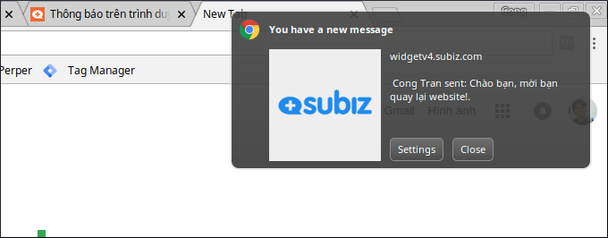
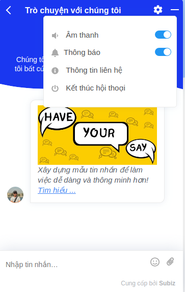
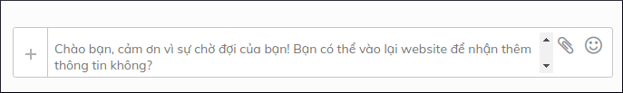
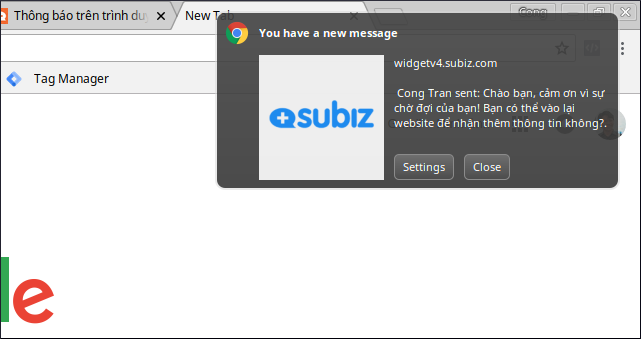

# Thông báo trên trình duyệt Users

### Thông báo trên trình duyệt là gì?

Khi có cửa sổ Subiz có tin nhắn mới, Users \(khách hàng\) sẽ nhận được thông báo trên trình duyệt kể cả khi họ không còn truy cập vào website của doanh nghiệp. Khi users click vào thông báo, họ sẽ truy cập lại website của Doanh nghiệp và từ đó có thể tiếp tục một cuộc nói chuyện qua Subiz. Nếu users đã tắt cả trình duyệt, thì lần mở trình duyệt sau đó thông báo sẽ được hiển thị.

Chức năng này giúp Doanh nghiệp:

* kéo lại những users đã thoát khỏi website.
* xây dựng tập users nhận thông tin từ Doanh nghiệp.
* Giúp việc tương tác giữa Doanh nghiệp và users trở nên liền mạch...

### Cách triển khai tính năng này

**Kêu gọi users Đồng ý nhận thông báo.**

Cửa sổ Subiz đã được thiết kế sẵn tính năng để users đăng ký nhận thông báo.

Ngoài ra, bạn có thể sử dụng Subiz API Javascript để kêu gọi users. [Đây là Hướng dẫn về API.](http://help.subiz.com/su-dung-subiz-nang-cao/api-javascript-cua-subiz-widget#api-subscribe-push-notification) Bạn có thể tùy ý đặt ở Menu hay ngay khi khách vào website để hỏi user đồng ý nhận thông báo. 

**Cách gửi thông báo tới users**

_Trong cuộc hội thoại:_  Với những users đã Đồng ý nhận thông báo, khi họ không còn online, agents vẫn có thể trả lời hội thoại và tin nhắn đó sẽ được Thông báo trình duyệt hiển thị trên màn hình của users.

_Qua Automation_ - Gửi tin nhắn lúc users offline \(**chức năng sắp ra mắt**\).

### Các trình duyệt được hỗ trợ

| Trình duyệt | Hệ điều  |
| :--- | :--- |
| Chrome phiên bản 42+ trở lên | Windows, Mac OS X, Linux and Android |
|  | Windows, Max OS  |
| Firefox \(V 44+ cho desktop; 48+ cho mobile\) | Windows, Mac OS X, Linux và Android |
| Opera \(v 42+ cho desktop; 37+ cho mobile\) | Windows, Mac OS X, Linux và Android |
| Safari \(version 7.1+\) | Mac OS Mavericks onwards desktops |
| Edge \(version 42+\) | Windows 10 |

### Quản lý số người đã đồng ý nhận thông báo

Bạn có thể quản lý số người Đồng ý nhận thông báo qua [Report](https://app.subiz.com/reports/user). Hoặc bạn cũng có thể lọc users với thuộc tính \(attribute\) \`desktop\_notify\_subscribed\` là True. 

### Câu hỏi thường gặp

* Web không có https có được hỗ trợ không? Có, Subiz hỗ trợ cả web không có https. Nhưng chúng tôi khuyến nghị bạn nên sử dụng https cho website. 
* Khách hàng có thể từ chối nhận thông báo? Có, khách có thể từ chối ngay trên cửa sổ Subiz hoặc trên cài đặt của trình duyệt.

